##############################################################################
Chapter 0 Installation of Arduino IDE 
##############################################################################

Arduino Software
*********************************

Arduino Software (IDE) is used to write and upload the code for Arduino Board.

First, install Arduino Software (IDE): visit https://www.arduino.cc, click "**SOFTWARE**" to enter the download page.

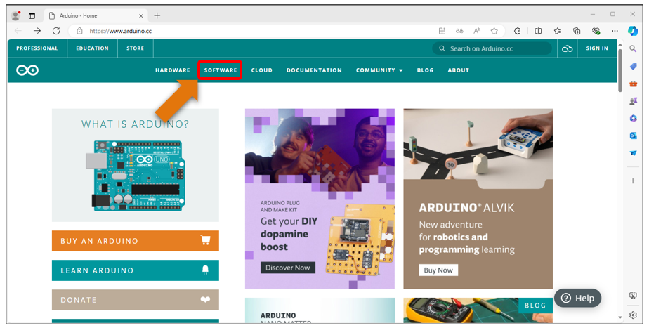

Select and download corresponding installer based on your operating system. If you are a Windows user, please select the "Windows" to download and install the driver correctly.

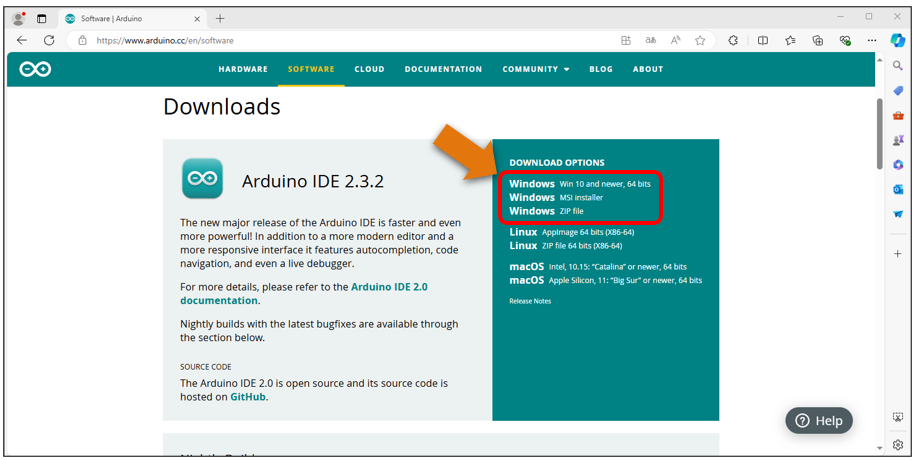

After the download completes, run the installer. For Windows users, there may pop up an installation dialog during the installation. When it popes up, please allow the installation.

After installation is completed, an Arduino Software shortcut will be generated on the desktop. Run the Arduino Software.

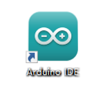

The interface of Arduino Software is as follows:

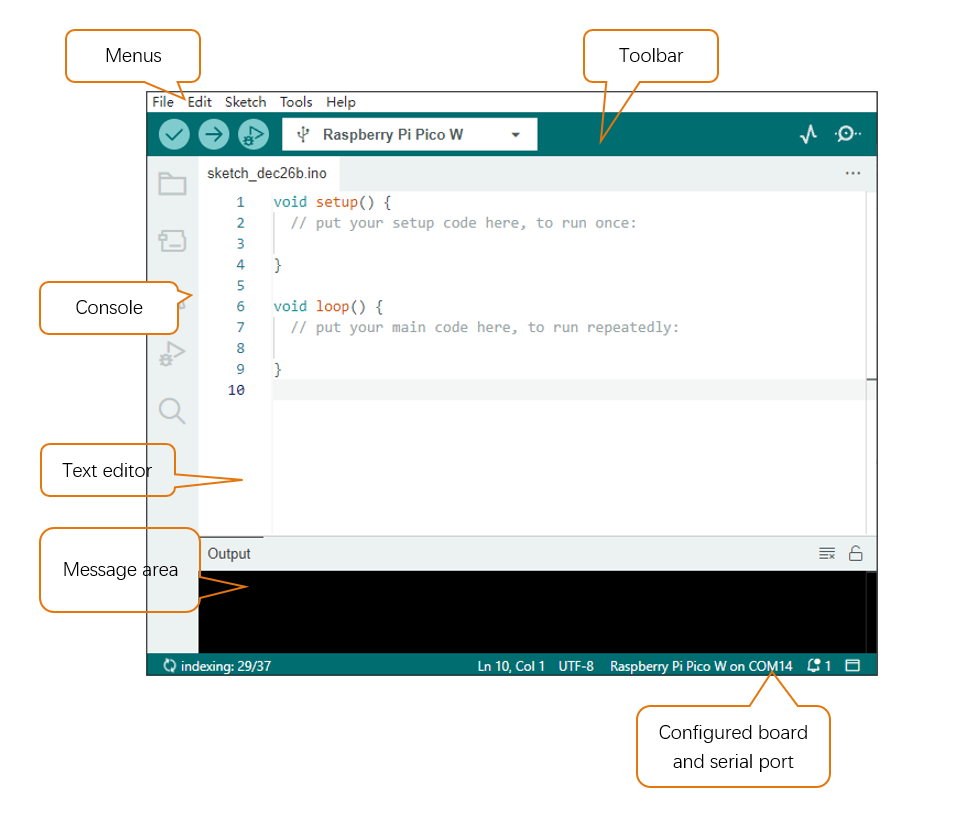

Programs written with Arduino Software (IDE) are called sketches. These sketches are written in the text editor and saved with the file extension.ino. The editor has features for cutting/pasting and searching/replacing text. The message area gives feedback while saving and exporting and also displays errors. The console displays text output by the Arduino Software (IDE), including complete error messages and other information. The bottom right-hand corner of the window displays the configured board and serial port. The toolbar buttons allow you to verify and upload programs, create, open, and save sketches, and open the serial monitor.

.. table:: 
    :class: table-line
    :align: center

    +----------------+----------------+--------------------------------------------------------------------+
    | |Chapter00_04| | Verify         | Check your code for compile errors.                                |
    +----------------+----------------+--------------------------------------------------------------------+
    | |Chapter00_05| | Upload         | Compile your code and upload them to the configured board.         |
    +----------------+----------------+--------------------------------------------------------------------+
    | |Chapter00_06| | Debug          | Help you to detect and solve problems in the code                  |
    +----------------+----------------+--------------------------------------------------------------------+
    | |Chapter00_07| | Plotter        | Convert the information output to the serial port into a waveform  |
    |                |                |                                                                    |
    |                |                | chart for visual analysis                                          |
    +----------------+----------------+--------------------------------------------------------------------+
    | |Chapter00_08| | Serial Monitor | Open the serial monitor.                                           |
    +----------------+----------------+--------------------------------------------------------------------+

Additional commands are found within the five menus: File, Edit, Sketch, Tools, Help. The menus are context sensitive, which means only those items relevant to the work currently being carried out are available.

Environment Configuration
**********************************

First, open the software platform arduino, and then click File in Menus and select Preferences.

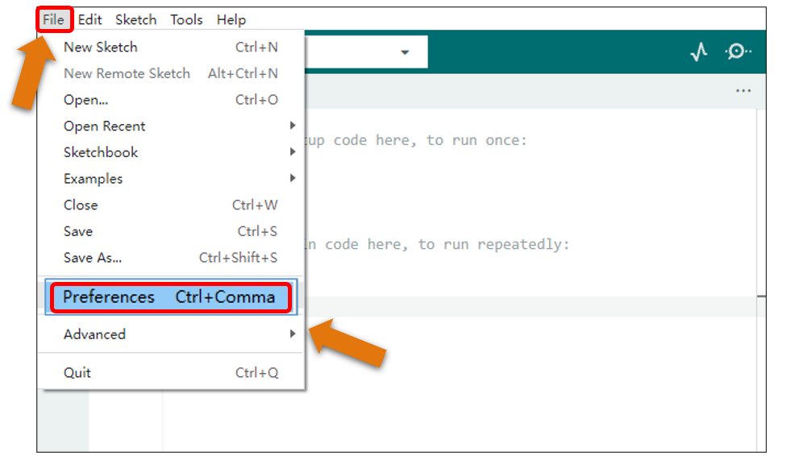

Second, click on the symbol behind "Additional Boards Manager URLs".

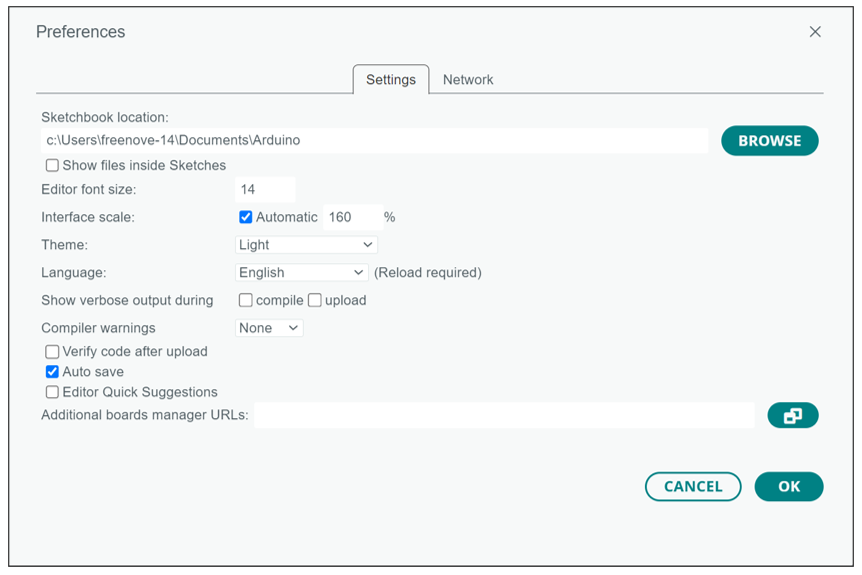

Third, fill in https://github.com/earlephilhower/arduino-pico/releases/download/global/package_rp2040_index.json in the new window, click OK, and click OK on the Preferences window again. 

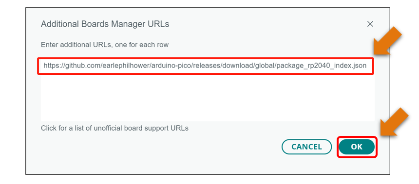

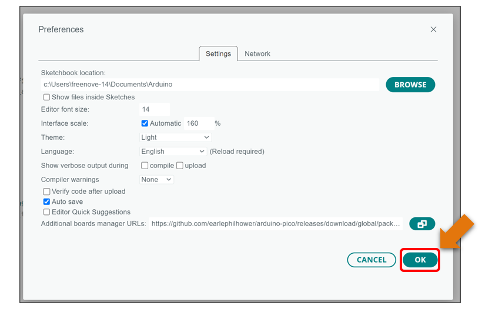

Fourth, click "Boards Manager".

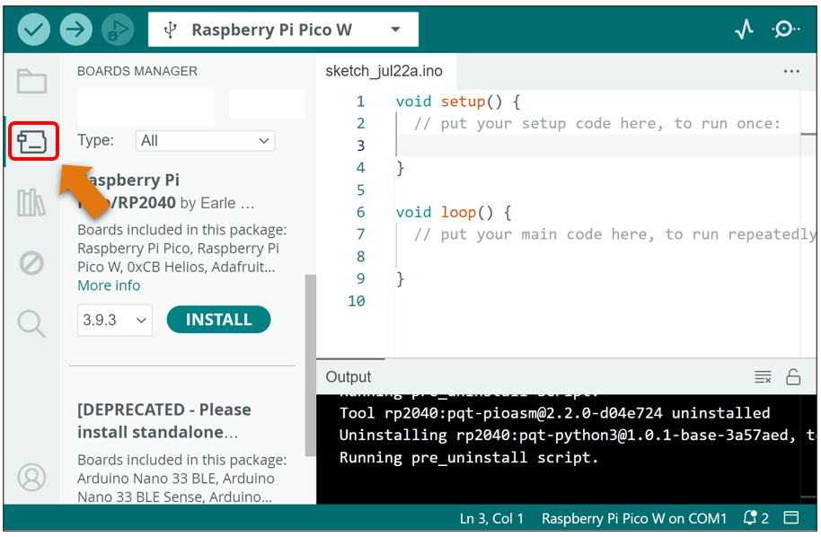

Fifth, input "Raspberry Pi Pico" in the window below, and press Enter. Click "Install" to install.

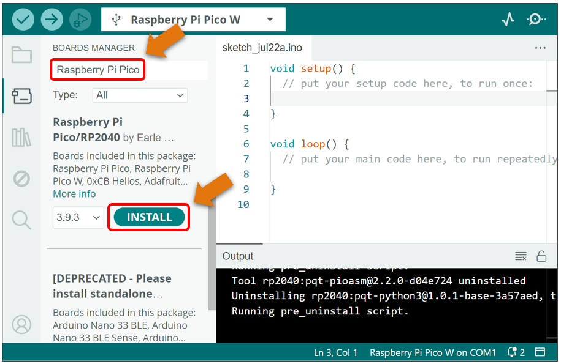

When finishing installation, click Tools in the Menus again and select Board: "Raspberry Pi Pico/RP2040", and then you can see information of Raspberry Pi Pico (W). Click "Raspberry Pi Pico W" so that the Raspberry Pi Pico W programming development environment is configured.

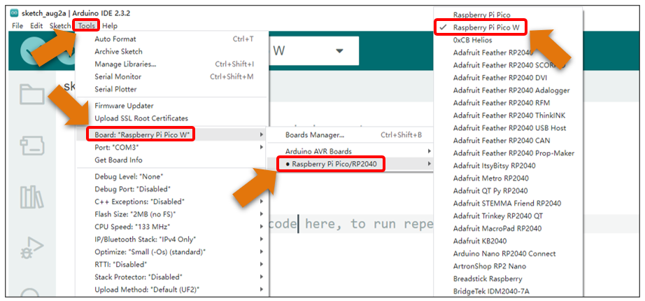

Additional Remarks
*********************************

To finish this tutorial, you can use a Raspberry Pi Pico W or a Raspberry Pi Pico. The two boards have the same form factor, and their only difference is that Pico W features with an onboard single-band 4.802GHz wireless interface using Infineon CYW2. That is to say, the hardware Raspberry Pi Pico W is almost the same as the normal pico except for the wireless interface, which enables Pico W to work with WiFi

No matter which board you use, the procedure for each project is the same. You only need to select the correct board and upload the corresponding code based on the board you use. 

In this book, we use Raspberry Pi Pico W to illustrate the operation.

The followings show the configuration on Arduino for the use of each board.

For Raspberry Pi Pico:

Click **Tools** on Menu bar, click **Board**, select "**Raspberry Pi Pico/RP2040**", and select **Raspberry Pi Pico**. 

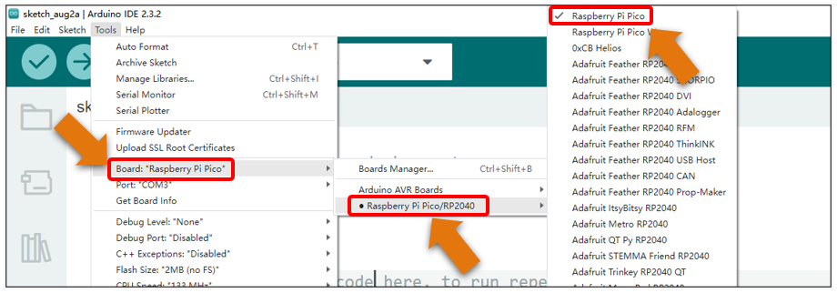

For Raspberry Pi Pico W:

Click Tools on Menu bar, click Board, select "Raspberry Pi Pico/RP2040", and select Raspberry Pi Pico W. 

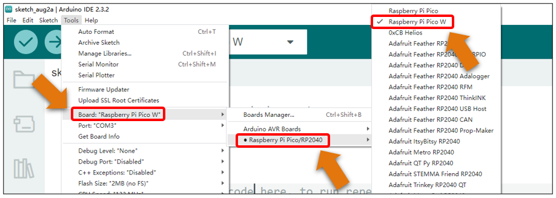