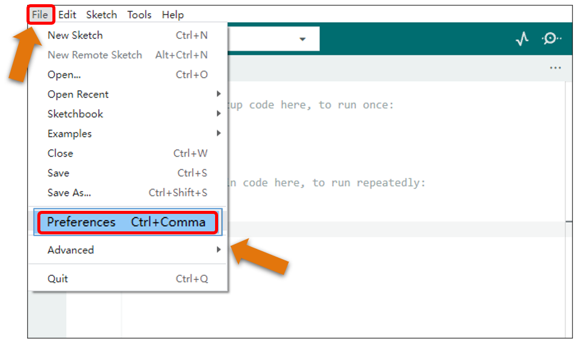
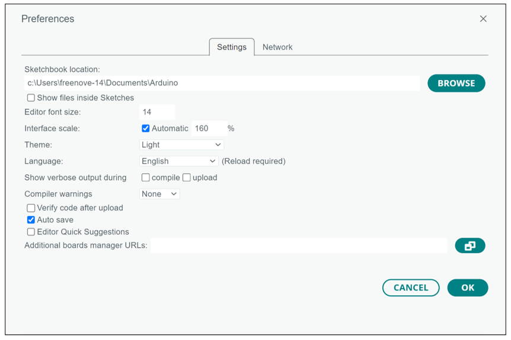
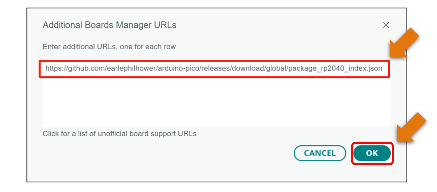
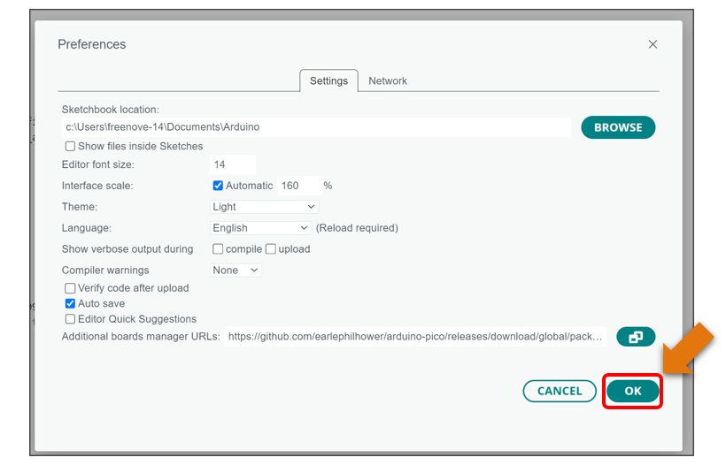
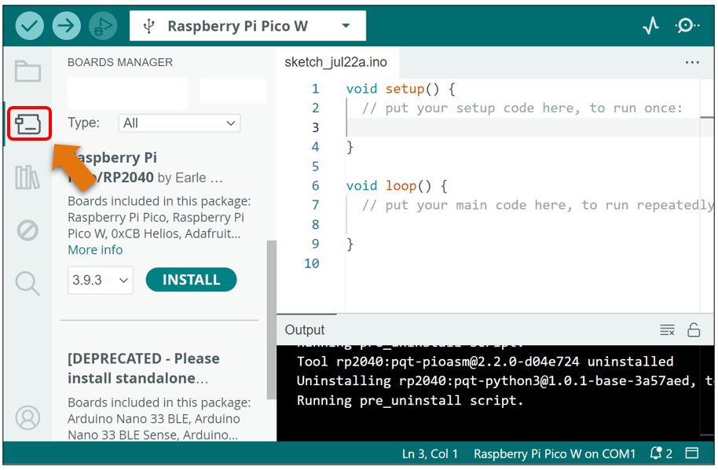
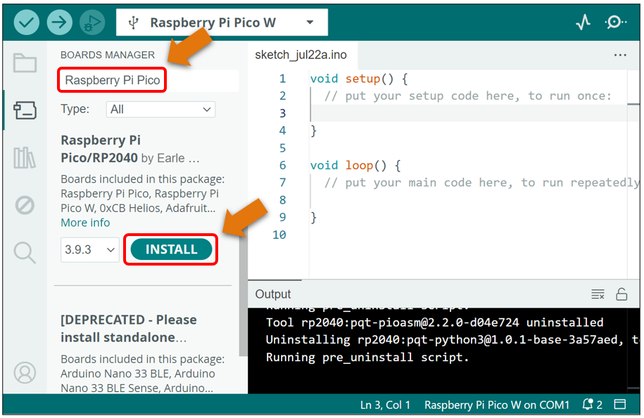
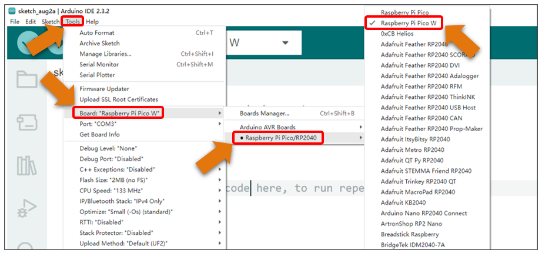
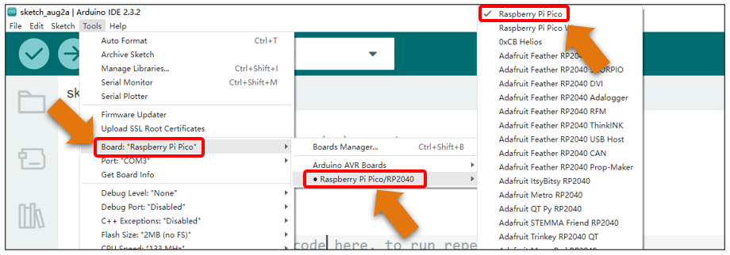
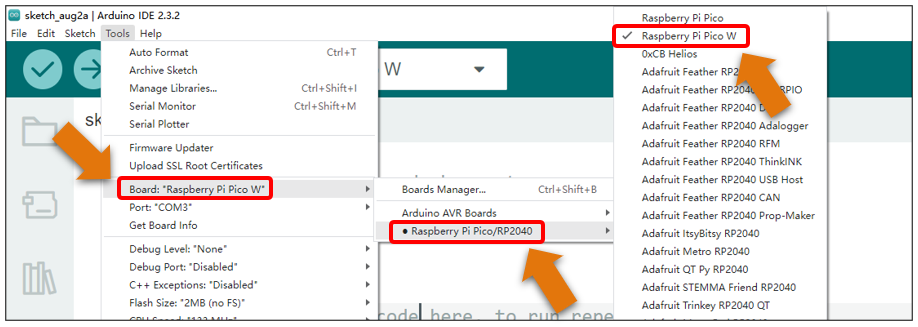

##############################################################################
Chapter 0 Installation of Arduino IDE 
##############################################################################

Arduino Software
*********************************

Arduino Software (IDE) is used to write and upload the code for Arduino Board.

First, install Arduino Software (IDE): visit https://www.arduino.cc/en/software/

.. image:: ../_static/imgs/ArduinoIDE/Preface03.png
    :align: center
    :width: 99%
    :class: image-border

Select and download corresponding installer based on your operating system. If you are a Windows user, please select the "Windows" to download and install the driver correctly.

.. image:: ../_static/imgs/ArduinoIDE/Preface04.png
    :align: center

After the downloading completes, run the installer. For Windows users, there may pop up an installation dialog box of driver during the installation process. When it is popped up, please allow the installation.

After installation is completed, an shortcut will be generated in the desktop.

.. image:: ../_static/imgs/ArduinoIDE/Preface05.png
    :align: center

Run it. The interface of the software is as follows:

.. image:: ../_static/imgs/ArduinoIDE/Preface06.png
    :align: center

Programs written with Arduino IDE are called sketches. These sketches are written in a text editor and are saved with the file extension.ino. The editor has features for cutting/pasting and for searching/replacing text. The console displays text output by the Arduino IDE, including complete error messages and other information. The bottom right-hand corner of the window displays the configured board and serial port. The toolbar buttons allow you to verify and upload programs, open the serial monitor, and access the serial plotter.

.. table::
    :align: center
    :class: table-line
    :width: 80%
    
    +-------------+---------------------------------------------------------------------+
    | |Preface07| | Verify                                                              |
    |             |                                                                     |
    |             | Checks your code for errors compiling it.                           |
    +-------------+---------------------------------------------------------------------+
    | |Preface08| | Upload                                                              |
    |             |                                                                     |
    |             | Compiles your code and uploads it to the configured board.          |
    +-------------+---------------------------------------------------------------------+
    | |Preface09| | Debug                                                               |
    |             |                                                                     |
    |             | Troubleshoot code errors and monitor program running status.        |
    +-------------+---------------------------------------------------------------------+
    | |Preface10| | Serial Plotter                                                      |
    |             |                                                                     |
    |             | Real-time plotting of serial port data charts.                      |
    +-------------+---------------------------------------------------------------------+
    | |Preface11| | Serial Monitor                                                      |
    |             |                                                                     |
    |             | Used for debugging and communication between devices and computers. |
    +-------------+---------------------------------------------------------------------+

.. |Preface07| image:: ../_static/imgs/ArduinoIDE/Preface07.png
.. |Preface08| image:: ../_static/imgs/ArduinoIDE/Preface08.png
.. |Preface09| image:: ../_static/imgs/ArduinoIDE/Preface09.png

Environment Configuration
**********************************

First, open the software platform arduino, and then click File in Menus and select Preferences.

Second, click on the symbol behind "Additional Boards Manager URLs".

Third, fill in https://github.com/earlephilhower/arduino-pico/releases/download/global/package_rp2040_index.json in the new window, click OK, and click OK on the Preferences window again. 

Fourth, click "Boards Manager".

Fifth, input "Raspberry Pi Pico" in the window below, and press Enter. Click "Install" to install.

When finishing installation, click Tools in the Menus again and select Board: "Raspberry Pi Pico/RP2040", and then you can see information of Raspberry Pi Pico (W). Click "Raspberry Pi Pico W" so that the Raspberry Pi Pico W programming development environment is configured.

Additional Remarks
*********************************

To finish this tutorial, you can use a Raspberry Pi Pico W or a Raspberry Pi Pico. The two boards have the same form factor, and their only difference is that Pico W features with an onboard single-band 4.802GHz wireless interface using Infineon CYW2. That is to say, the hardware Raspberry Pi Pico W is almost the same as the normal pico except for the wireless interface, which enables Pico W to work with WiFi

No matter which board you use, the procedure for each project is the same. You only need to select the correct board and upload the corresponding code based on the board you use. 

In this book, we use Raspberry Pi Pico W to illustrate the operation.

The followings show the configuration on Arduino for the use of each board.

For Raspberry Pi Pico:

Click **Tools** on Menu bar, click **Board**, select "**Raspberry Pi Pico/RP2040**", and select **Raspberry Pi Pico**. 

For Raspberry Pi Pico W:

Click Tools on Menu bar, click Board, select "Raspberry Pi Pico/RP2040", and select Raspberry Pi Pico W. 

