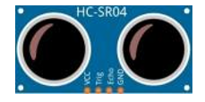

##############################################################################
Chapter 10 Ultrasonic Sensor Test
##############################################################################

Component Knowledge
****************************************

The Ultrasonic Ranging Module uses the principle that ultrasonic waves will reflect when they encounter any obstacles. This is possible by counting the time interval between when the ultrasonic wave is transmitted to   when the ultrasonic wave reflects back after encountering an obstacle. Time interval counting will end after   an ultrasonic wave is received, and the time difference (delta) is the total time of the ultrasonic wave's journey from being transmitted to being received. Because the speed of sound in air is a constant, and is about v=340m/s, we can calculate the distance between the Ultrasonic Ranging Module and the obstacle: s=vt/2.

The HC-SR04 Ultrasonic Ranging Module integrates both an ultrasonic transmitter and a receiver. The transmitter is used to convert electrical signals (electrical energy) into high frequency (beyond human hearing) sound waves (mechanical energy) and the function of the receiver is opposite of this. The picture and the diagram of the HC SR04 Ultrasonic Ranging Module are shown below:

.. list-table:: 
    :align: center
    :class: table-line
    
    * - |Chapter10_01|
      - |Chapter10_02|

Pin description:

.. table:: 
    :class: freenove-ow

    +------+------------------+
    | Pin  | Description      |
    +======+==================+
    | VCC  | power supply pin |
    +------+------------------+
    | Trig | trigger pin      |
    +------+------------------+
    | Echo | Echo pin         |
    +------+------------------+
    | GND  | GND              |
    +------+------------------+

Working voltage: 5V                                         

Working current: 12mA

Minimum measured distance: 2cm                   

Maximum measured distance: 200cm

Instructions for Use: output a high-level pulse in Trig pin lasting for least 10us, the module begins to transmit ultrasonic waves. At the same time, the Echo pin is pulled up. When the module receives the returned ultrasonic waves from encountering an obstacle, the Echo pin will be pulled down. The duration of high level in the Echo pin is the total time of the ultrasonic wave from transmitting to receiving, s=vt/2.

Circuit
********************************

Correctly plug the ultrasonic sensor to the front of the car.

Schematic
********************************

As shown in the schematic below, the Echo and Trig of the ultrasonic sensor respectively connect to GP2 and GP3 of the pico (W).

Sketch
================================

Open **"Sketch_08.1_Ultrasonic"** folder in **"Freenove_Omni_Wheel_Car_Kit_for_Raspberry_Pi_Pico\\Four-Wheel\\Sketches"** and then double-click **"Sketch_08.1_Ultrasonic.ino"**. 

Code
--------------------------------

.. literalinclude:: ../../../freenove_Kit/Four-Wheel/Sketch/Sketch_08.1_Ultrasonic/Sketch_08.1_Ultrasonic.ino
   :linenos:
   :language: c
   :dedent:

After downloading the code, the pico prints the distance value every 500 milliseconds on the serial monitor.

Code Explanation
--------------------------------

Define the pins of ultrasonic module.

.. literalinclude:: ../../../freenove_Kit/Four-Wheel/Sketch/Sketch_08.1_Ultrasonic/Sketch_08.1_Ultrasonic.ino
   :linenos:
   :language: c
   :lines: 8-9
   :dedent:

Set the Trig pin to output and Echo to input.

.. literalinclude:: ../../../freenove_Kit/Four-Wheel/Sketch/Sketch_08.1_Ultrasonic/Sketch_08.1_Ultrasonic.ino
   :linenos:
   :language: c
   :lines: 16-17
   :dedent:

Activate the serial port and set the baud rate to 115200.

.. literalinclude:: ../../../freenove_Kit/Four-Wheel/Sketch/Sketch_08.1_Ultrasonic/Sketch_08.1_Ultrasonic.ino
   :linenos:
   :language: c
   :lines: 33-33
   :dedent:

Make the Trig pin output high and last for 10 microseconds, so as to trigger the sensor.

.. literalinclude:: ../../../freenove_Kit/Four-Wheel/Sketch/Sketch_08.1_Ultrasonic/Sketch_08.1_Ultrasonic.ino
   :linenos:
   :language: c
   :lines: 24-26
   :dedent:

Obtain the duration of High level of the Echo pin and calculate the distance.

.. literalinclude:: ../../../freenove_Kit/Four-Wheel/Sketch/Sketch_08.1_Ultrasonic/Sketch_08.1_Ultrasonic.ino
   :linenos:
   :language: c
   :lines: 28-28
   :dedent:

Reference
--------------------------

.. py:function:: long pulseIn(uint8_t pin, uint8_t value, unsigned long timeout = 1000000);	
    
    pulseIn returns the duration of the signal on a digital pin, measured in microseconds.
    
    **Parameters**
    
    pin: The pin to read.
    
    Value: The type of pulse to measure.
    
        HIGH: Measure the duration of the high signal.

        LOW: Measure the duration of the low signal.
    
    timeout: (optional) The maximum time to wait for the signal to change, default is 1 second