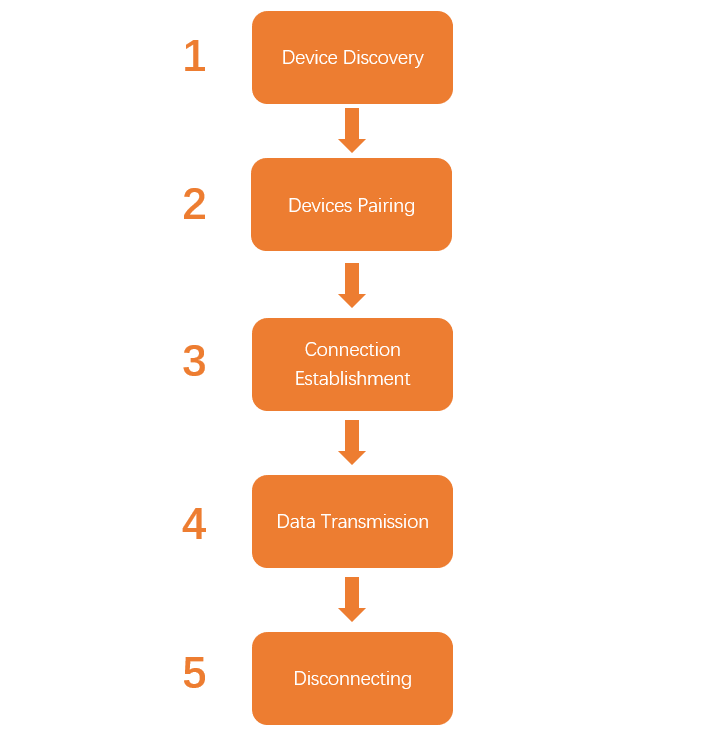
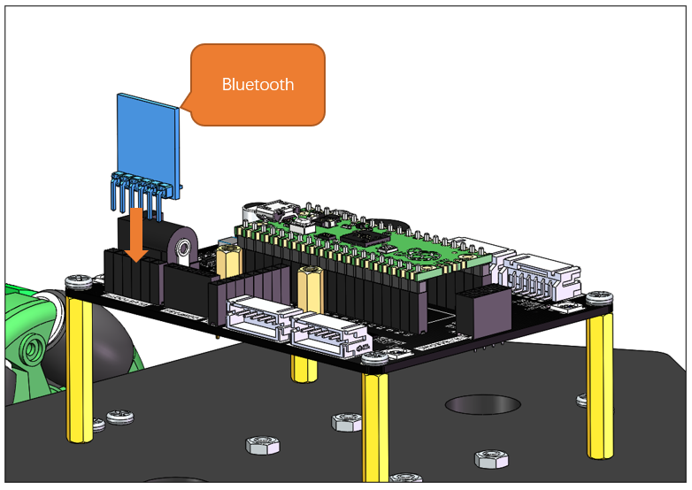
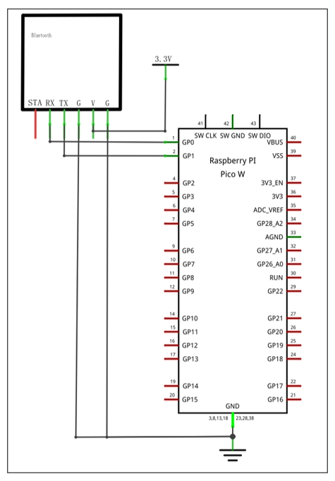
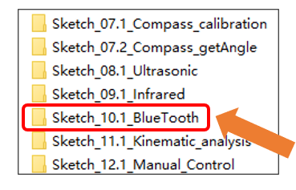
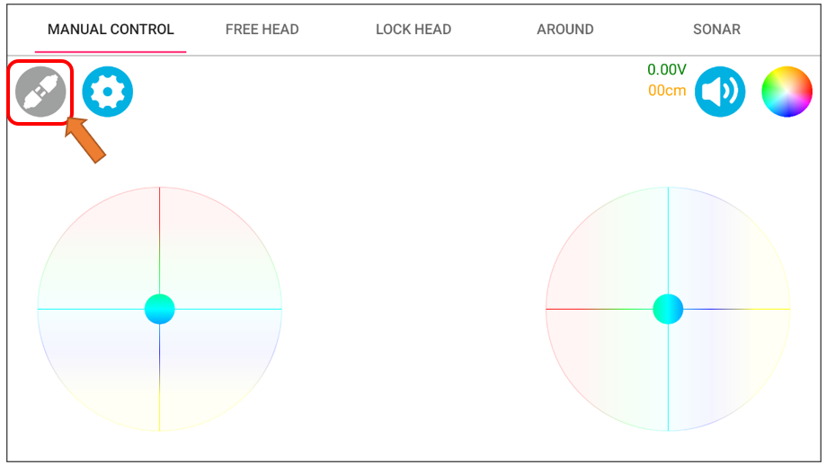
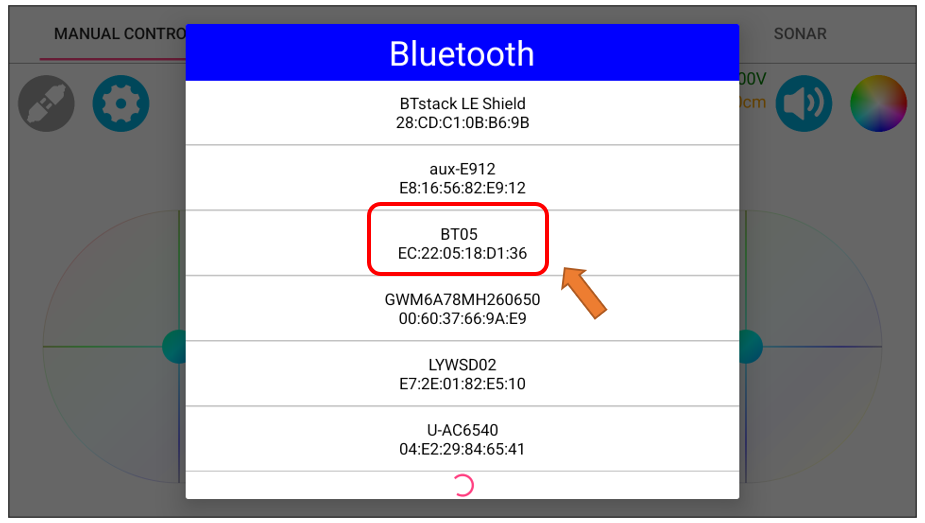
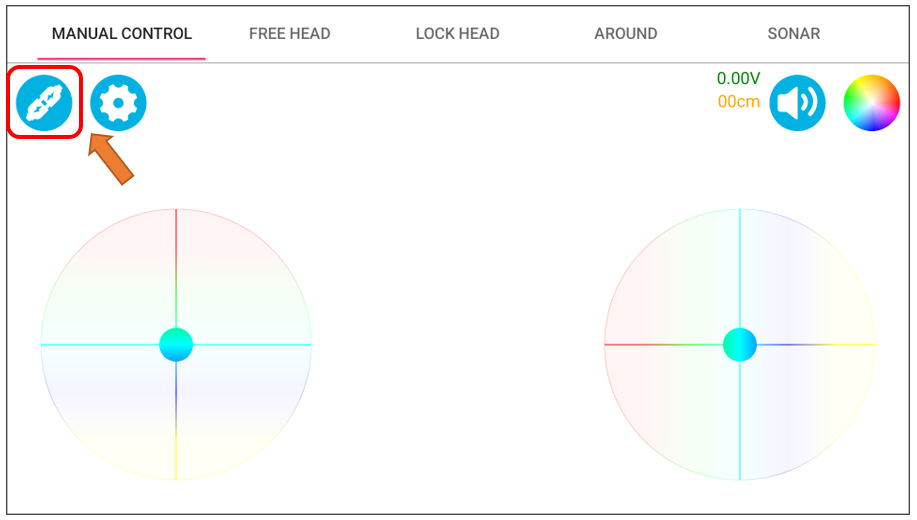

##############################################################################
Chapter 12 Bluetooth Test
##############################################################################

In earlier lessons, we explored wired serial communication. Yet, this approach is tethered to physical data cables, significantly constraining its potential use cases. Now, let's delve into Bluetooth modules, which facilitate wireless communication. We'll utilize a Bluetooth module to fetch commands from the Freenove APP and display them on the serial monitor.

Component Knowledge
************************************

Bluetooth
========================================

Bluetooth modules are devices designed for wireless communication, capable of transmitting data over short distances with the aim of facilitating low-power data transfer between devices. They rely on radio frequency signals, predominantly functioning in the 2.4 GHz band. This frequency spectrum is internationally recognized, ensuring compatibility and connectivity across various geographical locations.

The port description of the Bluetooth module is as follows:

.. table:: 
    :class: freenove-ow

    +----------+-------------------------------------------------+
    | Pin name |                   Description                   |
    +==========+=================================================+
    | STA      | The pin indicates the connection status.        |
    +----------+-------------------------------------------------+
    | RX       | The pin receives Bluetooth data.                |
    +----------+-------------------------------------------------+
    | TX       | The pin sends Bluetooth data.                   |
    +----------+-------------------------------------------------+
    | VCC(V)   | Positive pole of power supply with voltage 3.3V |
    +----------+-------------------------------------------------+
    | GND(G)   | Negative pole of power supply                   |
    +----------+-------------------------------------------------+

Steps of Bluetooth Communication
========================================

The process that the Bluetooth realize wireless communication can be simplified to the following steps:

1.	Device Discovery

When the Bluetooth feature of a device is activated, it initiates a process known as "device discovery." During this phase, the device broadcasts wireless signals to inquire if there are any nearby Bluetooth-enabled devices available for connection.

2.	 Devices Pairing

After identifying connectable devices, users must proceed with pairing. Pairing is akin to establishing a password for the devices, ensuring that only authorized devices can establish a connection.

3.	Connection Establishment

Once the pairing is successfully completed, a connection is established between the devices. The Bluetooth protocol ensures that data can be transmitted smoothly. Bluetooth utilizes a technique known as "frequency hopping spread spectrum" (FHSS), rapidly switching between multiple frequencies, which reduces interference and enhances the stability of the connection.

4.	Data Transmission

After the connection is established, devices can commence data exchange. Data is divided into packets and sent via wireless signals. The Bluetooth protocol manages these packets, ensuring they arrive at the receiving device intact and error-free.

5.	Disconnecting 

Once the data transmission is complete, devices can opt to disconnect. They will revert to the pairing mode, awaiting new connection requests.

Circuit
**********************************

Correctly plug the Bluetooth module to the car.

Schematic
**********************************

As shown in the schematic below, the RXD and TXD pins of the Bluetooth module connects Pico (W)'s GP0 and GP1.

Sketch
**********************************

Open "Sketch_10.1_Bluetooth" folder in **"Freenove_Omni_Wheel_Car_Kit_for_Raspberry_Pi_Pico\\Four-Wheel\\Sketches"** and then double-click **"Sketch_10.1_Bluetooth.ino".** 

Code
=================================

.. literalinclude:: ../../../freenove_Kit/Four-Wheel/Sketch/Sketch_10.1_BlueTooth/Sketch_10.1_BlueTooth.ino
   :linenos:
   :language: c
   :dedent:

Connection
=================================

Open Freenove APP and tap the omniwheel Car Kit. 

If you have not installed the Freenove APP to your phone, please refer to :ref:`fnk0097/codes/four_wheel/freenove_app:freenove app`

Step 1: Click the connection icon on the left.

Step 2: Select the device named BT05. At this point, the blue indicator on the Bluetooth module blinks every one second, indicating it is waiting for pairing.

Step 3: When the connection icon turn blue and the indicator on the Bluetooth module blink rapidly, it indicates that the devices pair successfully.

