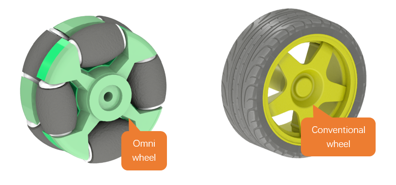
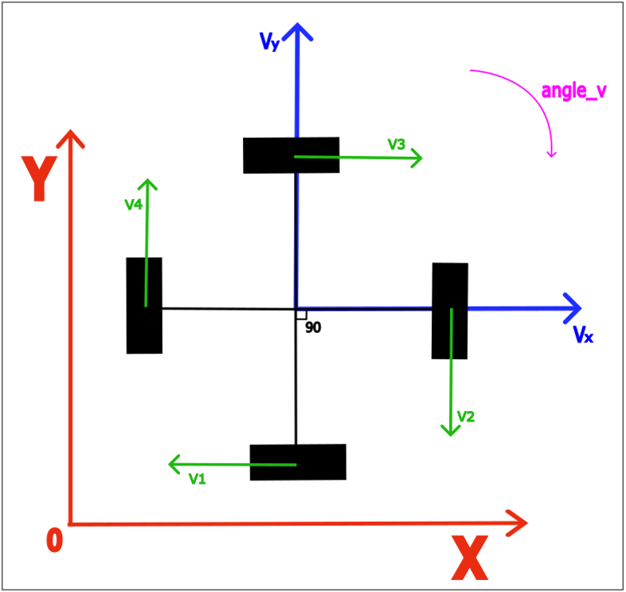
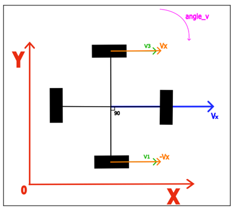
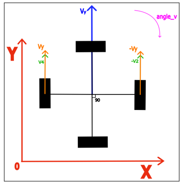
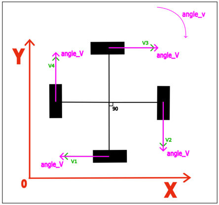
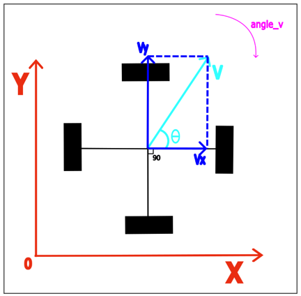
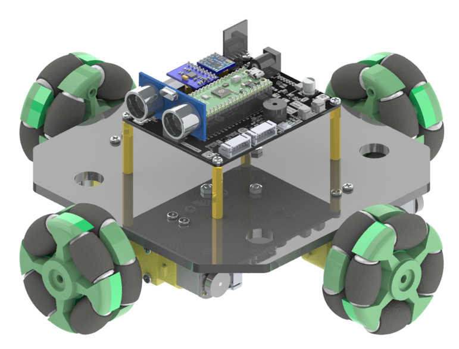
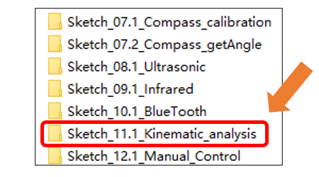

##############################################################################
Chapter 13 Kinematic Analysis
##############################################################################

In this chapter, we will get to know the speciality of omni wheels and how an omni-wheeled car can move in any direction.

Related Knowledge
******************************

Omni Wheels
==============================

Omni wheels are a unique type of wheel that can move freely in any direction, not just linearly forward or backward. Unlike conventional wheels, omni wheels consist of two layers, and they feature a ring of small rollers around the perimeter that can spin freely.

As shown in the figure below, the left one is an omni wheel and the right one is a conventional wheel.

Attitude Calculation of Omni-Wheeled Car
============================================

Omni wheels are specially designed to move freely in multiple directions, but a single or pair of these wheels alone cannot accomplish true omnidirectional movement. It is only through the coordinated action of three or more omni wheels that full omnidirectional capability is achieved. The design of an omni wheel enables it to exert force in various directions, yet a mere one or two wheels cannot provide the necessary support and control in all directions simultaneously. Each wheel of an omni wheeled robot car can independently control its rotational speed and direction, thereby enabling a variety of complex motion patterns, including straight-line movements, rotations, and diagonal motions.

The following figure shows the attitude analysis of the omni-wheeled car.

The symbols and their meaning are as described in the following table.

.. table:: 
    :class: freenove-ow

    +---------+----------------------------------------------------------+
    | Symbols |                         Meaning                          |
    +=========+==========================================================+
    | X       | The X-axis of the Absolute Coordinate System             |
    +---------+----------------------------------------------------------+
    | Y       | The Y-axis of the Absolute Coordinate System             |
    +---------+----------------------------------------------------------+
    | Vx      | The Decomposition of the Car's Total Speed on the X-axis |
    +---------+----------------------------------------------------------+
    | Vy      | The Decomposition of the Car's Total Speed on the Y-axis |
    +---------+----------------------------------------------------------+
    | V1      | The Total Speed of Wheel 1                               |
    +---------+----------------------------------------------------------+
    | V2      | The Total Speed of Wheel 2                               |
    +---------+----------------------------------------------------------+
    | V3      | The Total Speed of Wheel 3                               |
    +---------+----------------------------------------------------------+
    | V4      | The Total Speed of Wheel 4                               |
    +---------+----------------------------------------------------------+
    | angle_v | The Car's Angular Velocity                               |
    +---------+----------------------------------------------------------+

Let us decompose the motion of the car and compute the velocity of its four wheels individually.

1. When the car moves purely along the X-axis, it has no velocity component along the Y-axis, as illustrated in the figure below:

.. math:: 

    &\boldsymbol{v_1 = -V_x}
    
    &\boldsymbol{v_2 = 0}
    
    &\boldsymbol{v_3 = V_x}

    &\boldsymbol{v_4 = 0}

2.	When the car moves purely along the Y-axis, it has no velocity component along the X-axis, as illustrated in the figure below:

.. math:: 

    &\boldsymbol{v_1 = 0}
    
    &\boldsymbol{v_2 = -V_y}
    
    &\boldsymbol{v_3 = 0}

    &\boldsymbol{v_4 = V_y}

3.	When the car is only performing rotational movement.

.. math:: 

    &\boldsymbol{v_1 = angle_v}

    &\boldsymbol{v_2 = angle_v}

    &\boldsymbol{v_3 = angle_v}

    &\boldsymbol{v_4 = angle_v}

By superimposing the three situations, we can derive the motion equation for the car as follows:

.. math:: 

    &\boldsymbol{v_1 = -V_x + angle_v}

    &\boldsymbol{v_2 = -V_y + angle_v}

    &\boldsymbol{v_3 = V_x + angle_v}

    &\boldsymbol{v_4 = V_y + angle_v}

When the car moves in the direction of θ, the values of Vx and Vy can be determined by decomposing the velocity vector:

.. math:: 

    &\boldsymbol{V_x = -V \cdot \sin \theta}
    
    &\boldsymbol{V_y = V \cdot \cos \theta}

Here, V represents the car's total speed, and θ is the angle of the car's translation in the XY plane, with the positive direction of the X-axis as the reference.

Circuit
*********************************

For this chapter, we use the assembled car. Please refer to :ref:`fnk0097/codes/four_wheel/1_car_assembly:chapter 1 car assembly` for the detailed assembly process.

Sketch
*********************************

Next, we download the code to Raspberry Pi Pico (W) to examine the attitude calculation. Open **"Sketch_11.1_Kinematic_analysis"** folder under **"Freenove_Omni_Wheel_Car_Kit_for_Raspberry_Pi_Pico\\Four-Wheel\\Sketches"** and double-click **"Sketch_11.1_Kinematic_analysis.ino"**. 

Code
================================

Sketch_11.1_Kinematic_analysis.ino
---------------------------------------

.. literalinclude:: ../../../freenove_Kit/Four-Wheel/Sketch/Sketch_11.1_Kinematic_analysis/Sketch_11.1_Kinematic_analysis.ino
   :linenos:
   :language: c
   :dedent:

After downloading the code, put the car on the floor, turn ON the power switch of the car, and you will see to car sequentially perform the actions of moving forward, moving backward, moving left, moving right, moving at a 45-degree angle to the left, moving at a 45-degree angle to the right, moving at a 135-degree angle to the left, and moving at a 135-degree angle to the right.

Code Explanation
-----------------------------------

When the Motor_init() function is called, pico enables the motors' pins to output mode. 

.. literalinclude:: ../../../freenove_Kit/Four-Wheel/Sketch/Sketch_11.1_Kinematic_analysis/Sketch_11.1_Kinematic_analysis.ino
   :linenos:
   :language: c
   :lines: 81-94
   :dedent:

The function Motor_Control() calculates the velocity of each wheel.

.. literalinclude:: ../../../freenove_Kit/Four-Wheel/Sketch/Sketch_11.1_Kinematic_analysis/Sketch_11.1_Kinematic_analysis.ino
   :linenos:
   :language: c
   :lines: 48-59
   :dedent:

The function Motor_Control() is called under the loop function to control the car's movement.

.. literalinclude:: ../../../freenove_Kit/Four-Wheel/Sketch/Sketch_11.1_Kinematic_analysis/Sketch_11.1_Kinematic_analysis.ino
   :linenos:
   :language: c
   :lines: 42-42
   :dedent:

Reference
------------------------

.. py:function:: double sqrt(double x);

    This function is used to calculate the square root of a number.

.. py:function:: void Motor_Control (int speed_v,int speed_a);

    The function is used to control the movement of the car.

    speed_v: the speed of the car's translation, ranging from -255 to 255.
    
    speed_a: the direction of the car's movement, in degrees, ranging from -180 to 180.