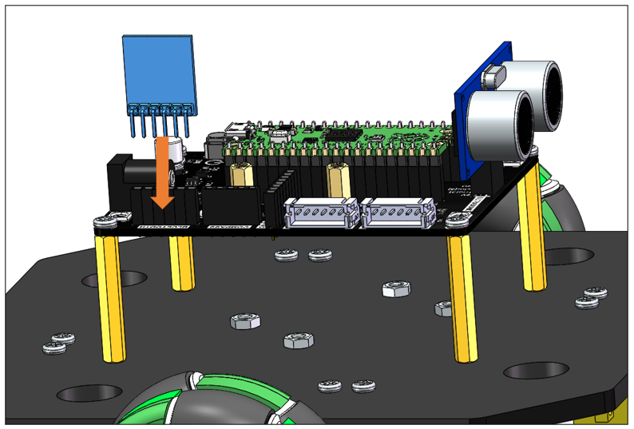
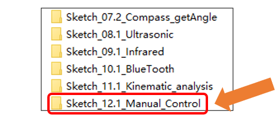
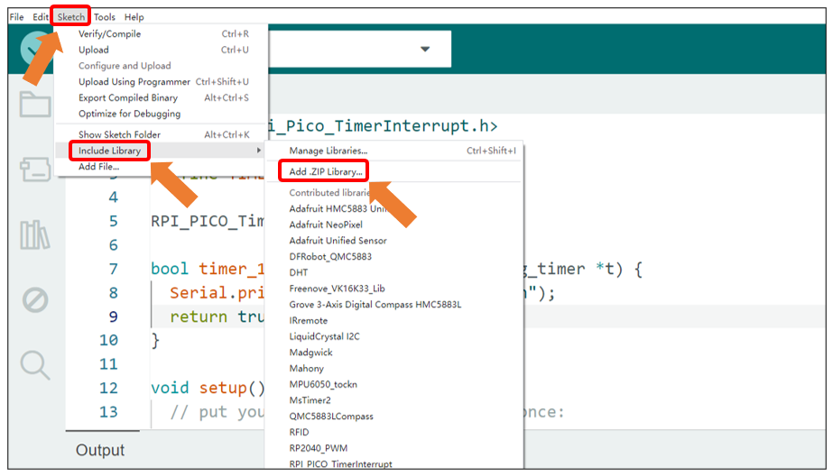
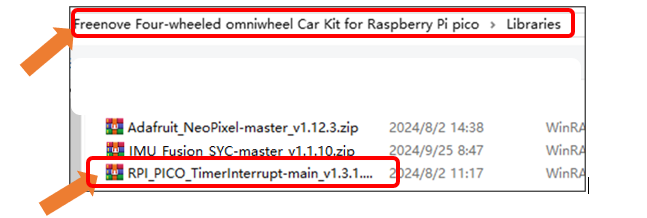
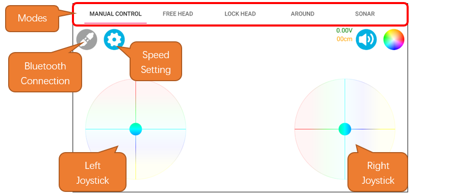
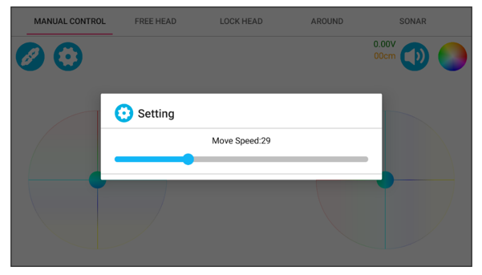
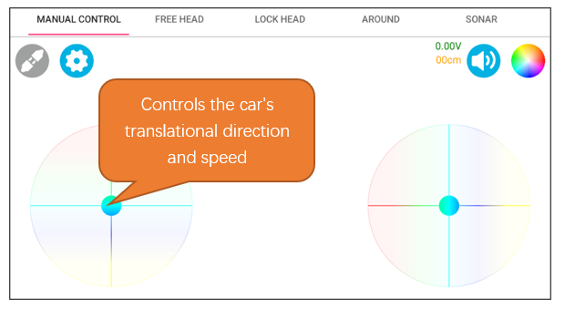
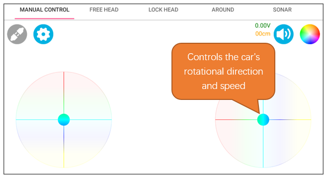
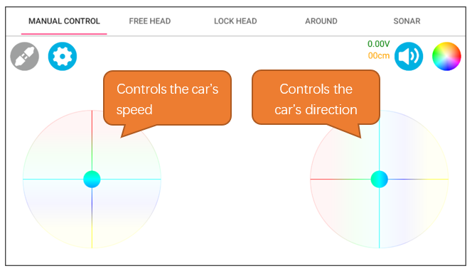

##############################################################################
Chapter 14 Manual Control
##############################################################################

In the Head Mode, the car's forward direction is based on the orientation of the ultrasonic module, and it can translate in various directions. For controlling the movement, the left joystick modulates the car's translational direction and speed, whereas the right joystick governs the car's rotational direction and velocity. Operating both joysticks simultaneously enables the car to execute circular movements.

Circuit
********************************

In this chapter, we use the assembled car with the Bluetooth module connected. Please refer to :ref:`fnk0097/codes/four_wheel/1_car_assembly:chapter 1 car assembly` for the detailed assembly process.

Sketch
********************************

Open **"Sketch_12.1_Manual_Control" folder in "Freenove Four-wheeled omniwheel Car Kit for Raspberry Pi pico\Sketches"** and then double-click **"Sketch_12.1_Manual Control.ino".** 

 
Open Arduino IDE, click Sketch on Menu bar -> Include Library -> Add .ZIP library. 

Open **"RPI_PICO_TimerInterrupt-main_v1.3.1.zip"** under the directory **"Freenove Four-wheeled omniwheel Car Kit for Raspberry Pi pico\\Libraries".**

Code
=============================

Sketch_12.1_Manual_Control
------------------------------

.. literalinclude:: ../../../freenove_Kit/Four-Wheel/Sketch/Sketch_12.1_Manual_Control/Sketch_12.1_Manual_Control.ino
    :linenos:
    :language: c
    :dedent:

Motor.cpp
-----------------------------

.. literalinclude:: ../../../freenove_Kit/Four-Wheel/Sketch/Sketch_12.1_Manual_Control/Motor.cpp
    :linenos:
    :language: c
    :lines: 65-83
    :dedent:

After downloading the code, open Freenove APP on your phone and connect it to the Bluetooth of the car. For installing the APP and connecting Bluetooth, please refer to :ref:`fnk0097/codes/four_wheel/freenove_app:introduction to the app`

Interface Introduction
-----------------------------

Operation Description
-----------------------------

At the speed setting interface, you can set the maximum speed of the car. The range is from 0 to 100.

When only the left joystick is operated, it controls the car's translational direction and speed. When it is released, the car stops moving.

When only the right joystick is operated, it controls the car's rotational direction and speed. When it is released, the car stops moving.

Operating both joysticks simultaneously enables the car to execute circular movements, with the left controls the speed and the right controls the direction.

Code Explanation
---------------------------

Call the 'Get_Command()' function to parse the commands sent by the APP, storing integer data into the 'parameters' array and character data into the 'cmdArray' array.

.. literalinclude:: ../../../freenove_Kit/Four-Wheel/Sketch/Sketch_12.1_Manual_Control/Sketch_12.1_Manual_Control.ino
    :linenos:
    :language: c
    :lines: 109-125
    :dedent:

Call the 'Car_Control()' function to control the car to perform corresponding actions according to the commands. For specific command protocols, please refer to the FNK0097 firmware communication protocol.

.. literalinclude:: ../../../freenove_Kit/Four-Wheel/Sketch/Sketch_12.1_Manual_Control/Sketch_12.1_Manual_Control.ino
    :linenos:
    :language: c
    :lines: 29-45
    :dedent:

Calculate the current speed of the car every 15 milliseconds and call the function 'Turn_Control()' to control the movement of the car.

.. literalinclude:: ../../../freenove_Kit/Four-Wheel/Sketch/Sketch_12.1_Manual_Control/Sketch_12.1_Manual_Control.ino
    :linenos:
    :language: c
    :lines: 53-56
    :dedent:

Perform kinematic decomposition on the car to calculate the speed of each wheel and incorporate PID control.

.. literalinclude:: ../../../freenove_Kit/Four-Wheel/Sketch/Sketch_12.1_Manual_Control/Motor.cpp
    :linenos:
    :language: c
    :lines: 65-83
    :dedent:

Reference
--------------------

.. py:function:: char *strtok(char *str, const char *delim);

    This function is used to split a string into substrings based on a delimiter.
    
    Str: The string to be split.
    
    Delim: The delimiter character.

.. py:function:: int atoi(const char *str);

    This function is used to convert a string to an integer.
    
    Str: The string representing the number to be converted.

.. py:function:: void Turn_Control(int speed_v,int speed_a,int angle_v,int location);

    This function is used to control the car's movement.

    **Parameters:**
    
    speed_v: The movement velocity of the car.
    
    speed_a: The movement angle of the car.
    
    angle_v: The angular velocity of the car.
    
    location: The direction in which the car is turning.