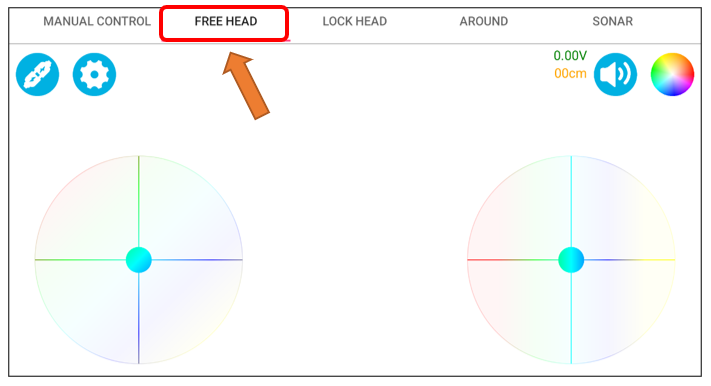

##############################################################################
Chapter 15 Free Head Mode
##############################################################################

In Free Head Mode, the car's movement is not dictated by its own heading but is aligned with an absolute spatial direction. Upon switching to this mode, the system automatically adopts the current orientation of the ultrasonic module as the forward direction for the car. Tapping the Free head mode icon again allows for realignment of the forward direction. In controlling the car, the left joystick modulates the car's translational angle and velocity, whereas the right joystick governs the car's rotational direction and speed. Operating both joysticks simultaneously enables the car to execute a movement that combines rotation with omnidirectional motion.

Related Knowledge
************************************

Digital Compass and Gyroscope Data Fusion 
============================================

We have previously discussed the methods for obtaining angles from electronic compasses and gyroscopes. Each of these sensors has its own strengths, but they also face certain limitations when used separately. Gyroscopes are known for their good dynamic response and resistance to noise interference, but they are prone to drift at zero points. Conversely, digital compasses provide better performance in static conditions, yet they can be susceptible to instability in their outputs due to noise from motor startups, resulting in vehicle drift. Thus, by effectively integrating the data from both sensors, we can enhance the precision and reliability of posture estimation.

.. table:: 
    :class: freenove-ow

    +-----------+----------------------+-----------------------------------------------------------------+------------------------------------+
    |  Sensors  |  Final Output Value  |                           Advantages                            |             Drawbacks              |
    +===========+======================+=================================================================+====================================+
    | Gyroscope | Rotational Angle     | good dynamic response and strong anti-interference capabilities | Zero Drift                         |
    +-----------+----------------------+-----------------------------------------------------------------+------------------------------------+
    | Compass   | Magnetic Field Angle | good static response and high accuracy                          | Bad anti-interference capabilities |
    +-----------+----------------------+-----------------------------------------------------------------+------------------------------------+

To learn more about data fusion, you may refer to `IMU_Fusion_SYC <https://github.com/Vegetable-SYC/IMU_Fusion_SYC>`__

Circuit
*******************************

Connect the Bluetooth module, gyroscope, and digital compass to the assembled car.

For detailed assembly process of the car, please refer to :ref:`fnk0097/codes/four_wheel/1_car_assembly:chapter 1 car assembly`

Sketch
********************************

Open **"Sketch_13.1_Free_head"** folder in **"Freenove_Omni_Wheel_Car_Kit_for_Raspberry_Pi_Pico\\Four-Wheel\\Sketches"** and then double-click **"Sketch_13.1_Free_head.ino"**. 

Code
================================

Sketch_13.1_Free_head.ino
------------------------------

.. literalinclude:: ../../../freenove_Kit/Four-Wheel/Sketch/Sketch_13.1_Free_head/Sketch_13.1_Free_head.ino
    :linenos:
    :language: c
    :dedent:

Angle.cpp
---------------------------------

.. literalinclude:: ../../../freenove_Kit/Four-Wheel/Sketch/Sketch_13.1_Free_head/Angle.cpp
    :linenos:
    :language: c
    :dedent:

Motor.cpp
---------------------------------

.. literalinclude:: ../../../freenove_Kit/Four-Wheel/Sketch/Sketch_13.1_Free_head/Motor.cpp
    :linenos:
    :language: c
    :dedent:

Before uploading the sketch, please make sure the IMU_Fusion_SYC library has been installed, so that the functions and tools it provides can be used. If the library was not installed yet, please refer to `IMU_Fusion_SYC <https://github.com/Vegetable-SYC/IMU_Fusion_SYC>`__. 

After downloading the code, open Freenove APP and click the connection icon to connect the Bluetooth. For installing the APP and Bluetooth connection, please refer to :ref:`fnk0097/codes/four_wheel/freenove_app:introduction to the app`.

:combo:`red font-bolder:Caution: Digital compasses are very sensitive to magnetic disturbances. After adding additional modules near the compass, it is essential to recalibrate it. Failure to do so may result in unstable operation of the car!`

If you need any support, please feel free to contact us via: support@freenove.com

Interface Introduction
---------------------------

Operation Description
---------------------------

At the speed setting interface, you can set the maximum speed of the car. The range is from 0 to 100.

When only the left joystick is operated, it controls the car's translational direction and speed. When it is released, the car stops moving.

When only the right joystick is operated, it controls the car's rotational direction and speed. When it is released, the car stops moving.

Operating both joysticks simultaneously enables the car to execute circular movements, with the left controls the speed and the right controls the direction.

Tap the FREE HEAD button again will change the direction of the car's head to the current direction.

Code Explanation
---------------------------

Call the function IMU_GetData() to obtain the fused angle data. Accumulate the obtained angles and calculate the average multiple times to achieve a more stable fused angle.

.. literalinclude:: ../../../freenove_Kit/Four-Wheel/Sketch/Sketch_13.1_Free_head/Angle.cpp
    :linenos:
    :language: c
    :lines: 19-23
    :dedent:

Call the Car_2_Control() function to control the car to perform specific actions. Enumerate the possible operations of the joystick and set the corresponding motion logic based on different states.

.. literalinclude:: ../../../freenove_Kit/Four-Wheel/Sketch/Sketch_13.1_Free_head/Sketch_13.1_Free_head.ino
    :linenos:
    :language: c
    :lines: 56-92
    :dedent:

Reference
--------------------------

.. py:function:: IMU::Calculate()

    This function is located in the IMU_Fusion_SYC library, which is called to calculate various angle data.

.. py:function:: IMU::getAccMagnitude()

    This function is located in the IMU_Fusion_SYC library, which is called to calculate the current acceleration.

.. py:function:: IMU::Data_Fusion()	

    This function is located in the IMU_Fusion_SYC library, which is called to compute the angles after data fusion from sensors such as the MPU6050 and QMC5883L