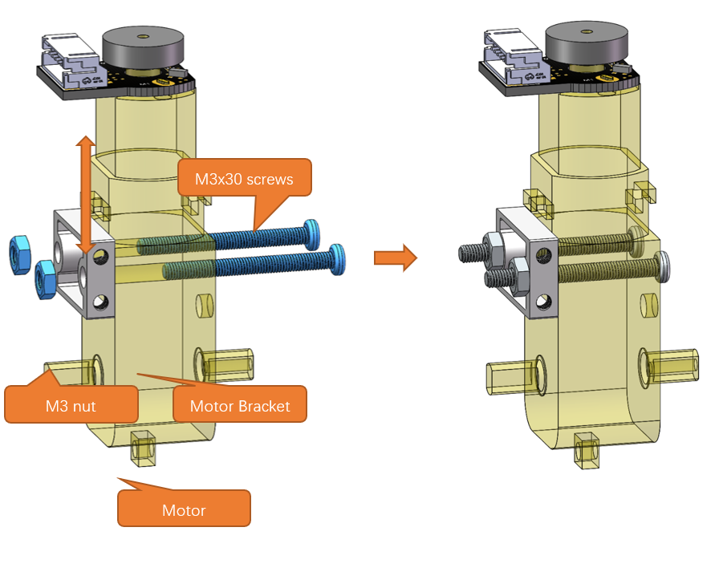

##############################################################################
Chapter 1 Car Assembly
##############################################################################

Before assembling the car, please check the part list to ensure they are complete.

If you have any concerns, please feel free to contact us via support@freenove.com

Assembling the Car
**********************************

Distinguish the top and bottom sides of the car chassis.
=================================================================

The bottom plate of the car has a distinction between the top and bottom, which can be distinguished through the holes on the car. Here is a schematic diagram:

.. table:: 
    :align: center

    +----------------+
    | Top:           |
    |                |
    | |Chapter01_31| |
    +----------------+
    | Bottom:        |
    |                |
    | |Chapter01_32| |
    +----------------+

Installing Motor and Wheels
------------------------------------

There are 3 bracket packages to fix motors, each containing an aluminum bracket, two M3*30 screws, two M3*8 screws and two M3 nuts. The parts of each set are as shown below:

Installation steps:

+------------------------------------------------------------------------------------------------------------+
| Step 1 Motor Assembly                                                                                      |
|                                                                                                            |
| Mount the motor bracket to the motor with two M3x30 screws and two M3 nuts. Please note that the connect   |
|                                                                                                            |
| or of the encoder should be at the same side of the motor bracket, as shown below:                         |
|                                                                                                            |
| |Chapter01_03|                                                                                             |
+------------------------------------------------------------------------------------------------------------+
| Step 2: Mount the motors to the bottom plate with two M3x8 screws.                                         |
|                                                                                                            |
| Please note that the motor bracket should be inward and the motor axis is facing out at the center of the  |
|                                                                                                            |
| board edge, as shown below:                                                                                |
|                                                                                                            |
| |Chapter01_33|                                                                                             |
|                                                                                                            |
| After assembly:                                                                                            |
|                                                                                                            |
| |Chapter01_34|                                                                                             |
+------------------------------------------------------------------------------------------------------------+
| Step 3: Wheel assembly                                                                                     |
|                                                                                                            |
| Fix the omni wheels to the car with the accompanying coupling and screw.                                   |
|                                                                                                            |
| |Chapter01_35|                                                                                             |
|                                                                                                            |
| After assembly:                                                                                            |
|                                                                                                            |
| |Chapter01_36|                                                                                             |
+------------------------------------------------------------------------------------------------------------+
| Step 4: Repeat the above steps to assemble the other two motors and wheels.                                |
|                                                                                                            |
| After assembly:                                                                                            |
|                                                                                                            |
| |Chapter01_37|                                                                                             |
+------------------------------------------------------------------------------------------------------------+

Battery Holder Assembly
----------------------------------

+----------------------------------------------------------------------------+
| Step 1: Battery holder assembly                                            |
|                                                                            |
| 1. Put the battery holder on the back of the car chassis.                  |
|                                                                            |
| 2. Mount the battery holder to the plate with four M3x10 flat-head screws. |
|                                                                            |
| |Chapter01_38|                                                             |
+----------------------------------------------------------------------------+
| Step2: Fix it with four M3 nuts.                                           |
|                                                                            |
| |Chapter01_39|                                                             |
|                                                                            |
| After assembly:                                                            |
|                                                                            |
| |Chapter01_40|                                                             |
+----------------------------------------------------------------------------+

Expansion Board Assembly
----------------------------------

+--------------------------------------------------------------------------------------+
| Step 1: Standoffs Installation                                                       |
|                                                                                      |
| 1. Put two M3x11 standoffs on the expansion board.                                   |
|                                                                                      |
| 2. Fix the standoffs with two M3x8 screws.                                           |
|                                                                                      |
| |Chapter01_11|                                                                       |
|                                                                                      |
| After assembly:                                                                      |
|                                                                                      |
| |Chapter01_12|                                                                       |
+--------------------------------------------------------------------------------------+
| Step 2: Plug in the Raspberry Pi Pico (or Raspberry Pi Pico W/ Raspberry Pi Pico 2)  |
|                                                                                      |
| |Chapter01_13|                                                                       |
|                                                                                      |
| |Chapter01_14|                                                                       |
|                                                                                      |
| After assembly:                                                                      |
|                                                                                      |
| |Chapter01_15|                                                                       |
|                                                                                      |
| **Caution:** The Raspberry Pi Pico (W) has a specific orientation for installation.  |
|                                                                                      |
| Ensure correct placement based on the markings on the expansion board.               |
|                                                                                      |
| Improper installation may result in damage to the Raspberry Pi Pico (W).             |
+--------------------------------------------------------------------------------------+
| Step 3: Plug in four peripheral modules.                                             |
|                                                                                      |
| |Chapter01_16|                                                                       |
|                                                                                      |
| After assembly:                                                                      |
|                                                                                      |
| |Chapter01_17|                                                                       |
+--------------------------------------------------------------------------------------+

Mounting the Expansion Board to Car Chassis
-----------------------------------------------

+--------------------------------------------------------------------------+
| Step 1: Installing four M3x30 standoffs.                                 |
|                                                                          |
| 1. Put four M3x30 standoffs on the top of the chassis.                   |
|                                                                          |
| 2. Tighten with four M3x8 screws.                                        |
|                                                                          |
| |Chapter01_41|                                                           |
|                                                                          |
| After assembly:                                                          |
|                                                                          |
| |Chapter01_42|                                                           |
+--------------------------------------------------------------------------+
| Step 2: Fix the expansion board to the standoffs with four M3x8 screws.  |
|                                                                          |
| |Chapter01_43|                                                           |
|                                                                          |
| After assembly:                                                          |
|                                                                          |
| |Chapter01_44|                                                           |
+--------------------------------------------------------------------------+

.. |Chapter01_41| image:: ../../codes/_static/imgs/1_Car_Assembly/Chapter01_18.png

Wires Connection
----------------------------

:red:`Caution: In the diagram above, the orange wires are motor wires and the blue ones are power cables.`

Installing two 18650 batteries
-----------------------------------

**Please follow the steps to install the batteries. Reverse installation of batteries may damage the board.**

**If you have any concerns, please feel free to contact us via support@freenove.com**

+----------------------------------------------------------------+
| Step 1: Distinguishing positive and negative of the batteries. |
|                                                                |
| |Chapter01_24|                                                 |
+----------------------------------------------------------------+
| Step 2: Correctly install the batteries.                       |
|                                                                |
| |Chapter01_46|                                                 |
+----------------------------------------------------------------+
| Step3: Install the cover for battery holder.                   |
|                                                                |
| |Chapter01_47|                                                 |
+----------------------------------------------------------------+

Library Installation
************************************

Before uploading the code, we need to include the necessary libraries first to use the functions and tools they provide. This section will introduce how to include libraries on Arduino IDE.

Here are two ways to do it. Method 2 is preferred.

Method 1
=======================================

Open Arduino IDE, click **Sketch on** Menu bar -> **Include Library** -> **Manage Libraries.**

There is an input field on the right top of the pop-up window. Enter **Rpi_Pico_TimerInterrupt** there and click to install the library boxed in the following figure.

Wait for the installation to finish.

Method 2
=====================================

Open Arduino IDE, click **Sketch** on Menu bar -> **Include Library** -> **Add .ZIP library.** 

On the pop-up window, select RPI_PICO_TimerInterrupt-main.zip in Libraries folder under "car_4_wheel\\Libraries", and then click Open.

