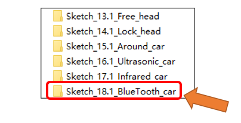

##############################################################################
Chapter 20 Bluetooth Car
##############################################################################

Next, let us integrate the functionalities and modules learned in previous chapters using a Bluetooth module, so as to control most features of the car with the phone APP.

Sketch
*****************************

Open **“Sketch_18.1_Bluetooth_car”** folder in **“Freenove_Omni_Wheel_Car_Kit_for_Raspberry_Pi_Pico\\Four-Wheel\\Sketches”** and then double-click **“Sketch_18.1_Bluetooth_car.ino”.** 

Code
=============================

Sketch_18.1_Bluetooth_car.ino
------------------------------------

.. literalinclude:: ../../../freenove_Kit/Four-Wheel/Sketch/Sketch_18.1_BlueTooth_car/Sketch_18.1_BlueTooth_car.ino
    :linenos:
    :language: c
    :dedent:

After compiling and uploading the sketch, you can control the car's modes and functionalities with the phone app via Bluetooth. To install the APP, please refer to :ref:`fnk0097/codes/four_wheel/freenove_app:freenove app`

If you need any support, please feel free to contact us via: support@freenove.com