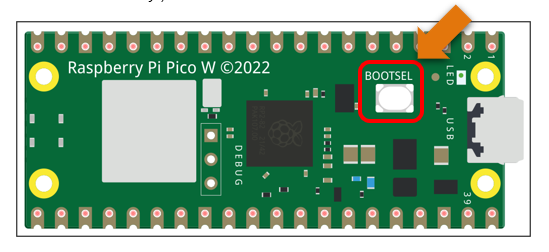
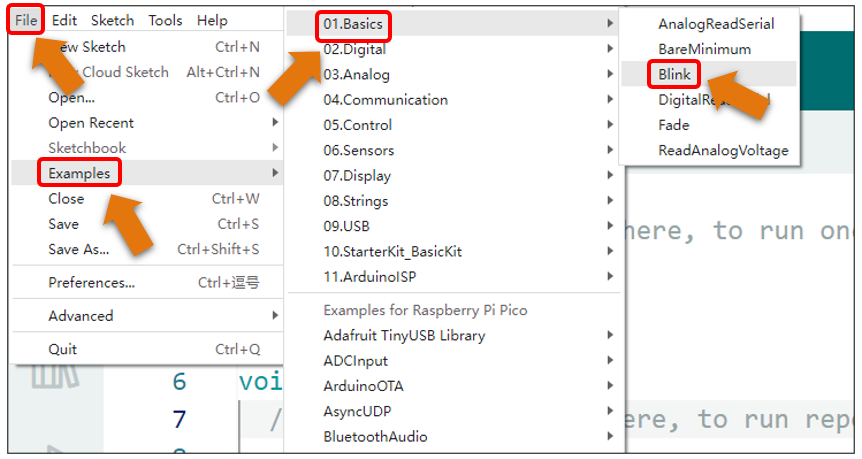
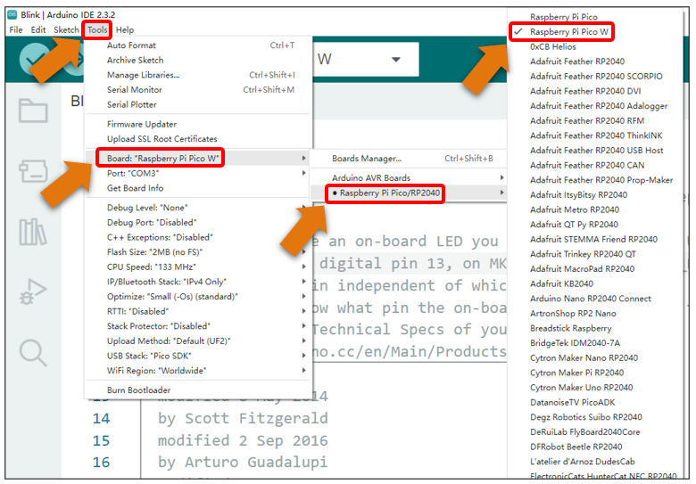
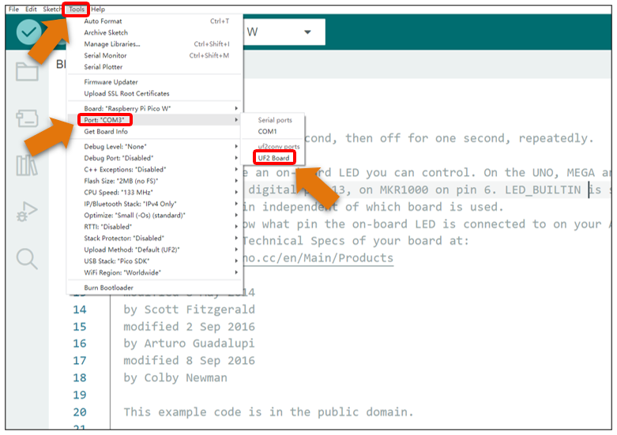
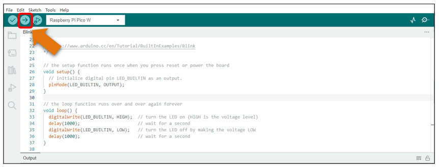
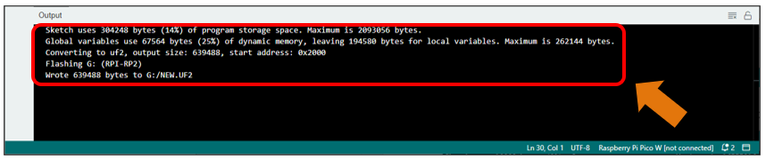
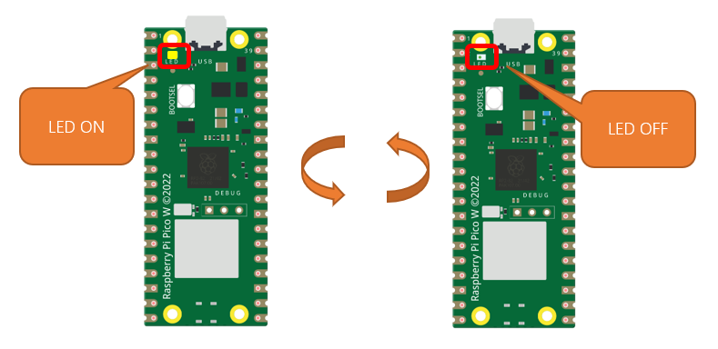

##############################################################################
Chapter 2 Uploading First Sketch (LED Blink)
##############################################################################

Uploading Arduino-compatible Firmware for Raspberry Pi Pico (W) 

To program a new Raspberry Pi Pico (W) with Arduino, you need to upload an Arduino-compatible Firmware for it. Please refer to the following steps to configure.

1. Disconnect Pico (W) from your computer. Press and hold the white button (BOOTSEL) on Pico (W) while connecting it to your computer. (Note: Be sure to hold the button before powering the Pico, otherwise the firmware will not download successfully.)

2. Open Arduino IDE. Click File > Examples > 01.Basics > Blink. 

3. Click Tools > Board > Raspberry Pi RP2040 Boards > Raspberry Pi Pico W. 

4. Click Tools > Port > UF2 Board. 

5. Upload sketch to Raspberry Pi Pico W.

When the sketch finishes uploading, you can see messages as below.

The indicator on Pico W starts to flash.

5. Click Tools > Port > COMx (Raspberry Pi Pico W). X of COMx varies from different computers. Please select the correct one on your computer. In our case, it is COM3. 

.. note::

   1. :red:`At the first use of Arduino to upload sketch for Pico (W), you need to select a port on the UF2 board. After that, each time before uploading sketch, please check whether the port has bed selected; otherwise, the downloading may fail.`

   2. :red:`Sometimes, Pico (W) may lose firmware due to the code and fail to work. At this point, you can upload firmware for Pico (W) as mentioned above.`

   3. :red:`Please note that after uploading the first code to Pico, the port UF2_Board will disappear and Pico will create a virtual serial port. Taking Windows system as an example, as shown in the figure above, a port named COMx shows up. Here, x represents a number. The value of x may vary among different computers.`