##############################################################################
Chapter 4 Motor Test 
##############################################################################

4.1 Motor
***********************************

Related Knowledge
===================================

Motor
-----------------------------------

A motor is a device that converts electrical energy into mechanical energy. Motor consists of two parts: stator and rotor. When motor works, the stationary part is stator, and the rotating part is rotor. Stator is usually the outer case of motor, and it has terminals to connect to the power. Rotor is usually the shaft of motor, and can drive other mechanical devices to run. Diagram below is a small DC motor with two pins.

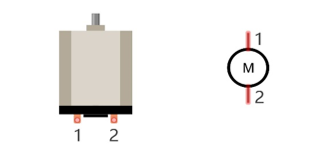

When a motor is connected to the power supply, it will rotate in one direction. Reverse the polarity of power supply, then the motor rotates in opposite direction.

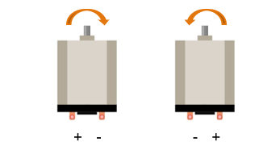

DRV8837
-----------------------------------

The DRV8837 is a DC motor driver chip that can control the motor's forward rotation, reverse rotation, and braking.

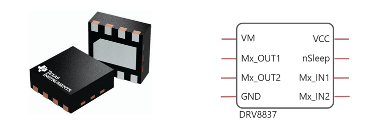

Port description of DRV8837 is as follows:

.. table:: 
    :class: freenove-ow

    +-------------+-----------------------------------------------------------------------------------------+
    |     PIN     |                                       DESCRIPTION                                       |
    +=============+=========================================================================================+
    | VM          | Motor power supply                                                                      |
    +-------------+-----------------------------------------------------------------------------------------+
    | OUT1 / OUT2 | Motor output Connect these pins to the motor winding.                                   |
    +-------------+-----------------------------------------------------------------------------------------+
    | GND         | Device ground                                                                           |
    +-------------+-----------------------------------------------------------------------------------------+
    | VCC         | Logic power supply                                                                      |
    +-------------+-----------------------------------------------------------------------------------------+
    | nSleep      | Sleep mode input When this pin is in logic low, the device enters low-power sleep mode. |
    |             |                                                                                         |
    |             | The device operates normally when this pin is logic high. Internal pulldown             |
    +-------------+-----------------------------------------------------------------------------------------+
    | In1 / In2   | IN1 input / IN2 input                                                                   |
    +-------------+-----------------------------------------------------------------------------------------+
 
For more details, please see datasheet.

The two terminals of the motor connect to two output channels of DRV8837.

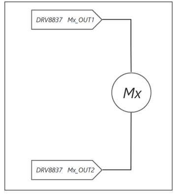

When one output channel outputs high and the other outputs low, the motor will rotate in one direction. If the signals of the two channels are exchanged, that is, the high level and the low level are interchanged, the direction of rotation of the motor will change.

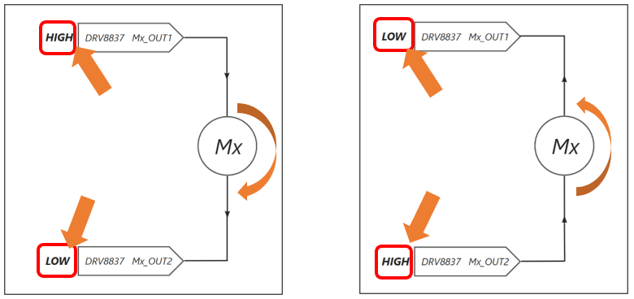

When the two channels simultaneously output high or low, the motor enters braking mode. 

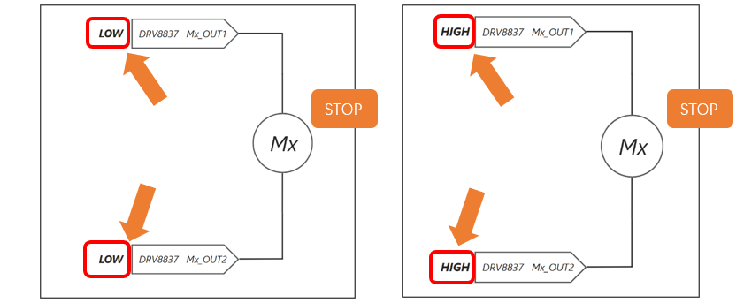

Here is the truth table for the motor states:

.. table:: 
    :class: freenove-ow

    +--------+--------+----------------------------------+
    | Mx_IN1 | Mx_IN2 | Rotating direction of the wheels |
    +========+========+==================================+
    | 1      | 0      | Forward                          |
    +--------+--------+----------------------------------+
    | 0      | 1      | backward                         |
    +--------+--------+----------------------------------+
    | 1      | 1      | Stop                             |
    +--------+--------+----------------------------------+
    | 0      | 0      | Stop                             |
    +--------+--------+----------------------------------+

Schematic
===============================

Next, we will start to learn the circuit connection of the car. As shown below, M1_IN1 connects to GPIO8 of the Pico, which means we can control the signal of M1_IN1 via GPIO8.

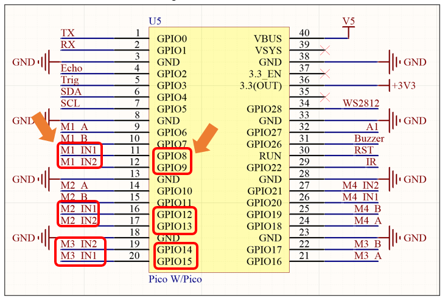

As can be seen from the schematic above, GPIO8 and GPIO9 controls motor M1, GPIO12 and GPIO13 controls M2, GPIO14 and GPIO15 controls M3

Note: The 'x' in Mx_IN1 should be between 1 and 3, corresponding to the identification numbers of the three motors. For instance, M1_IN1 refers to the first control pin for Motor 1, while M1_IN2 refers to the second control pin for Motor 1. Both pins are used in conjunction to control the motor's operations such as forward motion, reverse motion, and halting, where a 0 signifies a low voltage state and a 1 indicates a high voltage state.

Sketch
===============================

Next, we download the code to Raspberry Pi Pico (W) to test the motor. Open "Sketch_02.1_Motor" folder under ""Freenove_Omni_Wheel_Car_Kit_for_Raspberry_Pi_Pico\\Four-Wheel\\Sketch"" and double-click "Sketch_02.1_Motor.ino". 

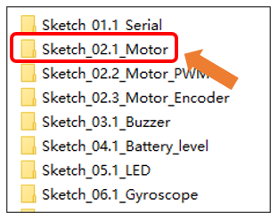

Code
--------------------------------

.. literalinclude:: ../../../freenove_Kit/Four-Wheel/Sketch/Sketch_02.1_Motor/Sketch_02.1_Motor.ino
    :linenos:
    :language: C
    :dedent:

This code is to control the motors to rotate. Click "Upload" to upload the code to Pico.

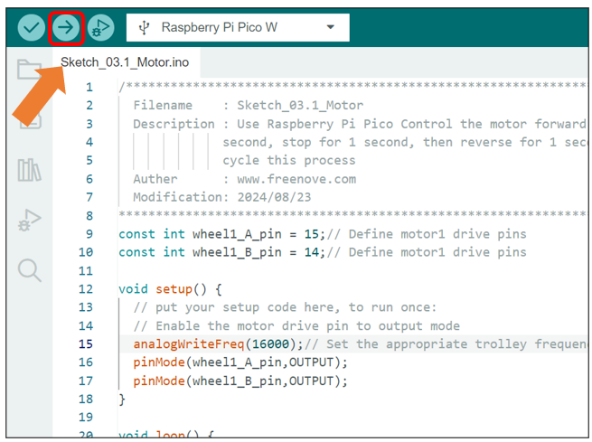

After the code finishes uploading, you can see Motor M1 rotate forward for one second, and then halt for one second, followed by rotating reversely for one second.

Notes:

1. The expansion board is designed with an anti-reverse flow circuit. If the motor does not respond after the code uploads, please check whether the power switch on the car expansion board is turned on.

2. There is a switch on the battery holder; please check if it is turned on.

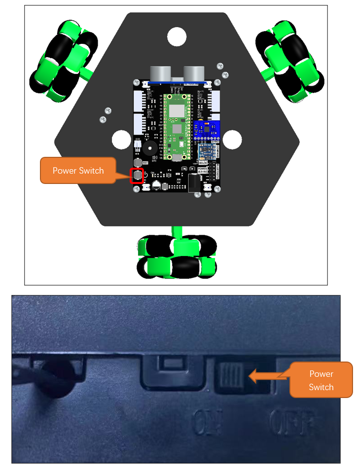

Code Explanation
---------------------------------

If you are not familiar with Arduino IDE, you can visit https://www.arduino.cc/reference/en/ 

Define the drive pins for the motor. In this code, wheel1_A_pin corresponds to M1_IN1 pin, and wheel1_B_pin to M1-IN2.

.. literalinclude:: ../../../freenove_Kit/Four-Wheel/Sketch/Sketch_02.1_Motor/Sketch_02.1_Motor.ino
    :linenos:
    :language: C
    :lines: 9-10
    :dedent:

In the Initialization function Setup(), configure the motor driving pins to output mode.

.. literalinclude:: ../../../freenove_Kit/Four-Wheel/Sketch/Sketch_02.1_Motor/Sketch_02.1_Motor.ino
    :linenos:
    :language: C
    :lines: 16-17
    :dedent:

Continously call the motor control function in the loop function loop() to have the motors runs in different directions.

.. literalinclude:: ../../../freenove_Kit/Four-Wheel/Sketch/Sketch_02.1_Motor/Sketch_02.1_Motor.ino
    :linenos:
    :language: C
    :lines: 20-37
    :dedent:

Reference
-----------------------------

.. py:function:: const

    In Arduino programming, 'const' is a keyword used to define constant variables. Variables defined with 'const' cannot be modified during the program execution; otherwise, it will cause a compilation error.

.. py:function:: void pinMode(int pin, int mode) ;

    Configures the specified pin to behave either as an input or an output.
    
    Parameters
    
    pin: the pin number to set the mode of Motor.
    
    mode: INPUT, OUTPUT, INPUT_PULLDOWM, or INPUT_PULLUP.

.. py:function:: void digitalWrite (int pin, int value) ;

    Writes the value HIGH or LOW (1 or 0) to the given pin which must have been previously set as an output.

4.2 Motor Speed Control through PWM
********************************************

Related Knowledge
============================================

Analog & Digital
--------------------------------------------

An Analog Signal is a continuous signal in both time and value. On the contrary, a Digital Signal or discrete - time signal is a time series consisting of a sequence of quantities. Most signals in life are analog signals. A familiar example of an Analog Signal would be how the temperature throughout the day is continuously changing and could not suddenly change instantaneously from 0℃ to 10℃ . However, Digital Signals can instantaneously change in value. This change is expressed in numbers as 1 and 0 (the basis of binary code).   Their differences can more easily be seen when compared when graphed as below.

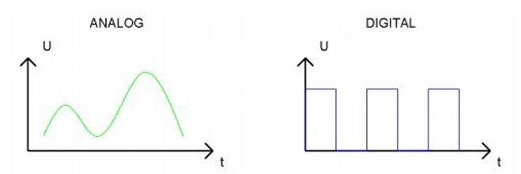

In practical application, we often use binary as the digital signal, that is a series of 0's and 1's. Since a binary signal only has two values (0 or 1), it has great stability and reliability. Lastly, both analog and digital signals can be converted into the other.

PWM
-------------------------------------------

PWM, Pulse Width Modulation, uses digital pins to send certain frequencies of square waves, that is, the output of high levels and low levels, which alternately last for a while. The total time for each set of high levels and low levels is generally fixed, which is called the period (the reciprocal of the period is frequency). The time of high level outputs are generally called "pulse width", and the duty cycle is the percentage of the ratio of pulse duration, or pulse width (PW) to the total period (T) of the waveform.

The longer the output of high levels last, the larger the duty cycle and the higher the corresponding voltage in analog signal will be. The following figures show how the analogs signal voltage vary between 0V-5V (high level is 5V) corresponding to the pulse width 0%-100%:

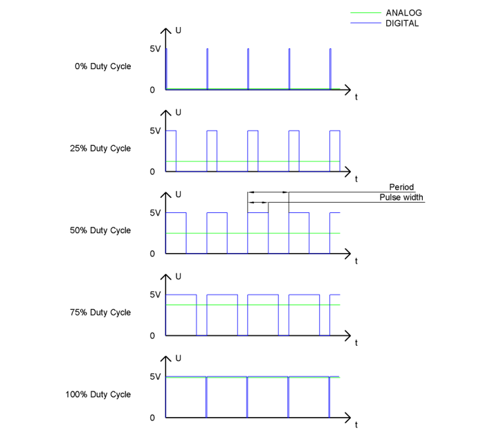

The longer the PWM duty cycle is, the higher the output power will be. Now that we understand this relationship, we can use PWM to control the speed of DC motor.

Sketch
============================================

Next, we download the code to Raspberry Pi Pico (W) to change the speed of the motors through PWM. Open "Sketch_02.2_Motor_PWM" folder under "Freenove_Omni_Wheel_Car_Kit_for_Raspberry_Pi_Pico\\Four-Wheel\\Sketch" and double-click "Sketch_02.2_Motor_PWM.ino". 

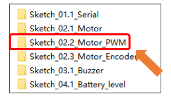

Code
====================================

.. literalinclude:: ../../../freenove_Kit/Four-Wheel/Sketch/Sketch_02.2_Motor_PWM/Sketch_02.2_Motor_PWM.ino
    :linenos:
    :language: C
    :dedent:

After downloading the code, in a clockwise direction, the motor M1 starts from a stationary state, accelerates to its maximum speed, and then slow down to return to a stationary state, repeating this process.

Code Explanation
------------------------------------

If you are not familiar with Arduino IDE, you can visit https://www.arduino.cc/reference/en/ to learn more. 

Set the motor's PWM frequency in the initialization function Setup().

.. literalinclude:: ../../../freenove_Kit/Four-Wheel/Sketch/Sketch_02.2_Motor_PWM/Sketch_02.2_Motor_PWM.ino
    :linenos:
    :language: C
    :lines: 14-14
    :dedent:

Set the motor driving pins to output mode.

.. literalinclude:: ../../../freenove_Kit/Four-Wheel/Sketch/Sketch_02.2_Motor_PWM/Sketch_02.2_Motor_PWM.ino
    :linenos:
    :language: C
    :lines: 16-17
    :dedent:

Continuously change the motors running speed in the loop function.

.. literalinclude:: ../../../freenove_Kit/Four-Wheel/Sketch/Sketch_02.2_Motor_PWM/Sketch_02.2_Motor_PWM.ino
    :linenos:
    :language: C
    :lines: 23-33
    :dedent:

Reference
-----------------------------------

.. py:function:: void analogWriteFreq(uint32_t frequency);

    analogWriteFreq function is used to set the PWM signal frequency, where frequency is the PWM frequency to be set, in Hertz (Hz).

.. py:function:: void analogWrite(uint8_t pin, int value);

    Arduino IDE provides the function, analogWrite(pin, value), which can make ports directly output PWM waves. Every pin on Pico board can be configured to output PWM. In the function called analogWrite(pin, value),the parameter "pin" specifies the port used to output PWM wave. The range of value is 0-255, which represents the duty cycle of 0%-100%.

    In order to use this function, we need to set the port to output mode.

4.3 TT Motor with Encoder
************************************

Within the realms of automation and robotics, motor control is a key technology. Simple pulse width modulation (PWM) speed control is not sufficient for achieving the high level of accuracy. To precisely determine the motor's speed and thereby achieve high-precision motor control, we have used encoder-equipped motors on this product. Below is an introduction to these motors with encoder. 

Related Knowledge
=====================================

The main body of the motors consists of a hall encoder and a gear reduction motor.

Gear Reduction Motor
-------------------------------------

Compared to regular motors, a gear reduction motor has an additional gearbox, which is a mechanical transmission device. It applies the combination of large and small gears to change the gear ratio, designed to reduce the motor's speed and increase its torque. The internal structure of the motor gearbox is shown in the figure below. The gearbox contains multiple gear stages, and the total gear ratio is the product of the gear ratios of each stage. The gear ratio is equal to the number of teeth on the output gear divided by the number of teeth on the input gear.

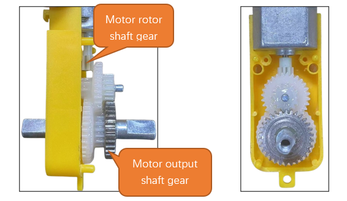

The gear set inside the gearbox can be simplified as the following model:

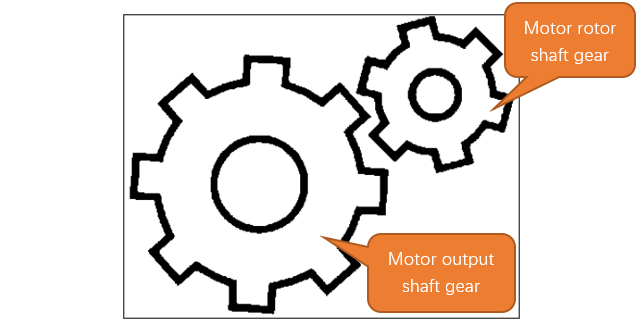

In this model, when the rotor connection shaft rotates N times, the main shaft rotates once, achieving the purpose of reducing the motor speed while increasing the motor torque. At this point, the reduction ratio of the motor is 1:N.

:red:`Note that the value of N is determined by the specific parameters of the motor. In the omnidirectional wheel robot, we provide a motor with a reduction ratio of 1:48, meaning the rotor connection shaft rotates 48 times for the main shaft to rotate once.`

If you need any support, please feel free to contact us via: support@freenove.com

How Interrupts Work
-------------------------------------

When an interrupt event is triggered, the Raspberry Pi Pico (W) receives an interrupt signal. At this moment, the Raspberry Pi Pico (W) pauses the currently executing program and instead executes the Interrupt Service Routine (ISR). The ISR contains the code that needs to be processed after the interrupt event occurs. Once the ISR execution is complete, the Raspberry Pi Pico will return to the state it was in before the interrupt occurred and continue executing the paused program, as shown in the diagram below.

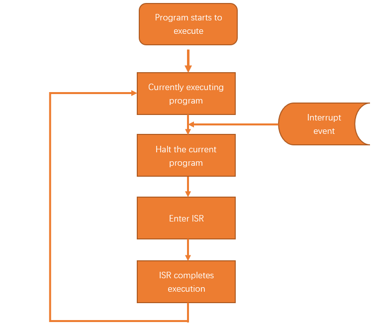

Hall Encoder
-------------------------------------

The Hall encoder consists of a magnetic ring and two Hall Effect sensors. The magnetic ring has 12 pairs of poles, which means there are 12 North (N) poles and 12 South (S) poles, as shown in the diagram below: 

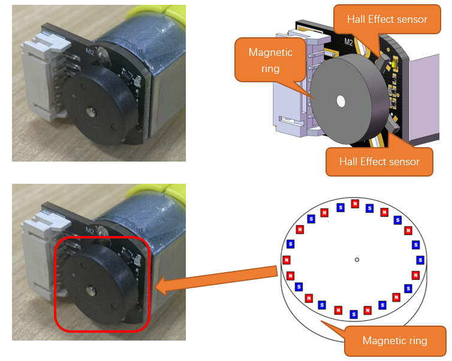

As the magnetic ring rotates, the magnetic poles on the ring continuously move past the Hall Effect sensors. These sensors produce different voltage level changes depending on whether they encounter a North (N) pole or a South (S) pole on the magnetic ring, as illustrated in the diagram below:

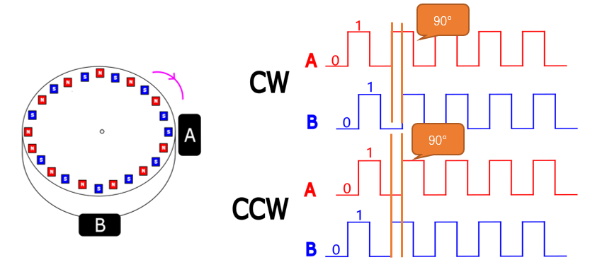

Code Knowledge
======================================

Encoder Value Obtaining
--------------------------------------

The Hall Effect sensors have two output signals, A and B. By analyzing their outputs, the direction of rotation can be determined.

Since A and B are 90° out of phase, their voltage level changes occur in a sequential order. By examining the changes in these levels, the direction of rotation can be identified, as shown in the diagram below:

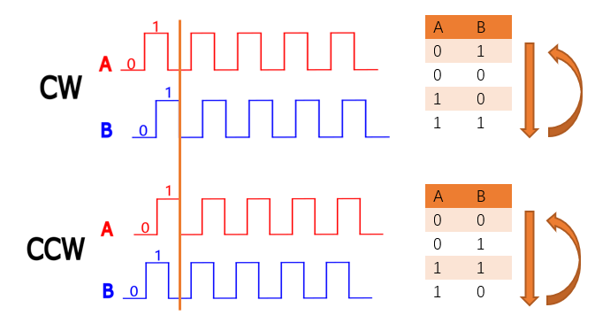

From the diagram above, it's clear that the combination order of A and B varies with the direction of rotation. By comparing the previous A and B combination to the current one, we can determine the direction of rotation.

For instance:

If the previous A and B combination is 11 and the current combination is 01, we can refer to the table in the diagram to conclude that the rotation direction is clockwise.

If you need any support, please feel free to contact us via: support@freenove.com

Schematic
======================================

The four-wheel omnidirectional robot collects analog signals using a Raspberry Pi Pico (W). It utilizes analog inputs and hardware interrupts to capture the electrical signals generated by the encoders, allowing it to determine the current speed and position of the motors.

The following diagram illustrates the encoder motor circuitry, where:

M1_A corresponds to GPIO6

M1_B corresponds to GPIO7

M2_A corresponds to GPIO10

M2_B corresponds to GPIO11

M3_A corresponds to GPIO16

M3_B corresponds to GPIO17

Please note that this car kit uses three 48:1 gear reduction TT motors with encoder. For each complete revolution of the wheels, the magnetic ring on the motor rotates 48 times. Each encoder motor outputs 13 pulses per revolution, resulting in a total of 2496 pulse signals for each complete turn of the motor.

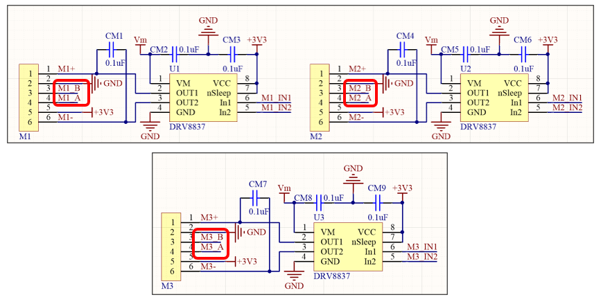

Sketch
====================================

Next, we download the code to Raspberry Pi Pico (W) to have the TT motor with encoder read encoder value. 

Open Sketch_02.3_Motor_Encoder" folder under "Freenove_Omni_Wheel_Car_Kit_for_Raspberry_Pi_Pico\\Four-Wheel\\Sketch" and double-click "Sketch_02.3_Motor_Encoder".

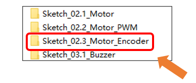

Code
--------------------------------------

.. literalinclude:: ../../../freenove_Kit/Four-Wheel/Sketch/Sketch_02.3_Motor_Encoder/Sketch_02.3_Motor_Encoder.ino
    :linenos:
    :language: C
    :dedent:

This code allows the pico to change the motors' speed. Click "Upload" to download the code.

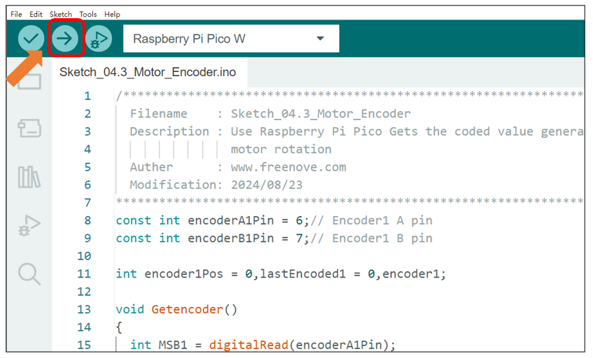

After downloading the code, manually rotate Motor1, and the serial monitor will print the encoder value every three seconds. The larger the rotation amplitude, the greater the encoder value. 

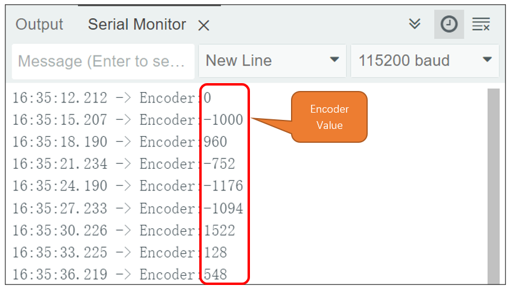

The position of Motor 1 is as shown below:

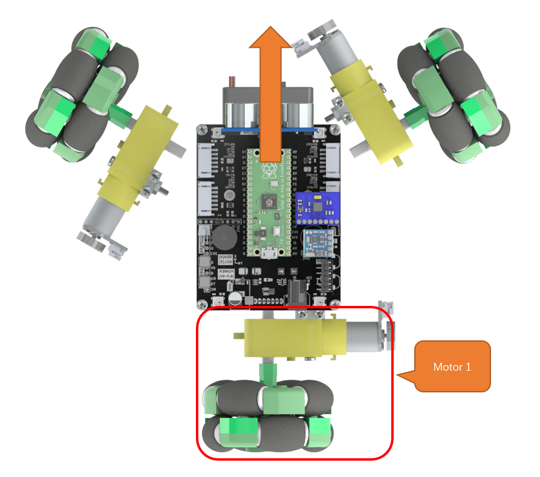

Code Explanation
-------------------------------------

If you are not familiar with Arduino IDE, you can visit https://www.arduino.cc/reference/en/ to learn more. 

Enable the encode pin to input mode.

.. literalinclude:: ../../../freenove_Kit/Four-Wheel/Sketch/Sketch_02.3_Motor_Encoder/Sketch_02.3_Motor_Encoder.ino
    :linenos:
    :language: C
    :lines: 33-34
    :dedent:

Enable the external interrupt to enter the Getencoder function when the encoder pin level changes.

.. literalinclude:: ../../../freenove_Kit/Four-Wheel/Sketch/Sketch_02.3_Motor_Encoder/Sketch_02.3_Motor_Encoder.ino
    :linenos:
    :language: C
    :lines: 36-37
    :dedent:

In the interrupt service function, retrieve the encoder value.

.. literalinclude:: ../../../freenove_Kit/Four-Wheel/Sketch/Sketch_02.3_Motor_Encoder/Sketch_02.3_Motor_Encoder.ino
    :linenos:
    :language: C
    :lines: 15-23
    :dedent:

Output the encoder value every two seconds

.. literalinclude:: ../../../freenove_Kit/Four-Wheel/Sketch/Sketch_02.3_Motor_Encoder/Sketch_02.3_Motor_Encoder.ino
    :linenos:
    :language: C
    :lines: 40-47
    :dedent:

Reference
----------------------

.. py:function:: <<

    The left shift operator is a bitwise operator that performs a left shift operation. The left side of the operator specifies the data to be shifted, while the right side indicates how many positions to shift. This operation moves the binary bits of a number to the left by the specified number of positions, filling in zeros on the right.

.. py:function:: <<

    The bitwise OR operator is a bitwise operator that performs an OR operation on the bits of the numbers on its left and right. The rule of OR operation is that if one of the two bits is 1, the result is 1; otherwise, it is 0.

.. py:function:: ||

    The logical OR operator is a logical operator commonly used for conditional testing. The rule for the logical OR operation is that if at least one side of the operator is true, the result is true; otherwise, it is false.

.. py:function:: int digitalRead (int pin) ;

    This function returns the value read at the given pin. It will be "HIGH" or "LOW"(1 or 0) depending on the logic level at the pin.

.. py:function:: void attachInterrupt(pin_size_t pin, voidFuncPtr callback, PinStatus mode)

    The attachInterrupt function is used to set up an external interrupt that calls the interrupt service routine (ISR) when the controller pin level changes.

    **Parameters:**

    pin: The interrupt number of the pin to be monitored.
    
    callback: The name of the interrupt service routine (ISR) function.
    
    **mode:**
    
    LOW: Triggered when the pin is low.
    
    HIGH: Triggered when the pin is high.
    
    FALLING: Triggered when the pin transitions from high to low.
    
    RISING: Triggered when the pin transitions from low to high.
    
    CHANGE: Triggered when the pin level changes.

.. py:function:: digitalPinToInterrupt(uint8_t pin)

    The digitalPinToInterrupt function maps a digital pin to its corresponding interrupt number. The interrupt numbers can vary between different controllers, so this function helps ensure that the correct interrupt is used for the specified digital pin.
