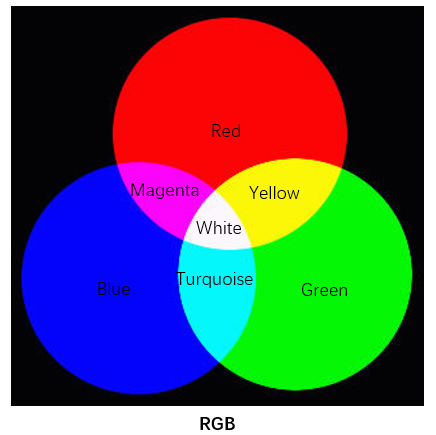
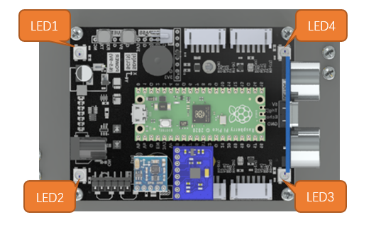
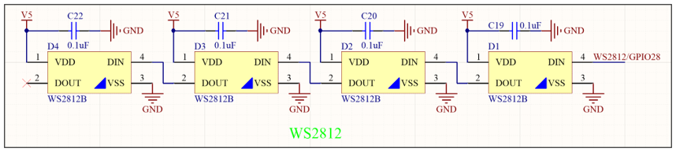
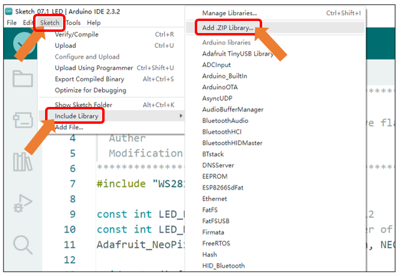
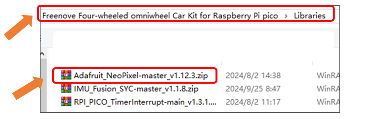
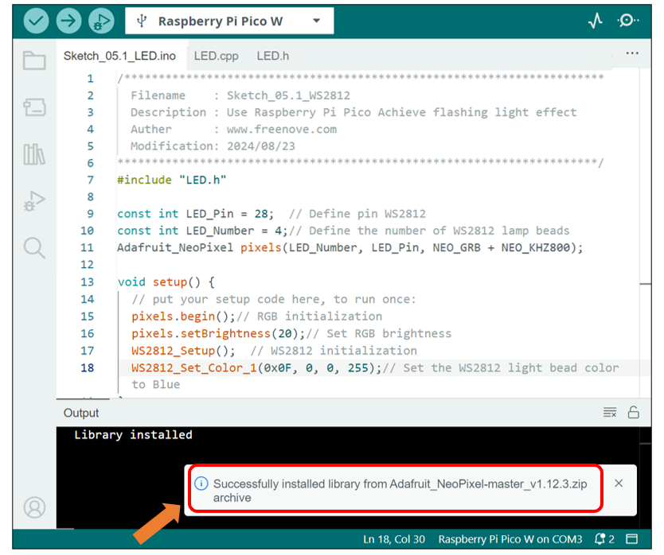
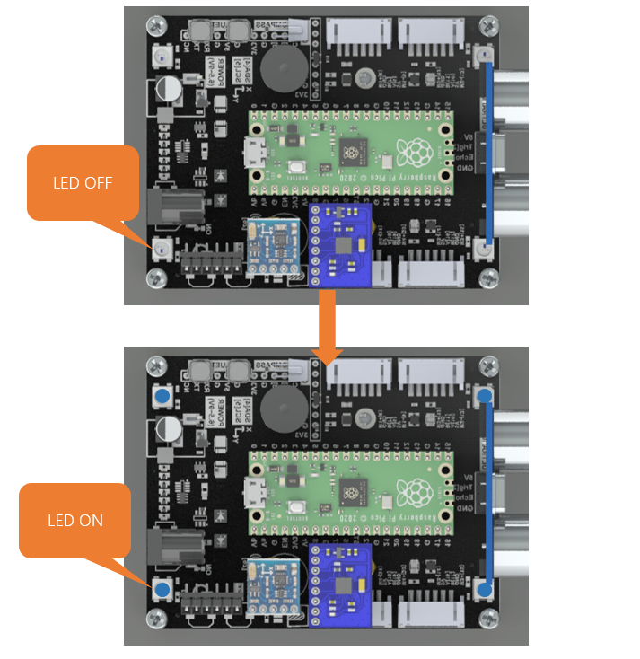

##############################################################################
Chapter 7 LED Test
##############################################################################

Related Knowledge
*************************************

Red, green, and blue are called the three primary colors. When you combine these three primary colors of different brightness, it can produce almost all kinds of visible light. 

The LED of the car is composed of eight LED, each of which is controlled by one pin and supports cascading.Each LED can emit three basic colors of red, green and blue, and supports 256-level brightness adjustment, which means that each LED can emit 2^24=16,777,216 different colors.

We know from previous section that, control board controls LEDs to emit a total of 256(0-255) different brightness with PWM. So, through the combination of three different colors of LEDs, RGB LED can emit 256^3=16777216 Colors, 16Million colors.

Schematic
**************************************

As shown below, the DOUT of each LED is connected with DIN of the next LED, and the 4 LED can be controlled to emit colorful colors by inputting control signals through LED. 

Sketch
***************************************

Next, we will download the code to Raspberry Pi Pico (W) to test the LED. Open the folder "Sketch_05.1_LED" in the "Freenove_Omni_Wheel_Car_Kit_for_Raspberry_Pi_Pico\\Four-Wheel\\Sketches" and then double click "Sketch_05.1_LED.ino".

Before uploading the sketch, please make sure the LED driver library has been installed. If not, please install it as follows.

Open Arduino IDE, click "Sketch" >- "Include Library" >- "Add.ZIP Library...".

Select "Adafruit_NeoPixel-master_v1.12.3.zip" under the directory of "Freenove Four-wheeled omniwheel Car Kit for Raspberry Pi pico \Libraries".

Wait for the installation to finish. 

Code
=====================================

.. literalinclude:: ../../../freenove_Kit/Four-Wheel/Sketch/Sketch_05.1_LED/Sketch_05.1_LED.ino
    :linenos:
    :language: c
    :dedent:

Verify and upload the code, the four LEDs will turn blue at the same time.

Code Explanation
---------------------------------------

Add the header file of LED. Each time before controlling LED, please add its header file.

.. literalinclude:: ../../../freenove_Kit/Four-Wheel/Sketch/Sketch_05.1_LED/Sketch_05.1_LED.ino
    :linenos:
    :language: c
    :lines: 7-7
    :dedent:

Define LED pin.

.. literalinclude:: ../../../freenove_Kit/Four-Wheel/Sketch/Sketch_05.1_LED/Sketch_05.1_LED.ino
    :linenos:
    :language: c
    :lines: 9-9
    :dedent:

Define LED number.

.. literalinclude:: ../../../freenove_Kit/Four-Wheel/Sketch/Sketch_05.1_LED/Sketch_05.1_LED.ino
    :linenos:
    :language: c
    :lines: 10-10
    :dedent:

Initialize RGB and set the brightness to 20.

.. literalinclude:: ../../../freenove_Kit/Four-Wheel/Sketch/Sketch_05.1_LED/Sketch_05.1_LED.ino
    :linenos:
    :language: c
    :lines: 15-16
    :dedent:

Initialize LED and set the color.

.. literalinclude:: ../../../freenove_Kit/Four-Wheel/Sketch/Sketch_05.1_LED/Sketch_05.1_LED.ino
    :linenos:
    :language: c
    :lines: 17-18
    :dedent:

Display the color of LED. After setting the color, you need to call show function to display it.

.. literalinclude:: ../../../freenove_Kit/Four-Wheel/Sketch/Sketch_05.1_LED/Sketch_05.1_LED.ino
    :linenos:
    :language: c
    :lines: 23-23
    :dedent:

Reference
---------------------------------

.. py:function:: void WS2812_Show(int mode)

    The WS2812_Show function can change the LED mode.

    **Parameters:**

    0: LED off
    
    1: Steady on mode
    
    2: Chasing mode
    
    3: Blinking mode
    
    4: Breathing mode
    
    5: Rainbow mode