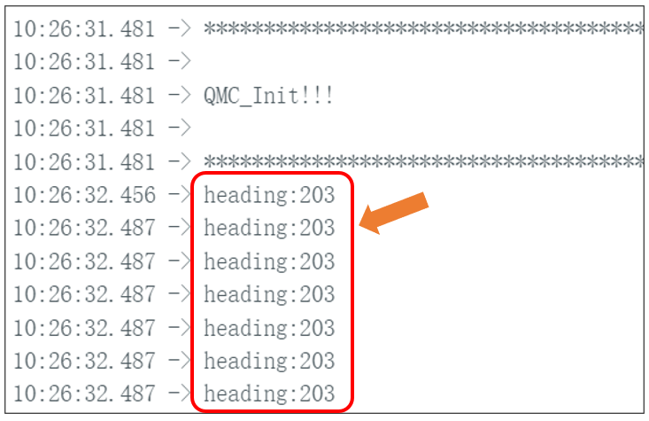

##############################################################################
Chapter 9 Compass Test
##############################################################################

Project 9.1 Compass Calibration
**************************************

Component Knowledge
======================================

A digital compass can detect the intensity and orientation of the Earth's magnetic field, offering directional insights. It measures the magnetic field strength across the X, Y, and Z axes and communicates this data to the MCU (Microcontroller Unit) via the I2C protocol.

The compass sensor is highly sensitive to magnetic fields and noise, and operating it in areas with intense magnetic fields or high noise levels can disrupt its functionality, causing inaccuracies in angle readings. To ensure precise angle measurements, it's crucial to calibrate the sensor before use.

The port description of the compass module is as follows:

.. table::
    :class: freenove-ow

    +----------+------------+----------------------------------------------------------------------------------+
    | Pin name | Pin number |                                   Description                                    |
    +==========+============+==================================================================================+
    | VCC      | 1          | Positive pole of power supply with voltage 5V                                    |
    +----------+------------+----------------------------------------------------------------------------------+
    | GND      | 2          | Negative pole of power supply                                                    |
    +----------+------------+----------------------------------------------------------------------------------+
    | SCL      | 3          | I2C communication clock pin                                                      |
    +----------+------------+----------------------------------------------------------------------------------+
    | SDA      | 4          | I2C communication clock pin                                                      |
    +----------+------------+----------------------------------------------------------------------------------+
    | DRDY     | 5          | Data Ready signal, used to inform the sensor that new data are ready to be read. |
    +----------+------------+----------------------------------------------------------------------------------+

Circuit
======================================

Plug the compass sensor to the expansion board to have it connected to the Raspberry Pi Pico (W).

Schematic
======================================

As shown in the schematic below, the SDA and SCL of the sensor are connected to GP4 and GP5 of the Raspberry Pi Pico (W) respectively.

Sketch
======================================

In this section, we continued to use the IMI_Fusion_SYC library previously installed. Please make sure you have installed it before upload the sketch.

Now, let's calibrate the compass. Open **"Sketch_07.1_Compass_calibration"** folder in **"Freenove_Four-Wheeled_omniwheel_Car_Kit_for_Raspberry_Pi_pico\\Sketches"** and then double-click **"Sketch_07.1_Compass_calibration.ino"**.

Code
======================================

.. literalinclude:: ../../../freenove_Kit/Four-Wheel/Sketch/Sketch_07.1_Compass_calibration/Sketch_07.1_Compass_calibration.ino
    :linenos:
    :language: c
    :dedent:

After downloading the code, open serial monitor and you can see the message **"QMC_init!!!"**.

If the sensor fails to initialize, you will see the following message. In this case, please make sure the sensor is correctly connected.

Upon finishing initialization, it will start calibrating the compass. When progress bar starts, rotate the sensor at a constant speed until the progress bar reaches 100%.

When the progress bar reaches 100%, the calibration data will be printed on the serial monitor. At this point, please record the data of x_offset, y_offset, x_scale, and y_scale in a timely manner.

Please note that the calibration data vary among different compass.

Code Explanation
----------------------------------

If you are not familiar with Arduino IDE, you can visit https://www.arduino.cc/reference/en/ to learn more. 

Declare an object named imu.

.. literalinclude:: ../../../freenove_Kit/Four-Wheel/Sketch/Sketch_07.1_Compass_calibration/Sketch_07.1_Compass_calibration.ino
    :linenos:
    :language: c
    :lines: 9-9
    :dedent:

Activate the serial port and set the baud rate to 9600.

.. literalinclude:: ../../../freenove_Kit/Four-Wheel/Sketch/Sketch_07.1_Compass_calibration/Sketch_07.1_Compass_calibration.ino
    :linenos:
    :language: c
    :lines: 12-12
    :dedent:

Wire initialization.

.. literalinclude:: ../../../freenove_Kit/Four-Wheel/Sketch/Sketch_07.1_Compass_calibration/Sketch_07.1_Compass_calibration.ino
    :linenos:
    :language: c
    :lines: 14-14
    :dedent:

Compass initialization.

.. literalinclude:: ../../../freenove_Kit/Four-Wheel/Sketch/Sketch_07.1_Compass_calibration/Sketch_07.1_Compass_calibration.ino
    :linenos:
    :language: c
    :lines: 15-15
    :dedent:

Compass calibration.

.. literalinclude:: ../../../freenove_Kit/Four-Wheel/Sketch/Sketch_07.1_Compass_calibration/Sketch_07.1_Compass_calibration.ino
    :linenos:
    :language: c
    :lines: 19-19
    :dedent:

If you need any support, please feel free to contact us via: support@freenove.com

Project 9.2 Yaw Angle Reading
******************************************

In the previous section, we introduce how to calibrate the compass. In this section, we will further tell us how to use the compass to read yaw angles.

Sketch
===============================

In this section, we continued to use the IMI_Fusion_SYC library previously installed. Please make sure you have installed it before upload the sketch.

Before uploading the sketch to read the yaw angle, please make sure you have calibrated the compass and recored the calibration data.

Open **"Sketch_07.2_Compass_getAngle"** folder in **"Freenove Four-wheeled omniwheel Car Kit for Raspberry Pi pico \Sketches"** and then double-click **"Sketch_07.2_Compass_getAngle.ino"**.

Code
===============================

Input the **calibration data** to the code marked below, otherwise the reading angle will be incorrect.

.. literalinclude:: ../../../freenove_Kit/Four-Wheel/Sketch/Sketch_07.1_Compass_calibration/Sketch_07.1_Compass_calibration.ino
    :linenos:
    :language: c
    :dedent:

After downloading the code, the current yaw angle will be printed on the serial monitor. You can verify whether it is correct by comparing with the value of the Compass software on your phone.

