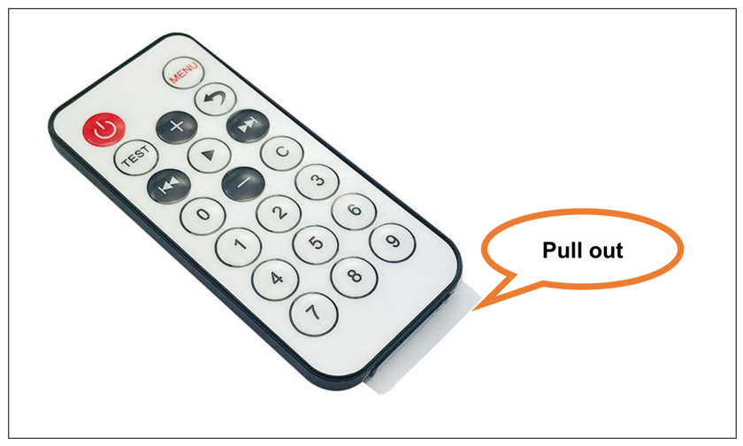
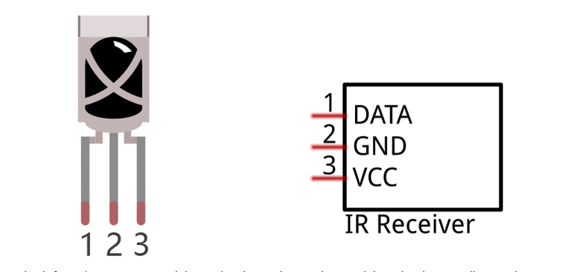
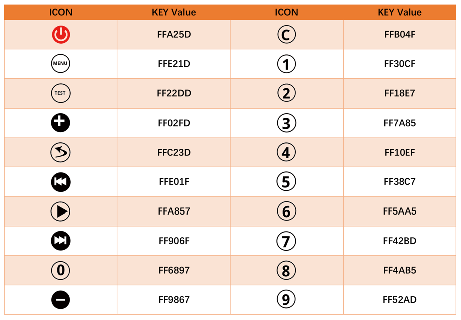
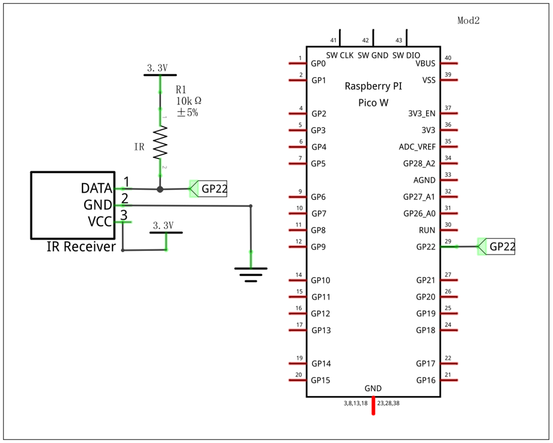
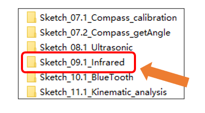
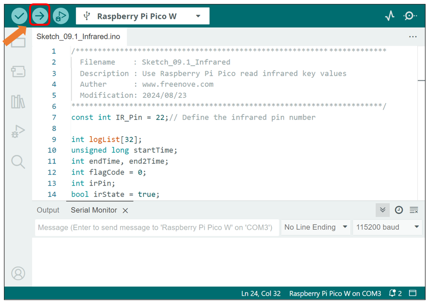
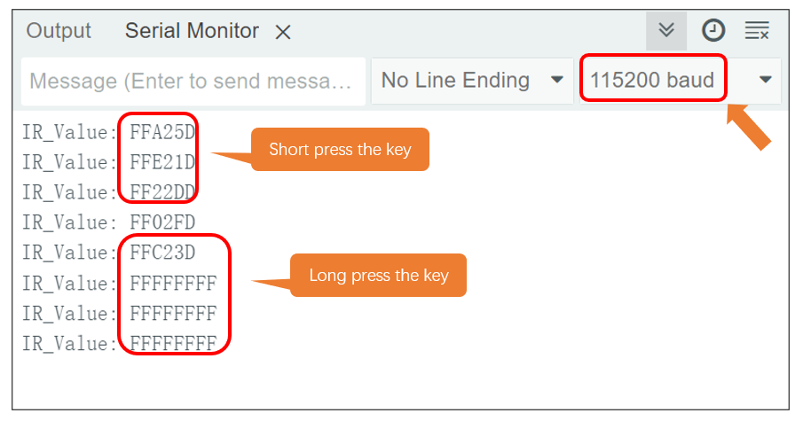
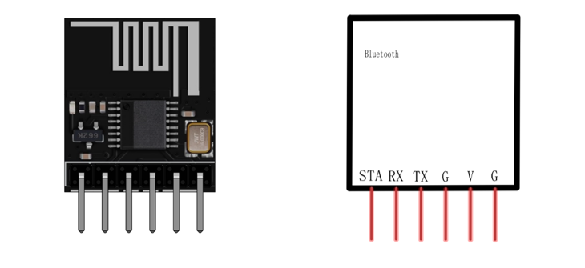

##############################################################################
Chapter 11 Infrared Test
##############################################################################

Component Knowledge
************************************

Infrared remote
==================================

An Infrared (IR) remote control is a device with a certain number of buttons. Pressing down different buttons will make the infrared emission tube, which is located in the front of the remote control, send infrared with different encoding. Infrared remote control technology is widely used in household appliances, such as TV, air conditioning, etc. Thus, it makes it possible for you to switch TV programs and adjust the temperature of the air conditioning away from them. The remote control we use is shown below:

Infrared receiver
==================================

Infrared (IR) receiver is a component which can receive the infrared light, so we can use it to detect the signal emitted by the infrared remote control. DATA pin here outputs the received infrared signal.

When you use the infrared remote control, it sends a key value to the receiving circuit according to the pressed key. The following is the key value that the receiving circuit will receive when each key of the infrared remote control is pressed.

Schematic
**********************************

As shown in the schematic, GP22 of the pico connects to the infrared receiver, which means we can access the infrared signal via GP22.

Sketch
**********************************

Next, we download the code to Raspberry Pi Pico (W) to test the infrared receiver. Open "Sketch_09.1_Infrared" folder under "Freenove Three-wheeled omniwheel Car Kit for Raspberry Pi pico \Sketches" and double-click "Sketch_09.1_Infrared.ino". 

Code
=================================

Sketch_11.1_Infrared.ino
----------------------------------

.. literalinclude:: ../../../freenove_Kit/Three-Wheel/Sketch/Sketch_09.1_Infrared/Sketch_09.1_Infrared.ino
   :linenos:
   :language: c
   :dedent:

This sketch uses the infrared receiving tube to receive the value sent form the infrared remote control, and print it out via the serial port. Click **"Upload"** to download the code. 

After downloading the code, open the serial port monitor, set the baud rate to **115200**, press the IR remote control, the pressed keys value will be printed out through the serial port.

Code Explanation
----------------------

When the IR_Init() function is called, Pico initializes the infrared received pin (GP22) and sets the external interrupt, associating it with the IR_Read() function. Every time the infrared receives data, external interrupt calls IR_Read() function to receive data.

.. literalinclude:: ../../../freenove_Kit/Three-Wheel/Sketch/Sketch_09.1_Infrared/Sketch_09.1_Infrared.ino
   :linenos:
   :language: c
   :lines: 29-33
   :dedent:

Assign the read infrared key value to the variable irValue.

.. literalinclude:: ../../../freenove_Kit/Three-Wheel/Sketch/Sketch_09.1_Infrared/Sketch_09.1_Infrared.ino
   :linenos:
   :language: c
   :lines: 23-23
   :dedent:

Print the variable irValue in HEX format.

.. literalinclude:: ../../../freenove_Kit/Three-Wheel/Sketch/Sketch_09.1_Infrared/Sketch_09.1_Infrared.ino
   :linenos:
   :language: c
   :lines: 24-24
   :dedent:

Allow to receive new infrared key values again.

.. literalinclude:: ../../../freenove_Kit/Three-Wheel/Sketch/Sketch_09.1_Infrared/Sketch_09.1_Infrared.ino
   :linenos:
   :language: c
   :lines: 25-25
   :dedent:

The port description of the Bluetooth module is as follows: