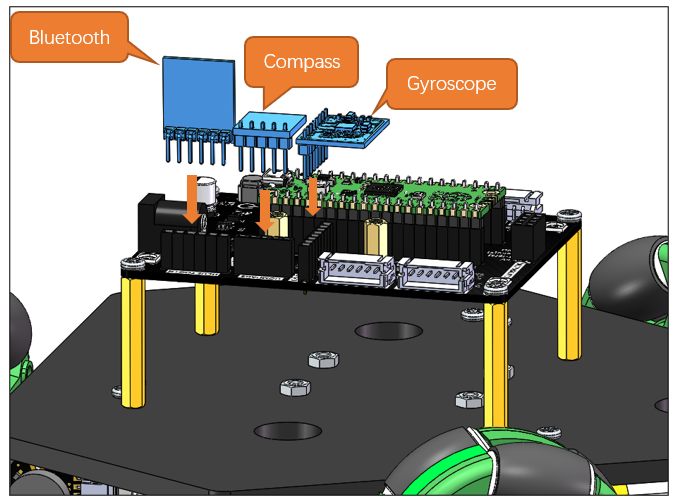
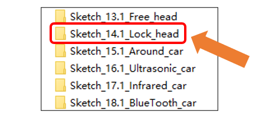
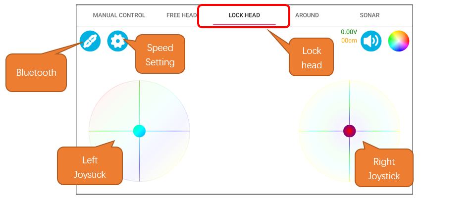
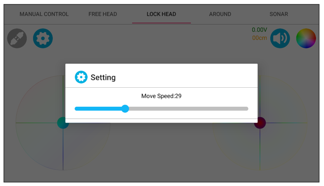
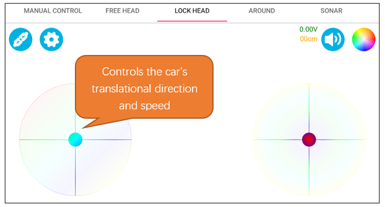

##############################################################################
Chapter 16 Lock Head Mode
##############################################################################

In Lock Head Mode, the car's direction of travel is consistently aligned with an absolute direction in space. Even if the car is manually lifted and its orientation is altered, it will automatically realign to its original angle. To control the car, the left joystick is used to adjust the translational speed and direction, while the right joystick is to control its rotational angle.

Circuit
****************************

Connect the Bluetooth module, gyroscope, and digital compass to the assembled car.

For detailed assembly process of the car, please refer to :ref:`fnk0097/codes/three_wheel/1_car_assembly:chapter 1 car assembly`

Sketch
***************************

Open **“Sketch_14.1_Lock_head”** folder in **“Freenove_Omni_Wheel_Car_Kit_for_Raspberry_Pi_Pico\\Three-Wheel\\Sketches”** and then double-click **“Sketch_14.1_Lock_head.ino”.**

Code
=============================

Sketch_14.1_Lock_hand.ino
-----------------------------

.. literalinclude:: ../../../freenove_Kit/Three-Wheel/Sketch/Sketch_14.1_Lock_head/Sketch_14.1_Lock_head.ino
    :linenos:
    :language: c
    :dedent:

Motor.cpp
-----------------------------

.. literalinclude:: ../../../freenove_Kit/Three-Wheel/Sketch/Sketch_14.1_Lock_head/Motor.cpp
    :linenos:
    :language: c
    :lines: 68-85
    :dedent:

Before uploading the sketch, please make sure the IMU_Fusion_SYC library has been installed, so that the functions and tools it provides can be used. If the library was not installed yet, please refer to `IMU_Fusion_SYC <https://github.com/Vegetable-SYC/IMU_Fusion_SYC>`__. After downloading the code, open Freenove APP and click the connection icon to connect the Bluetooth. For installing the APP and Bluetooth connection, please refer to :ref:`fnk0097/codes/three_wheel/freenove_app:introduction to the app`

.. note::
    
    :red:`The small car's direction of motion always points towards 200 degrees in the magnetic field!`

Interface Introduction
-----------------------------

Operation Description
-----------------------------

At the speed setting interface, you can set the maximum speed of the car. The range is from 0 to 100.

When only the left joystick is operated, it controls the car's translational direction and speed. When it is released, the car stops moving.

When only the right joystick is actuated, it controls the target orientation angle of the car, and the car will hold at the corresponding angle when the joystick is released.

.. image:: ../../codes/_static/imgs/16_Lock_Head_Mode/Chapter16_05.png
    :align: center

Code Explanation
-------------------------------

Call the Car_3_Control() function to control the car to perform corresponding actions according to the instructions.

.. literalinclude:: ../../../freenove_Kit/Three-Wheel/Sketch/Sketch_14.1_Lock_head/Sketch_14.1_Lock_head.ino
    :linenos:
    :language: c
    :lines: 53-82
    :dedent:

Use a timer interrupt to control the car to check the encoder value every 5ms, detect the angle every 10ms, and measure the speed and control the car's movement according to the encoder value every 15ms.

.. literalinclude:: ../../../freenove_Kit/Three-Wheel/Sketch/Sketch_14.1_Lock_head/Sketch_14.1_Lock_head.ino
    :linenos:
    :language: c
    :lines: 84-99
    :dedent: