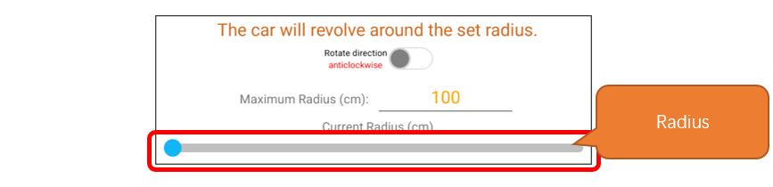

##############################################################################
Chapter 17 Around Mode
##############################################################################

In the Around Mode, the vehicle consistently orients itself around a fixed central point using the ultrasonic module as a reference, maintaining a constant speed for circular motion. Users can modify the car's orbital radius and direction via Freenove APP, with adjustable radius settings from 0 to 100 centimeters.

Related Knowledge
******************************

Around Mode Attitude Calculating
=========================================

Around mode essentially enables the car to perform circular motion, which is a common type of composite movement where an object moves along a circular path around a central point.

To simplify the model for analysis, we can consider the omni-wheeled car as a particle for motion analysis. At this point, we can obtain the analytical results as shown in the following figure:

We place the car stationary on a point of the circular trajectory and decompose its velocity V into components Va and Vb along the x-axis and y-axis. Va is always aligned with the tangent to the circle at that point, while Vb points consistently towards the center of the circle. This allows us to consider the circular motion as a combination of two movements: Va is the speed of the car moving translationally in the horizontal direction, and Vb is the speed of the car's rotational motion, or angular velocity. Building on the formulas for pose calculation, we can derive the following equations:

.. math:: 

    &\boldsymbol{V_x = -V_a \cdot \sin 90^\circ}
    
    &\boldsymbol{V_y = V_a \cdot \cos 90^\circ} 

    \\

    &\boldsymbol{v_1 = -V_x + V_b}
    
    &\boldsymbol{v_2 = -V_y + V_b} 
    
    &\boldsymbol{v_3 = V_x + V_b}
    
    &\boldsymbol{v_4 = V_y + V_b}

Using this formula, we can enable the omni-wheeled car to perform circular motion.

Around Mode Kinematic Analysis
=========================================

Assuming the radius of the circular motion is R, the formula V = W * R tells us that when the value of the radius R remains constant, the ratio between V and W also remains constant. Substituting into the formula, we get:

.. math:: 

    \boldsymbol{R = \frac{V_a}{V_b}} 

You only need to set one of the values for Va or Vb to determine the radius of the circular motion trajectory. The overall formula is:

.. math:: 

    &\boldsymbol{V_b = \frac{R}{V_a}} 

    \\
    
    &\boldsymbol{V_x = -V_a \cdot \sin 90^\circ} 

    &\boldsymbol{V_y = V_a \cdot \cos 90^\circ} 

    \\

    &\boldsymbol{v_1 = -V_x + V_b}

    &\boldsymbol{v_2 = -V_y + V_b}

    &\boldsymbol{v_3 = V_x + V_b}

Please note: R and Va in the formula are the values that need to be set, and V1, V2, V3, are the linear speeds of the three wheels.

Sketch
***************************

Open **“Sketch_15.1_Around_car”** folder in **“Freenove_Omni_Wheel_Car_Kit_for_Raspberry_Pi_Pico\\Three-Wheel\\Sketches”** and then double-click **“Sketch_15.1_Around_car.ino”**.

.. image:: ../../codes/_static/imgs/17_Around_Mode/Chapter17_03.png
    :align: center

Code
==========================

Sketch_15.1_Around_car.ino
----------------------------

.. literalinclude:: ../../../freenove_Kit/Three-Wheel/Sketch/Sketch_15.1_Around_car/Sketch_15.1_Around_car.ino
    :linenos:
    :language: c
    :lines: 59-69
    :dedent:

Motor.cpp
---------------------------

.. literalinclude:: ../../../freenove_Kit/Three-Wheel/Sketch/Sketch_15.1_Around_car/Motor.cpp
    :linenos:
    :language: c
    :lines: 54-81
    :dedent:

After compiling and uploading the code, place the omni-wheeled car on the ground and power it on. The omni-wheeled car will perform a uniform circular motion with a radius of 20 cm in a clockwise direction.

Code Explanation
---------------------------

Determine the input parameter; when the parameter is "clockwise", the car circles clockwise, and when the parameter is "anticlockwise", the car circles counterclockwise.

.. literalinclude:: ../../../freenove_Kit/Three-Wheel/Sketch/Sketch_15.1_Around_car/Motor.cpp
    :linenos:
    :language: c
    :lines: 56-74
    :dedent:

About Around mode
***************************

For the connection of Bluetooth device, please refer to Freenove APP-Connection

Please note that the example code for this part does not involve Bluetooth. 

To control the car via Bluetooth, please open **“Sketch_20.1_Bluetooth_car”** folder in **“car_4_wheels\\Sketches”** and then double-click **“Sketch_20.1_Bluetooth_car.ino”**.

Interface Introduction
====================================

Operation Description
====================================

This button is to change the cicular direction. When it is enabled, the car circles clockwise, and disabled, it circles counterclockwise.

Input the maximum radius. If the number set is below 100, it will be 100.

Slide the bar to set the car's circular radius. The range is from 0 to the max radius set.

