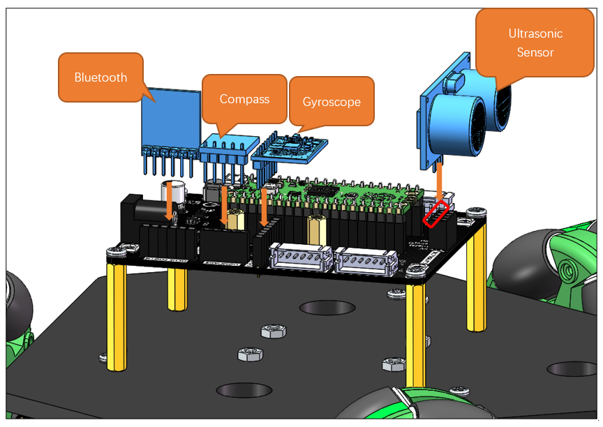
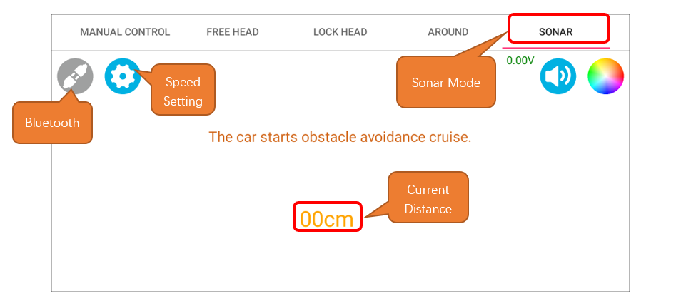
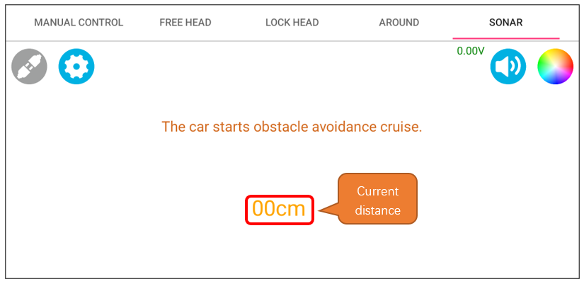

##############################################################################
Chapter 18 Sonar Mode
##############################################################################

In the previous chapters, we have learned how to use an ultrasonic module to read distances. In this chapter, we will attempt to implement the obstacle-avoidance function for this car. When the mode is activated the car will move forward at a fixed speed. When it encounters an obstacle, it will read the distance from both sides and turn towards the more open direction to continue moving forward.

Sonar Mode Summary
**********************************

In ultrasonic obstacle avoidance mode, the car will move forward at a fixed speed when there are no obstacles ahead. When it encounters an obstacle, it will rotate towards both sides and read the distance data, then turn towards the more open side to continue moving forward.

Circuit
***********************************

In this section, we use the assembled car with ultrasonic module, gyroscope, compass module, and Bluetooth module connected. For detailed process of car assembly, please refer to :ref:`fnk0097/codes/three_wheel/1_car_assembly:chapter 1 car assembly`

Sketch
**********************************

Open **“Sketch_16.1_Ultrasonic_car”** folder in **“Freenove_Omni_Wheel_Car_Kit_for_Raspberry_Pi_Pico\\Three-Wheel\\Sketches”** and then double-click **“Sketch_16.1_Ultrasonic_car.ino”**.

Code
=================================

Sketch_16.1_Ultrasonic_car.ino
---------------------------------

.. literalinclude:: ../../../freenove_Kit/Three-Wheel/Sketch/Sketch_16.1_Ultrasonic_car/Sketch_16.1_Ultrasonic_car.ino
    :linenos:
    :language: c
    :dedent:

Ultrasonic.cpp
---------------------------------

.. literalinclude:: ../../../freenove_Kit/Three-Wheel/Sketch/Sketch_16.1_Ultrasonic_car/Ultrasonic.cpp
    :linenos:
    :language: c
    :dedent:

Code Explanation
---------------------------------

Use a timer interrupt to control the car to check the encoder value every 5ms, detect the angle every 10ms, and measure the speed and control its movement according to the encoder value every 15ms.

.. literalinclude:: ../../../freenove_Kit/Three-Wheel/Sketch/Sketch_16.1_Ultrasonic_car/Sketch_16.1_Ultrasonic_car.ino
    :linenos:
    :language: c
    :lines: 53-71
    :dedent:

Call the function Ultrasonic_Run () to control the car's movement.

.. literalinclude:: ../../../freenove_Kit/Three-Wheel/Sketch/Sketch_16.1_Ultrasonic_car/Motor.cpp
    :linenos:
    :language: c
    :lines: 64-81
    :dedent:

Reference
----------------------

.. py:function:: void Ultrasonic_Run(int speed_v, int angle_a, int turn_speed)

    The function is designed to control the movement of the robot car. It calculates the speed of each motor by obtaining the target speed, rotation angle, and turning speed as parameters, and applies a PID control algorithm to achieve precise motion control.

    **Parameters:**
       
        speed_v: The target speed of the car
       
        angle_a: The target rotation angle of the car
       
        turn_speed: The target turning speed of the car

.. py:function:: void Ultrasonic_control(int speed, int turn_time, int distance)

    This function is designed to control the robot car's obstacle avoidance. It determines the action logic of the robot by obtaining speed, turning interval, and obstacle avoidance distance as parameters.

    **Parameters:**
        
        speed: The cruising speed of the robot, with a parameter range from 0 to 100.
        
        turn_time: The time interval between two turns of the car, in milliseconds.
        
        distance: The minimum safe distance between the car and an obstacle, in centimeters. When the distance is below this value, the car will initiate obstacle avoidance.

About Sonar Mode
**********************************

For the connection of Bluetooth device, please refer to :ref:`fnk0097/codes/three_wheel/freenove_app:introduction to the app`

Please note that the example code in this section does not involve Bluetooth. To control the car via Bluetooth, please upload **Sketch_20.1_Bluetooth_car**.

Interface Introduction
==================================

Operation Description
==================================

Display the real-time distance between the car and the obstacles ahead in centimeters.

