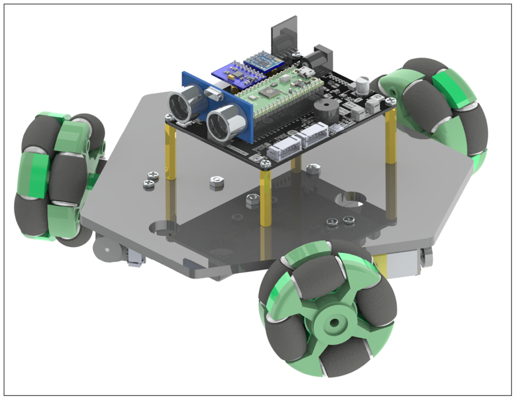
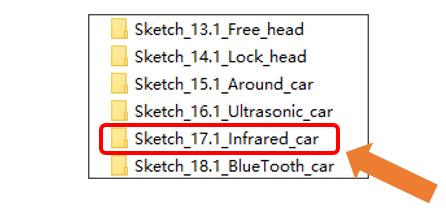
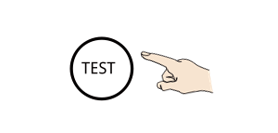
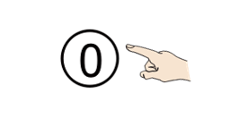
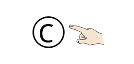
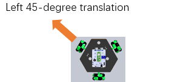
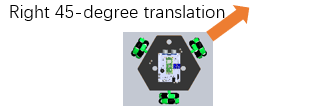
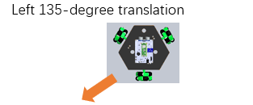
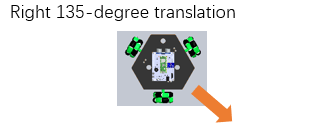

##############################################################################
Chapter 19 Infrared Control
##############################################################################

In the previous chapters, we learned how to use infrared modules. In this chapter, we will learn how to control the car's movement and change modes using an infrared remote controller.

Circuit
********************************

For detailed assembly process of the car, please refer to :ref:`fnk0097/codes/three_wheel/1_car_assembly:chapter 1 car assembly`

Sketch
**********************************

Open **“Sketch_17.1_Infrared_car”** folder in **“Freenove_Omni_Wheel_Car_Kit_for_Raspberry_Pi_Pico\\Three-Wheel\\Sketches”** and then double-click **“Sketch_17.1_Infrared_car.ino”**.

Code
================================

Sketch_17.1_Infrared_car.ino
-------------------------------

.. literalinclude:: ../../../freenove_Kit/Three-Wheel/Sketch/Sketch_17.1_Infrared_car/Sketch_17.1_Infrared_car.ino
    :linenos:
    :language: c
    :dedent:

Motor.cpp
-------------------------------

.. literalinclude:: ../../../freenove_Kit/Three-Wheel/Sketch/Sketch_17.1_Infrared_car/Motor.cpp
    :linenos:
    :language: c
    :lines: 51-65
    :dedent:

After downloading the code, place the car on the ground and turn ON the power switch. The keys and their corresponding values and function are as shown in the table below: 

.. table:: 
    :align: center
    :class: text-center font-bolder :x-large:`
    :widths: 1 1 1 

    +----------------+---------------------+----------------------+
    | :large:`Keys`  | :large:`Function`   | :large:`Key Value`   |
    +================+=====================+======================+
    | |Chapter19_02| | |Chapter19_13|      | :large:`FF02FD`      |
    +----------------+---------------------+----------------------+
    | |Chapter19_03| | |Chapter19_14|      | :large:`FFE01F`      |
    +----------------+---------------------+----------------------+
    | |Chapter19_04| | |Chapter19_15|      | :large:`FF906F`      |
    +----------------+---------------------+----------------------+
    | |Chapter19_05| | |Chapter19_16|      | :large:`FF9867`      |
    +----------------+---------------------+----------------------+
    | |Chapter19_06| | |Chapter19_17|      | :large:`FFA857`      |
    +----------------+---------------------+----------------------+
    | |Chapter19_07| | |Chapter19_18|      | :large:`FF22DD`      |
    +----------------+---------------------+----------------------+
    | |Chapter19_08| | |Chapter19_19|      | :large:`FFC23D`      |
    +----------------+---------------------+----------------------+
    | |Chapter19_09| | |Chapter19_20|      | :large:`FF6897`      |
    +----------------+---------------------+----------------------+
    | |Chapter19_10| | |Chapter19_21|      | :large:`FFB04F`      |
    +----------------+---------------------+----------------------+
    | |Chapter19_11| | |Chapter19_22|      | :large:`FFA25D`      |
    +----------------+---------------------+----------------------+
    | |Chapter19_12| | |Chapter19_23|      | :large:`FFE214D`     |
    +----------------+---------------------+----------------------+

