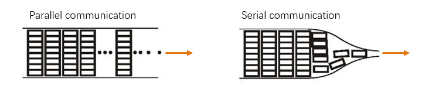
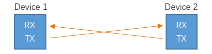
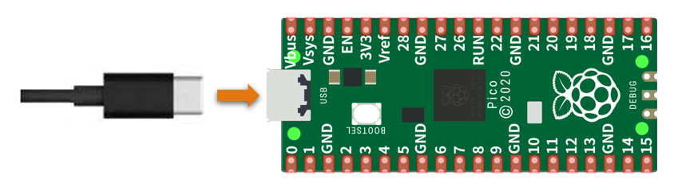
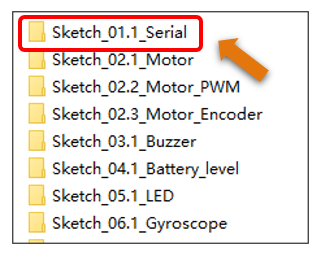
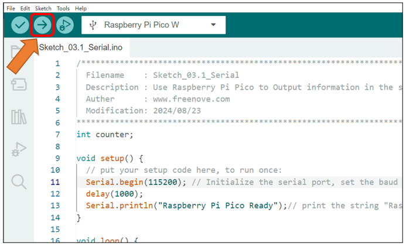
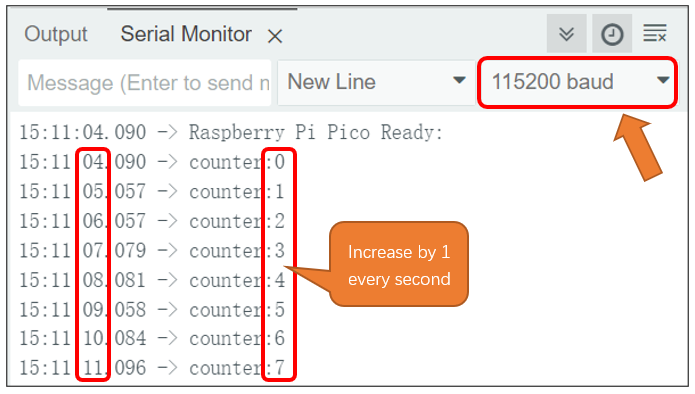

##############################################################################
Chapter 3 Serial
##############################################################################

Related Knowledge
***************************************

Serial and parallel communication
=======================================

Serial communication uses one data cable to transfer data one bit by another in turn, while parallel communication means that the data is transmitted simultaneously on multiple cables. Serial communication takes only a few cables to exchange information between systems, which is especially suitable for computers to computer, long distance communication between computers and peripherals. Parallel communication is faster, but it requires more cables and higher cost, so it is not appropriate for long distance communication.

Serial communication
=======================================

Serial communication generally refers to the Universal Asynchronous Receiver/Transmitter (UART), which is commonly used in electronic circuit communication. It has two communication lines, one is responsible for sending data (TX line) and the other for receiving data (RX line). The serial communication connections of two devices use is as follows:

Before serial communication starts, the baud rate in both sides must be the same. Only use the same baud rate can the communication between devices be normal. The baud rates commonly used are 9600 and 115200.

Circuit
**************************************

Connect control board to the computer with USB cable.

If you need any support, please feel free to contact us via: support@freenove.com

Sketch
**************************************

Next, we download the code to Raspberry Pi Pico (W) to test the motor. Open "Sketch_01.1_Serial" folder under "Freenove_Omni_Wheel_Car_Kit_for_Raspberry_Pi_Pico\\Three-Wheel\\Sketch" and double-click "Sketch_01.1\_ Serial.ino".

Code
=====================================

.. literalinclude:: ../../../freenove_Kit/Three-Wheel/Sketch/Sketch_01.1_Serial/Sketch_01.1_Serial.ino
  :linenos:
  :language: c
  :dedent:

This code achieves the function of printing data on serial monitor. Click "Upload" to upload the code to Pico.

After downloading the code, open the serial port monitor, set the baud rate to 115200.

Reference
--------------------------------------

.. py:function:: void setup () 

    The 'setup' function serves as an initializer. It is the first block of code to be executed upon code upload, and it runs only a single time during the program's operation. It is imperative that this function remains intact and unaltered; attempting to delete or comment it out will result in compilation errors.

.. py:function:: void loop ()

    The 'loop' function begins execution after the 'setup' function has completed and continues to run repeatedly. This is where you should place code that needs to be continuously executed. Be aware that this function must not be deleted or commented out; doing so will lead to compilation errors.

.. py:function:: void delay(unsigned long ms);

    The 'delay' function in Arduino is used to halt the program's execution for a specified amount of time. It takes one argument, which represents the duration of the pause in milliseconds (ms). For instance, 'delay(1000)' will pause the program for 1 second, as 1 second is equivalent to 1000 milliseconds.

.. py:function:: void Serial.begin(long baud);

    The 'Serial.begin' function in Arduino is used to initialize the serial communication. It accepts one argument, which specifies the baud rate to be set.

.. py:function:: size_t Serial.print(int val);

    The 'Serial.print' function in Arduino is used for sending data to the serial monitor. The value passed as an argument to this function will be printed to the serial monitor.

.. py:function:: size_t Serial.println(int val);

    The 'Serial.println' function in Arduino is similar to 'Serial.prin', but it differs in that it appends a newline character at the end of the data being sent. This is useful for formatting the output in the serial monitor, making it easier to read by separating lines of text.