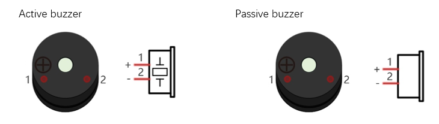
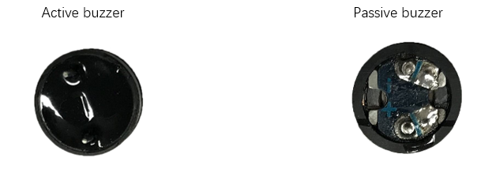
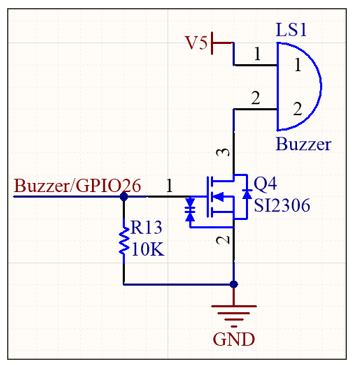
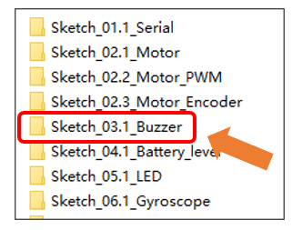
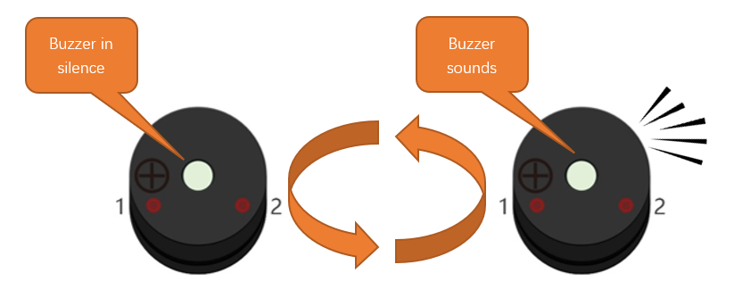

##############################################################################
Chapter 5 Buzzer Test
##############################################################################

Related Knowledge
*********************************

Buzzer is a sounding component, which is widely used in electronic devices such as calculator, electronic warning clock and alarm. Buzzer has two types: active and passive. Active buzzer has oscillator inside, which will sound as long as it is supplied with power. Passive buzzer requires external oscillator signal (generally use PWM with different frequency) to make a sound.

Active buzzer is easy to use. Generally, it can only make a specific frequency of sound. Passive buzzer requires an external circuit to make a sound, but it can be controlled to make a sound with different frequency. The resonant frequency of the passive buzzer is 2 kHz, which means the passive buzzer is loudest when its resonant frequency is 2 kHz.

How to identify active and passive buzzer

1.	Usually, there is a label on the surface of active buzzer covering the vocal hole, but this is not an absolute judgment method.

2.	Active buzzers are more complex than passive buzzers in their manufacture. There are many circuits and crystal oscillator elements inside active buzzers; all of this is usually protected with a waterproof coating (and a housing) exposing only its pins from the underside. On the other hand, passive buzzers do not have protective coatings on their underside. From the pin holes viewing of a passive buzzer, you can see the circuit board, coils, and a permanent magnet (all or any combination of these components depending on the model.

The buzzer used in this car is a passive buzzer that can make sounds with different frequency.

Schematic
*********************************

As we can see, the buzzer is controlled by GPIO26 of Raspberry Pi Pico W. When the buzzer receives PWM signal, N-MOS will be activated to make the buzzer sound. When the buzzer receives no signal, it will be controlled at low level by R2 and N-MOS will not be activated, so the buzzer will not make any sounds. 

Sketch
**********************************

Next, we download the code to Raspberry Pi Pico (W) to test the buzzer. Open "03.1_Buzzer" folder under "Freenove_Omni_Wheel_Car_Kit_for_Raspberry_Pi_Pico\\Three-Wheel\\Sketch" and double-click "03.1_Buzzer.ino".

Code
===============================

.. literalinclude:: ../../../freenove_Kit/Three-Wheel/Sketch/Sketch_03.1_Buzzer/Sketch_03.1_Buzzer.ino
    :linenos:
    :language: c
    :dedent:

After downloading the code, the buzzer makes sounds at 100Hz every 500 milliseconds.

Code Explanation
===============================

If you are not familiar with Arduino IDE, you can visit https://www.arduino.cc/reference/en/ to learn more. 

Define the pin of buzzer.

.. literalinclude:: ../../../freenove_Kit/Three-Wheel/Sketch/Sketch_03.1_Buzzer/Sketch_03.1_Buzzer.ino
    :linenos:
    :language: c
    :lines: 8-8
    :dedent:

Enable the buzzer pin to output mode.

.. literalinclude:: ../../../freenove_Kit/Three-Wheel/Sketch/Sketch_03.1_Buzzer/Sketch_03.1_Buzzer.ino
    :linenos:
    :language: c
    :lines: 12-12
    :dedent:

Call the function to have the buzzer make sounds at 100Hz every 500ms, and repeat this process.

.. literalinclude:: ../../../freenove_Kit/Three-Wheel/Sketch/Sketch_03.1_Buzzer/Sketch_03.1_Buzzer.ino
    :linenos:
    :language: c
    :lines: 15-21
    :dedent:

Reference 
-----------------------------------

.. py:function:: arg1 void tone(uint8_t pin, unsigned int frequency, unsigned long duration = 0);

    The tone function is commonly used to control a buzzer.

    **Parameters:**
    
    pin: The pin number to control.
    
    frequency: The frequency of the tone to be generated, in Hz, with a range of 0 to 65,535.
    
    duration: (Optional) The duration for which the tone should play.