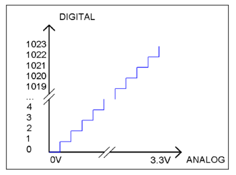
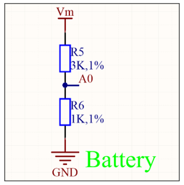
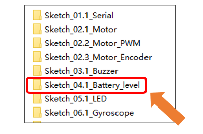
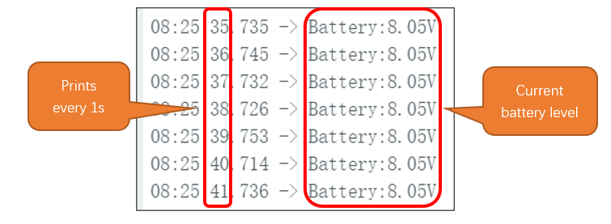

##############################################################################
Chapter 6 ADC Test 
##############################################################################

ADC
***********************************

ADC is an electronic integrated circuit used to convert analog signals such as voltages to digital or binary form consisting of 1s and 0s. The range of our ADC on Raspberry Pi Pico (W) is 10 bits, which means the resolution is 2^10=1024, and it represents a range (at 3.3V) will be divided equally to 1024 parts. The rage of analog values corresponds to ADC values. So the more bits the ADC has, the denser the partition of analog will be and the greater the precision of the resulting conversion.

Subsection 1: the analog in rang of 0V---3.3/1023 V corresponds to digital 0;

Subsection 2: the analog in rang of 3.3/1023 V---2*3.3 /1023V corresponds to digital 1;

The following analog will be divided accordingly.

The conversion formula is as follows:

.. math:: 

    \boldsymbol{\text{ADC Value}} \boldsymbol{=} \frac{\boldsymbol{\text{Analog Voltage}}}{{3.3}} \boldsymbol{\times} {1023}

Schematic
***********************************

As we can see, the car reads the voltage of the batteries through GPIO27 of Raspberry Pi Pico (W). 

The voltage acquisition range of GPIO27 on Raspberry Pi Pico (W) is 0-3.3V, while the car is powered by two 18650-lithium batteries, whose voltage is 8.4V when they are fully charged, which exceeds the acquisition range of Raspberry Pi Pico (W). Therefore, after passing through the voltage divider circuit composed of R3 and R4, the voltage at A0 will be about 1/4 of the battery voltage, 8.4/4=2.1V, which is within the voltage collection range of GPIO27.

Sketch
***********************************

In this section, we will use GPIO27 of Raspberry Pi Pico (W) to read the voltage value of the batteries and print it on serial monitor. Open "Sketch_04.1_Battery_level" folder in "Freenove Three-wheeled omniwheel Car Kit for Raspberry Pi pico \\Sketches" and then double-click "Sketch_04.1_Battery_level.ino".

Code
===================================

After downloading the code, we can see current battery level be printed on serial monitor every 1 second.

Code Explanation
-----------------------------------

Define the ADC sampling pin.

.. literalinclude:: ../../../freenove_Kit/Three-Wheel/Sketch/Sketch_04.1_Battery_level/Sketch_04.1_Battery_level.ino
    :linenos:
    :language: c
    :lines: 8-8
    :dedent:

Set the pin to input mode.

.. literalinclude:: ../../../freenove_Kit/Three-Wheel/Sketch/Sketch_04.1_Battery_level/Sketch_04.1_Battery_level.ino
    :linenos:
    :language: c
    :lines: 13-13
    :dedent:

Initialize the pico serial port and set the baud rate to 9600.

.. literalinclude:: ../../../freenove_Kit/Three-Wheel/Sketch/Sketch_04.1_Battery_level/Sketch_04.1_Battery_level.ino
    :linenos:
    :language: c
    :lines: 14-14
    :dedent:

Obtain the battery voltage every 1 second and print on Serial Monitor.

.. literalinclude:: ../../../freenove_Kit/Three-Wheel/Sketch/Sketch_04.1_Battery_level/Sketch_04.1_Battery_level.ino
    :linenos:
    :language: c
    :lines: 17-24
    :dedent:

Reference
----------------------

.. py:function:: int analogRead(uint8_t pin);

    The analogRead function is used to read an analog input. Upon a successful read, it returns an integer value in the range of 0 to 1023.

    **Parameters:**

    pin: The analog input pin number to read from.