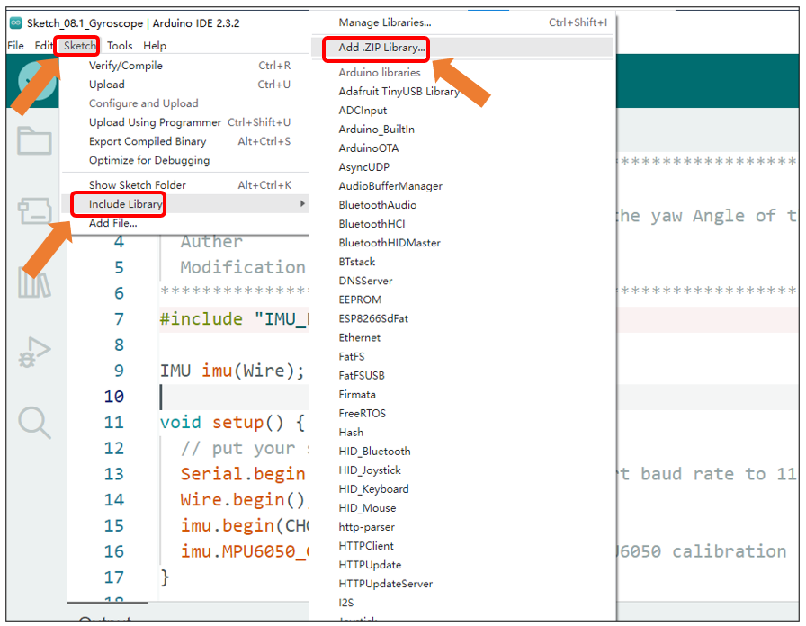
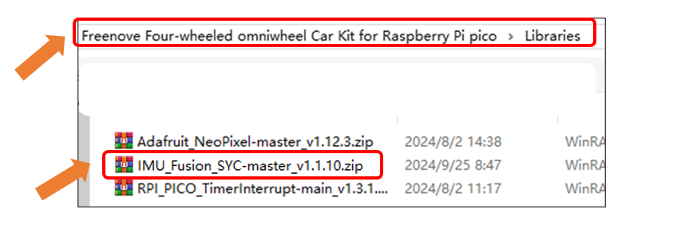

##############################################################################
Chapter 8 Gyroscope Test
##############################################################################

Component Knowledge
*********************************

I2C communication
=================================

I2C (Inter-Integrated Circuit) is a two-wire serial communication mode, which can be used to the connection of micro controller and its peripheral equipment. Devices using I2C communication must be connected to the serial data (SDA) line, and serial clock (SCL) line (called I2C bus). Each device has a unique address and can be used as a transmitter or receiver to communicate with devices connected to the bus.

MPU6050 Gyroscope
=================================

The MPU6050 follows the I2C communication protocol and the default address is 0x68. It is widely used to assist with balancing vehicles, robots and aircraft, mobile phones and other products which require stability to control stability and attitude or which need to sense same.

The port description of the MPU6050 module is as follows:

.. table::
    :class: freenove-ow

    +----------+------------+-------------------------------------------------------------+
    | Pin name | Pin number |                         Description                         |
    +==========+============+=============================================================+
    | VCC      | 1          | Positive pole of power supply with voltage 5V               |
    +----------+------------+-------------------------------------------------------------+
    | GND      | 2          | Negative pole of power supply                               |
    +----------+------------+-------------------------------------------------------------+
    | SCL      | 3          | I2C communication clock pin                                 |
    +----------+------------+-------------------------------------------------------------+
    | SDA      | 4          | I2C communication clock pin                                 |
    +----------+------------+-------------------------------------------------------------+
    | XDA      | 5          | I2C host data pin which can be connected to other devices.  |
    +----------+------------+-------------------------------------------------------------+
    | XCL      | 6          | I2C host clock pin which can be connected to other devices. |
    +----------+------------+-------------------------------------------------------------+
    | AD0      | 7          | I2C address bit control pin.                                |
    |          |            |                                                             |
    |          |            | Low level: the device address is 0x68                       |
    |          |            |                                                             |
    |          |            | High level: the device address is 0x69                      |
    +----------+------------+-------------------------------------------------------------+
    | INT      | 8          | Output interrupt pin                                        |
    +----------+------------+-------------------------------------------------------------+

For more details, please refer to datasheet.

Zero Drift
=================================

During the calibration of a gyroscope, the initial angle measurement may be accurate; however, over time, the zero position tends to drift, resulting in an accumulating error. This phenomenon is referred to as zero drift. The underlying cause is that obtaining angle information from the gyroscope's raw data requires integration. In this process, the angular velocity signal often contains small biases and drifts. These biases accumulate through integration, leading to progressively increasing errors over time, which can eventually cause circuit saturation, preventing the output of accurate angle measurements.

Circuit
**********************************

Plug the MPU6050 chip to the expansion board.

Schematic
**********************************

As can be seen from the schematic below, the SDA and SCL of the MPU6050 are connected to GP4 and GP5 of the Pico (W).

Sketch
==================================

As we use the I2C interface to read the gyroscope's data, we need to install the related library before use.

Open Arduino IDE, click **"Sketch"** -> **"Include Library"** -> **"Add.ZIP Library..."**.

Select **"IMU_Fusion_SYC-master_v1.1.10.zip"** under the directory of **"Freenove Three-wheeled omniwheel Car Kit for Raspberry Pi pico\\Libraries"**.

Wait for the installation to finish.

Open "Sketch_06.1_Gyroscope" folder in **"Freenove_Omni_Wheel_Car_Kit_for_Raspberry_Pi_Pico\\Three-Wheel\\Sketches"** and then double-click **"Sketch_06.1_Gyroscope.ino**".

Code
----------------------------------

.. literalinclude:: ../../../freenove_Kit/Three-Wheel/Sketch/Sketch_06.1_Gyroscope/Sketch_06.1_Gyroscope.ino
    :linenos:
    :language: c
    :dedent:

Compile and upload the sketch. Do NOT touch the circuit board once the Upload button is clicked, until the message **"Calibration complete"** is printed.

After the gyroscope initialization is complete, it takes 1-3 seconds for self-calibration. During this process, please do not touch the circuit board to ensure more accurate calibration.

Once the initialization is complete, you will see the angle data obtained from the gyroscope printed in the serial monitor, with a period of 500 milliseconds.

Code Explanation
-----------------------------------

If you are not familiar with Arduino IDE, you can visit https://www.arduino.cc/reference/en/ to learn more. 

Declare that the MPU communicates with Wire.

.. literalinclude:: ../../../freenove_Kit/Three-Wheel/Sketch/Sketch_06.1_Gyroscope/Sketch_06.1_Gyroscope.ino
    :linenos:
    :language: c
    :lines: 9-9
    :dedent:

Set the serial port baud rate to 115200

.. literalinclude:: ../../../freenove_Kit/Three-Wheel/Sketch/Sketch_06.1_Gyroscope/Sketch_06.1_Gyroscope.ino
    :linenos:
    :language: c
    :lines: 13-13
    :dedent:

I2C initialization

.. literalinclude:: ../../../freenove_Kit/Three-Wheel/Sketch/Sketch_06.1_Gyroscope/Sketch_06.1_Gyroscope.ino
    :linenos:
    :language: c
    :lines: 14-14
    :dedent:

MPU6050 initialization

.. literalinclude:: ../../../freenove_Kit/Three-Wheel/Sketch/Sketch_06.1_Gyroscope/Sketch_06.1_Gyroscope.ino
    :linenos:
    :language: c
    :lines: 15-15
    :dedent:

MPU6050 self-calibration

.. literalinclude:: ../../../freenove_Kit/Three-Wheel/Sketch/Sketch_06.1_Gyroscope/Sketch_06.1_Gyroscope.ino
    :linenos:
    :language: c
    :lines: 16-16
    :dedent:

Obtain raw data of MPU6050 and calculate.

.. literalinclude:: ../../../freenove_Kit/Three-Wheel/Sketch/Sketch_06.1_Gyroscope/Sketch_06.1_Gyroscope.ino
    :linenos:
    :language: c
    :lines: 23-23
    :dedent:

Print the obtained yaw angles on serial monitor.

.. literalinclude:: ../../../freenove_Kit/Three-Wheel/Sketch/Sketch_06.1_Gyroscope/Sketch_06.1_Gyroscope.ino
    :linenos:
    :language: c
    :lines: 25-25
    :dedent:

Reference
-----------------------------------

.. py:function:: Wire.begin();	

    Initialize I2C.

.. py:function:: IMU::MPU6050_CalcGyroOffsets();	

    This function is part of the IMU_Fusion_SYC library. After calling this function, the gyroscope will automatically calibrate upon power-up and print the calibration information to the serial monitor.

.. py:function:: IMU::begin();	

    This function is part of the IMU_Fusion_SYC library and is used to initialize the gyroscope. 

    **Parameters:**

    * CHOOSE_MPU6050: Initializes the gyroscope.

    * CHOOSE_QMC5883L: Initializes the electronic compass.

    * CHOOSE_ALL: Initializes both the gyroscope and the electronic compass simultaneously.

.. py:function:: IMU::getAngleZ();

    This function is part of the IMU_Fusion_SYC library and can be used to obtain the yaw angle.