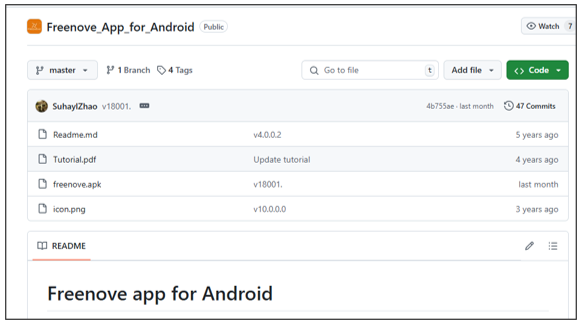

##############################################################################
Freenove app
##############################################################################

Install Freenove app
*****************************

There are three ways to install our app.

1. Google Play Software
=======================================

Search "Freenove" on Google Play to download and install. 

2. Google Play Website
=======================================

Visit https://play.google.com/store/apps/details?id=com.freenove.suhayl.Freenove, and click install

.. image:: ../../codes/_static/imgs/Freenove_app/App01.png
    :align: center
    :width: 80%

3. Github
=======================================

Visit https://github.com/Freenove/Freenove_app_for_Android, download the files in this library, and install freenove.apk to your Android phone manually.

Expand the options of "Code", and click "Download ZIP". 

4. iOS
=======================================

Open App Store on your iPhone/iPad.

Tap Search on the menu bar at the bottom

.. image:: ../../codes/_static/imgs/Freenove_app/App05.png
    :align: center
    :width: 80%

Input freenove to search

Click the icon to install.

Introduction to the APP
*************************************

Menu
=======================================

Open application "Freenove", as shown below:

Scroll down to find Omnidirectional wheel car and tap it.

The interface is as shown below:

Hardware_Communication_Protocol
*************************************

Supported Communication 
=======================================

.. table:: 
    :class: zebra
    :align: center
    :widths: 1 1
    :width: 50%

    +---------------+-----------------------+
    | Communication | Bluetooth Device Name |
    +===============+=======================+
    | Bluetooth     | BT05                  |
    +---------------+-----------------------+

Communication Command Format
========================================

:combo:`font-bolder x-large:The communication command format is as follows:`

"A#10#20#30#40#50#\\n".

Where the first character of each command is the command character, used to distinguish the general category of the command, such as "A".

The character "#" is the delimiter between the command character and the parameters, used to split the string.

Each command ends with a  newline character "#\\n", which is used to separate each command.

When parsing commands, one should first split the commands with "\\n", then split the command character and parameters of each command with "#". If there is any remaining content after splitting with "\\n", it should be concatenated into the parsing of the subsequent commands.

Each command consists of a command character and parameters, with one command character and a variable number of parameters, ranging from 0 to n, depending on the specific command.

Command Characters of FNK0097
=======================================

.. code-block:: text
    :linenos: 

    #define ENTER                      '\n'
    #define INTERVAL_CHAR              '#'
    #define CMD_MOTOR_Bluetooth        'A'
    #define CMD_LED_Bluetooth          'C'
    #define CMD_BUZZER_Bluetooth       'D'
    #define CMD_ULTRASONIC_Bluetooth   'E'
    #define CMD_STATE_Bluetooth        'M'
    #define CMD_CIRCLE_Bluetooth       'B'
    #define CMD_BATTERY _Bluetooth     'F'

Communication Protocol of FNK0097
=======================================

CMD_MOTOR_Bluetooth = "A"
---------------------------------------

:combo:`font-bolder x-large:This command controls the car's basic movements.`

Format: A#Parameter1#Parameter2#Parameter3#Parameter4\\n, where:

- Parameter1 represents the angle between the joystick direction and the Y-axis, with a range of 0-180 for the negative semi-axis and 0-(-180) for the positive semi-axis.

- Parameter2 represents the length of the joystick, with a range of 0-100.

- Parameter3 represents the angle of the second joystick, with a similar range as Parameter1.

- Parameter4 represents the length of the second joystick, with a range similar to Parameter2.

.. table:: 
    :class: freenove-ow

    +-----------------------------+----------------------------------------------------------------+
    | App Commands                | Actions                                                        |
    +=============================+================================================================+
    | CMD_M_MOTOR#0#100#0#0\\n    | Car moves forward (at a speed of 100)                          |
    +-----------------------------+----------------------------------------------------------------+
    | CMD_M_MOTOR#180#100#0#0\\n  | Car moves backward (at a speed of 100)                         |
    +-----------------------------+----------------------------------------------------------------+
    | CMD_M_MOTOR#0#0#90#100\\n   | Car turns left (at a speed of 100)                             |
    +-----------------------------+----------------------------------------------------------------+
    | CMD_M_MOTOR#0#0#-90#100\\n  | Car turns right (at a speed of 100)                            |
    +-----------------------------+----------------------------------------------------------------+
    | CMD_M_MOTOR#0#0#0#0\\n      | Car stops                                                      |
    +-----------------------------+----------------------------------------------------------------+
    | CMD_M_MOTOR#90#100#0#0\\n   | Car moves left (at a speed of 100)                             |
    +-----------------------------+----------------------------------------------------------------+
    | CMD_M_MOTOR#-90#100#0#0\\n  | Car moves right (at a speed of 100)                            |
    +-----------------------------+----------------------------------------------------------------+
    | CMD_M_MOTOR#45#100#0#0\\n   | Car moves diagonally forward to the left (at a speed of 100)   |
    +-----------------------------+----------------------------------------------------------------+
    | CMD_M_MOTOR#-45#100#0#0\\n  | Car moves diagonally forward to the right (at a speed of 100)  |
    +-----------------------------+----------------------------------------------------------------+
    | CMD_M_MOTOR#135#100#0#0\\n  | Car moves diagonally backward to the left (at a speed of 100)  |
    +-----------------------------+----------------------------------------------------------------+
    | CMD_M_MOTOR#-135#100#0#0\\n | Car moves diagonally backward to the right (at a speed of 100) |
    +-----------------------------+----------------------------------------------------------------+

CMD_LED_Bluetooth = "C"
-----------------------------------

:combo:`font-bolder x-large:This command is to change the LED modes.`

.. table:: 
    :class: freenove-ow

    +--------------+-----------------------------------------------------+
    | App Commands |                        Modes                        |
    +==============+=====================================================+
    | C#0\\n       | OFF                                                 |
    +--------------+-----------------------------------------------------+
    | C#1\\n       | RGB control (manually, with RGB input)              |
    +--------------+-----------------------------------------------------+
    | C#2\\n       | Pursuit Mode (with RGB input)                       |
    +--------------+-----------------------------------------------------+
    | C#3\\n       | Blink Mode (with RGB input)                         |
    +--------------+-----------------------------------------------------+
    | C#4\\n       | Breathing Mode (with RGB input)                     |
    +--------------+-----------------------------------------------------+
    | C#5\\n       | Rainbow Breathing Mode (RGB parameters are invalid) |
    +--------------+-----------------------------------------------------+

CMD_BUZZER_Bluetooth = "D"
-----------------------------------

:combo:`font-bolder x-large:This command controls the buzzer.`

The frequency of the buzzer is fixed at 2000.

.. table:: 
    :class: freenove-ow

    +--------------+-----------------+
    | App Commands |      Action     |
    +==============+=================+
    | D#2000\\n    | Activate buzzer |
    +--------------+-----------------+

CMD_POWER_Bluetooth = "F"
-----------------------------------

:combo:`font-bolder x-large:This command checks the battery power.`

The slave device proactively sends data to the master device in the format: P#Battery Voltage\n (Example: P#8.12\n). In the APP, this voltage value will be displayed, with the unit being millivolts (mv).

.. table:: 
    :class: freenove-ow

    +-------------+----------------+
    | APP Command | Display on APP |
    +=============+================+
    | P#8123\\n   | 8.123V         |
    +-------------+----------------+

CMD_ULTRASONIC_Bluetooth = "E"
-----------------------------------

The slave device proactively sends data to the master device in the format: E#Distance Value\\n (Example: E#22\n). In the APP, this distance value will be displayed, with the unit being centimeters (cm).

.. table:: 
    :class: freenove-ow

    +-------------+----------------+
    | APP Command | Display on APP |
    +=============+================+
    | E#22\\n     | 22cm           |
    +-------------+----------------+

CMD_STATE_Bluetooth = "M"
-----------------------------------

:combo:`font-bolder x-large:This command changes the car's mode.`

Format: M#Mode No.#\\n (Example: M#0#\\n)

APP Command Table

.. table:: 
    :class: freenove-ow

    +--------------+----------------+
    | APP Commands |     Modes      |
    +==============+================+
    | M#0#\\n      | Manual Control |
    +--------------+----------------+
    | M#1#\\n      | Free Head Mode |
    +--------------+----------------+
    | M#2#\\n      | Lock Head Mode |
    +--------------+----------------+
    | M#3#\\n      | Around Mode    |
    +--------------+----------------+
    | M#4#\\n      | Sonar Mode     |
    +--------------+----------------+

CMD_CIRCLE_Bluetooth = "B"
-----------------------------------

:combo:`font-bolder x-large:This command changes the parameters of Around Mode.`

Format: B#circle direction#circle radus#\\n (Example: B#0#100#\\n)

APP Command Table:

.. table:: 
    :class: freenove-ow

    +--------------+---------------------------------------------------+
    | APP Commands |                       Modes                       |
    +==============+===================================================+
    | B#0#100#\\n  | Clockwise, with a circle radius of 100 cm.        |
    +--------------+---------------------------------------------------+
    | B#1#100#\\n  | Counterclockwise, with a circle radius of 100 cm. |
    +--------------+---------------------------------------------------+

.. note::
    
    The circle radius can be changed according to requirements, with 100 cm used as an example in the table.