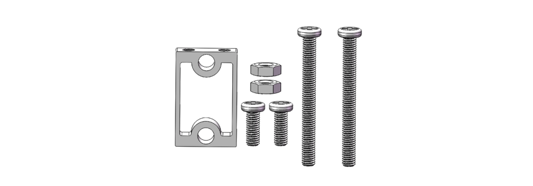
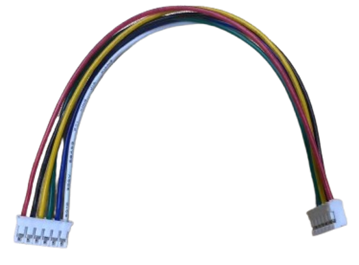

##############################################################################
List
##############################################################################

If you have any concerns, please feel free to contact us via support@freenove.com

Car Expansion Board
*****************************

.. list-table:: 
    :align: center
    :widths: 50 50

    * - Top
      - Bottom

    * - |List00|
      - |List01|
  

Machinery Parts
*****************************

+----------+----------+----------+
| |List02| | |List03| | |List04| |
+----------+----------+----------+
| |List05| | |List06| |          |
+----------+----------+----------+

Transmission Parts
*****************************

+-----------------------------+-----------------------------+
| Motor bracket package x3                                  |
|                                                           |
| (Motor Bracket x1, M3x8 Screws x2, M3x30 Screws x2) x3    |
|                                                           |
| |List07|                                                  |
+-----------------------------+-----------------------------+
| TT Motor with Encoder x 3   | Omni wheels x 3             |
|                             |                             |
| |List08|                    | |List09|                    |
+-----------------------------+-----------------------------+
| Coupling for Omni Wheels x3 | M2.5x25 Screw x3            |
|                             |                             |
| |List10|                    | |List11|                    |
+-----------------------------+-----------------------------+

.. |List09| image:: ../../codes/_static/imgs/List/List09.png

Electronic Parts
*****************************

+---------------------+-------------------------+----------------------------------------+
| Digital Compass x 1 |MPU6050 Gyroscope x 1    |Bluetooth x 1                           |
|                     |                         |                                        |
| |List12|            | |List13|                | |List14|                               |
+---------------------+--------------+----------+----------------------------------------+
| Infrared Emitter x1                |Raspberry Pi Pico W x1 or Raspberry Pi Pico x1     |
|                                    |                                                   |
| |List15|                           | |List16|                                          |
+------------------------------------+---------------------------------------------------+
| Battery Holder x 1                 |Ultrasonic Module x1                               |
|                                    |                                                   |
| |List17|                           | |List18|                                          |
+------------------------------------+---------------------------------------------------+

Wires
******************************

USB Data Cable (Micro USB) 1m

 
PH2.0mm-6P Wires-Same Direction 200mm
 

Tools 
******************************

Cross Srewdriver-3mm x 1

Required but NOT Contained Parts
**************************************

2 x 3.7V 18650 lithium :red:`rechargeable` batteries with continuous discharge current >3A.

**It is easier to find proper battery on** :blue:`eBay` **than Amazon. Search "18650 high drain" on eBay.**

