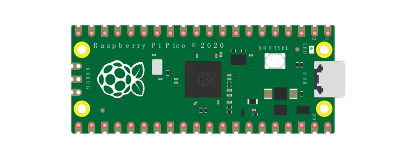
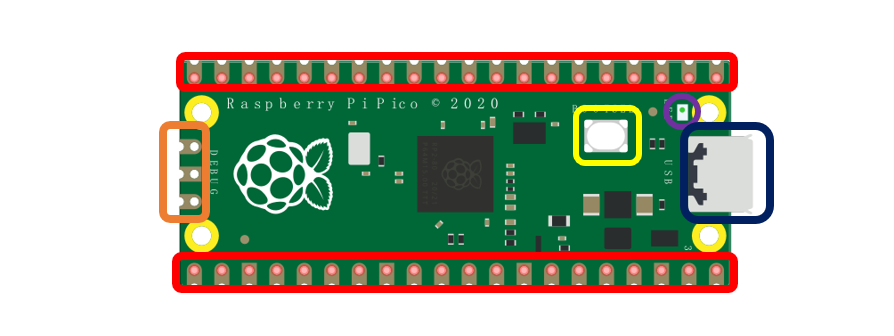
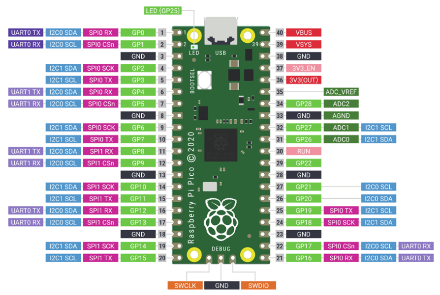
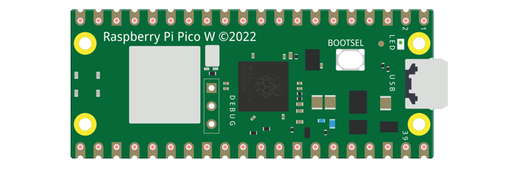
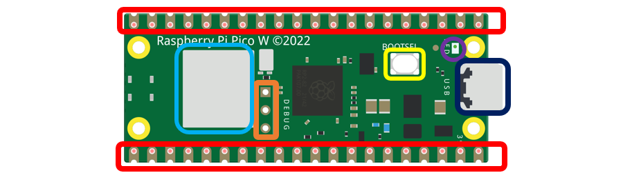
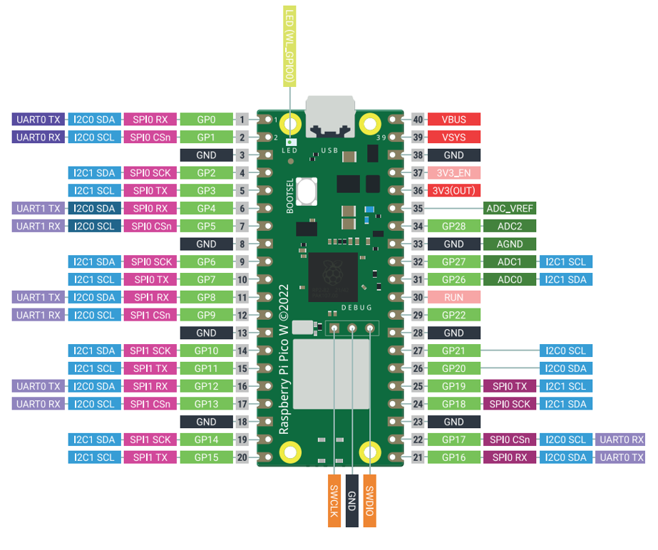
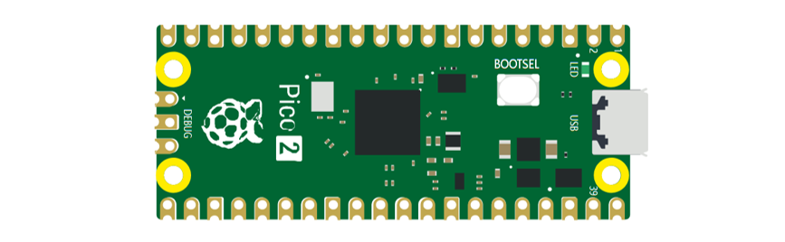
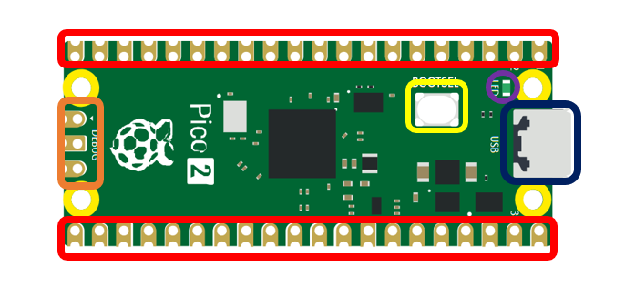
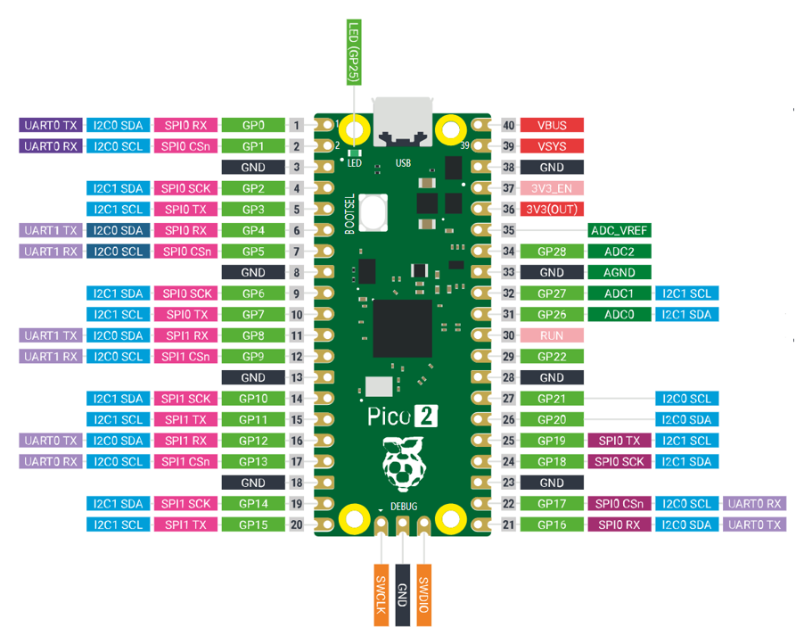
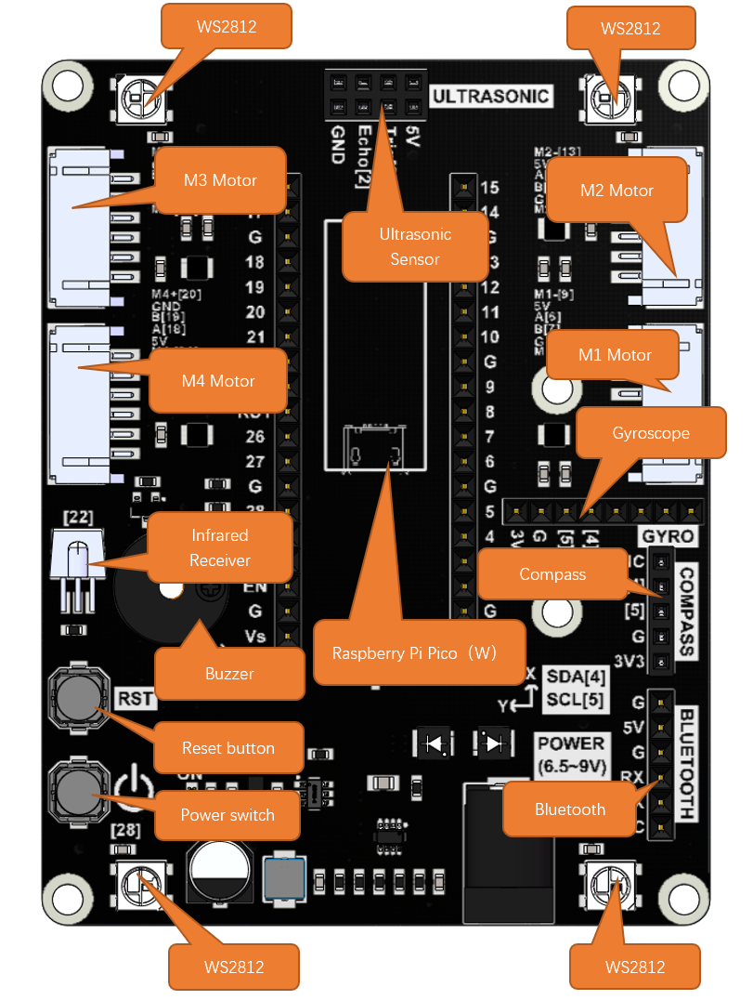

##############################################################################
Raspberry Pi Pico
##############################################################################

Raspberry Pi Pico
********************************

Before learning Pico, we need to know about it. Here we use an imitated diagram of Pico, which resembles the actual Pico.

The hardware interfaces are distributed as follows:

.. table:: 
    :widths: 1 1

    +-------------+----------------+
    | |Preface01|                  |
    +-------------+----------------+
    | Frame color | Description    |
    +=============+================+
    | |Preface02| | Pins           |
    +-------------+----------------+
    | |Preface03| | BOOTSEL button |
    +-------------+----------------+
    | |Preface04| | USB port       |
    +-------------+----------------+
    | |Preface05| | LED            |
    +-------------+----------------+
    | |Preface06| | Debugging      |
    +-------------+----------------+

Function definition of pins:

.. table:: 
    :width:  100%
    :widths: 1 1 1 1 
    
    +-------------+----------------+-------------+-----------+
    | Color       | Pins           | Color       | Pins      |
    +=============+================+=============+===========+
    | |Preface08| | GND            | |Preface13| | Power     |
    +-------------+----------------+-------------+-----------+
    | |Preface09| | GPIO           | |Preface14| | ADC       |
    +-------------+----------------+-------------+-----------+
    | |Preface10| | UART(default)  | |Preface15| | UART      |
    +-------------+----------------+-------------+-----------+
    | |Preface11| | SPI            | |Preface16| | I2C       |
    +-------------+----------------+-------------+-----------+
    | |Preface12| | System Control | |Preface17| | Debugging |
    +-------------+----------------+-------------+-----------+

.. |Preface14| image:: ../_static/imgs/Preface/Preface14.png

UART, I2C, SPI Default Pin
============================================

In Arduino IDE, the default pins of serial port are Pin0 and Pin1. 

.. note::
    
    Serial port is virtualized by RP2040. Therefore, when using the serial port, please enable the verification function of DTR. It can work under any baud rate.

UART
----------------------------

.. table:: 
    :class: freenove-ow
    :width: 70%
    :widths: 1 1
    
    +---------------+---------+
    | Function      | Default |
    +===============+=========+
    | UART_BAUDRATE | X       |
    +---------------+---------+
    | UART_BITS     | 8       |
    +---------------+---------+
    | UART_STOP     | 1       |
    +---------------+---------+
    | UART_TX       | Pin 0   |
    +---------------+---------+
    | UART_RX       | Pin 1   |
    +---------------+---------+

I2C
----------------------------

.. table:: 
    :class: freenove-ow
    :width: 70%
    :widths: 1 1
    
    +---------------+---------+
    | Function      | Default |
    +===============+=========+
    | I2C Frequency | 400000  |
    +---------------+---------+
    | I2C_SDA       | Pin 4   |
    +---------------+---------+
    | I2C_SCL       | Pin 5   |
    +---------------+---------+

SPI
----------------------------

.. table:: 
    :class: freenove-ow
    :width: 70%
    :widths: 1 1
    
    +--------------+---------+
    | Function     | Default |
    +==============+=========+
    | SPI_BAUDRATE | 1000000 |
    +--------------+---------+
    | SPI_POLARITY | 0       |
    +--------------+---------+
    | SPI_PHASE    | 0       |
    +--------------+---------+
    | SPI_BITS     | 8       |
    +--------------+---------+
    | SPI_FIRSTBIT | MSB     |
    +--------------+---------+
    | SPI_SCK      | Pin 18  |
    +--------------+---------+
    | SPI_MOSI     | Pin 19  |
    +--------------+---------+
    | SPI_MISO     | Pin 16  |
    +--------------+---------+
    | SPI_SS       | Pin 17  |
    +--------------+---------+

Raspberry Pi Pico W
***************************************

Raspberry Pi Pico W adds CYW43439 as the WiFi function on the basis of Raspberry Pi Pico. It is connected to RP2040 chip through SPI interface.

The hardware interfaces are distributed as follows:

.. table:: 
    :widths: 1 1

    +-------------+----------------+
    | |Preface19|                  |
    +-------------+----------------+
    | Frame color | Description    |
    +=============+================+
    | |Preface02| | Pins           |
    +-------------+----------------+
    | |Preface03| | BOOTSEL button |
    +-------------+----------------+
    | |Preface04| | USB port       |
    +-------------+----------------+
    | |Preface05| | LED            |
    +-------------+----------------+
    | |Preface06| | Debugging      |
    +-------------+----------------+
    | |Preface20| | Wireless       |
    +-------------+----------------+

.. table:: 
    :width:  100%
    :widths: 1 1 1 1 
    
    +-------------+----------------+-------------+-----------+
    | Color       | Pins           | Color       | Pins      |
    +=============+================+=============+===========+
    | |Preface08| | GND            | |Preface13| | Power     |
    +-------------+----------------+-------------+-----------+
    | |Preface09| | GPIO           | |Preface14| | ADC       |
    +-------------+----------------+-------------+-----------+
    | |Preface10| | UART(default)  | |Preface15| | UART      |
    +-------------+----------------+-------------+-----------+
    | |Preface11| | SPI            | |Preface16| | I2C       |
    +-------------+----------------+-------------+-----------+
    | |Preface12| | System Control | |Preface17| | Debugging |
    +-------------+----------------+-------------+-----------+

For details: https://datasheets.raspberrypi.com/picow/pico-w-datasheet.pdf

UART, I2C, SPI, Wireless Default Pin
==============================================

In Arduino IDE, the default pins of serial port are Pin0 and Pin1. 

.. note::
    
    Serial port is virtualized by RP2040. Therefore, when using the serial port, please enable the verification function of DTR. It can work under any baud rate.

UART
-----------------------------

.. table:: 
    :class: freenove-ow
    :width: 70%
    :widths: 1 1
    
    +--------------+---------+
    | Function     | Default |
    +==============+=========+
    | SPI_BAUDRATE | 1000000 |
    +--------------+---------+
    | SPI_POLARITY | 0       |
    +--------------+---------+
    | SPI_PHASE    | 0       |
    +--------------+---------+
    | SPI_BITS     | 8       |
    +--------------+---------+
    | SPI_FIRSTBIT | MSB     |
    +--------------+---------+
    | SPI_SCK      | Pin 18  |
    +--------------+---------+
    | SPI_MOSI     | Pin 19  |
    +--------------+---------+
    | SPI_MISO     | Pin 16  |
    +--------------+---------+
    | SPI_SS       | Pin 17  |
    +--------------+---------+

I2C
-----------------------------

.. table:: 
    :class: freenove-ow
    :width: 70%
    :widths: 1 1
    
    +---------------+---------+
    | Function      | Default |
    +===============+=========+
    | I2C Frequency | 400000  |
    +---------------+---------+
    | I2C_SDA       | Pin 4   |
    +---------------+---------+
    | I2C_SCL       | Pin 5   |
    +---------------+---------+

SPI
-----------------------------

.. table:: 
    :class: freenove-ow
    :width: 70%
    :widths: 1 1
    
    +--------------+---------+
    | Function     | Default |
    +==============+=========+
    | SPI_BAUDRATE | 1000000 |
    +--------------+---------+
    | SPI_POLARITY | 0       |
    +--------------+---------+
    | SPI_PHASE    | 0       |
    +--------------+---------+
    | SPI_BITS     | 8       |
    +--------------+---------+
    | SPI_FIRSTBIT | MSB     |
    +--------------+---------+
    | SPI_SCK      | Pin 18  |
    +--------------+---------+
    | SPI_MOSI     | Pin 19  |
    +--------------+---------+
    | SPI_MISO     | Pin 16  |
    +--------------+---------+
    | SPI_SS       | Pin 17  |
    +--------------+---------+

Wireless
-----------------------------

.. table:: 
    :class: freenove-ow
    :width: 70%
    :widths: 1 1

    +----------+------------+
    | Function | Default    |
    +==========+============+
    | WL_ON    | GPIO23     |
    +----------+------------+
    | WL_D     | GPIO24     |
    +----------+------------+
    | WL_CLK   | GPIO29_ADC |
    +----------+------------+
    | WL_CS    | GPIO25     |
    +----------+------------+

Raspberry Pi Pico 2
****************************************

Raspberry Pi Pico 2 uses RP2350 chip as the main controller, which equipped with dual Cortex-M33 or Hazard3 processors, capable of running up to 150 MHz, providing a significant boost in processing power, compared with the original pico. It also doubles the memory with 520KB of SRAM and 4MB of onboard flash memory, with the ADC sampling frequency increasing to up to 500ksps. In addition, it adds 8 more PWM channels, and features additional interfaces like 2× Timer with 4 alarms, 1× AON Timer and 4 x PIO.

The hardware interfaces are distributed as follows:

.. table:: 
    :widths: 1 1

    +-------------+----------------+
    | |Preface01|                  |
    +-------------+----------------+
    | Frame color | Description    |
    +=============+================+
    | |Preface02| | Pins           |
    +-------------+----------------+
    | |Preface03| | BOOTSEL button |
    +-------------+----------------+
    | |Preface04| | USB port       |
    +-------------+----------------+
    | |Preface05| | LED            |
    +-------------+----------------+
    | |Preface06| | Debugging      |
    +-------------+----------------+

Function definition of pins:

.. table:: 
    :width:  100%
    :widths: 1 1 1 1 
    
    +-------------+----------------+-------------+-----------+
    | Color       | Pins           | Color       | Pins      |
    +=============+================+=============+===========+
    | |Preface08| | GND            | |Preface13| | Power     |
    +-------------+----------------+-------------+-----------+
    | |Preface09| | GPIO           | |Preface14| | ADC       |
    +-------------+----------------+-------------+-----------+
    | |Preface10| | UART(default)  | |Preface15| | UART      |
    +-------------+----------------+-------------+-----------+
    | |Preface11| | SPI            | |Preface16| | I2C       |
    +-------------+----------------+-------------+-----------+
    | |Preface12| | System Control | |Preface17| | Debugging |
    +-------------+----------------+-------------+-----------+

For details: https://datasheets.raspberrypi.com/pico/pico-2-datasheet.pdf

UART, I2C, SPI Default Pin
========================================

In Arduino IDE, the default pins of serial port are Pin0 and Pin1. 

.. note::
    
    Serial port is virtualized by RP2350. Therefore, when using the serial port, please enable the verification function of DTR. It can work under any baud rate.

UART
----------------------------

.. table:: 
    :class: freenove-ow
    :width: 70%
    :widths: 1 1
    
    +---------------+---------+
    | Function      | Default |
    +===============+=========+
    | UART_BAUDRATE | X       |
    +---------------+---------+
    | UART_BITS     | 8       |
    +---------------+---------+
    | UART_STOP     | 1       |
    +---------------+---------+
    | UART_TX       | Pin 0   |
    +---------------+---------+
    | UART_RX       | Pin 1   |
    +---------------+---------+

I2C
----------------------------

.. table:: 
    :class: freenove-ow
    :width: 70%
    :widths: 1 1
    
    +---------------+---------+
    | Function      | Default |
    +===============+=========+
    | I2C Frequency | 400000  |
    +---------------+---------+
    | I2C_SDA       | Pin 4   |
    +---------------+---------+
    | I2C_SCL       | Pin 5   |
    +---------------+---------+

SPI
----------------------------

.. table:: 
    :class: freenove-ow
    :width: 70%
    :widths: 1 1
    
    +--------------+---------+
    | Function     | Default |
    +==============+=========+
    | SPI_BAUDRATE | 1000000 |
    +--------------+---------+
    | SPI_POLARITY | 0       |
    +--------------+---------+
    | SPI_PHASE    | 0       |
    +--------------+---------+
    | SPI_BITS     | 8       |
    +--------------+---------+
    | SPI_FIRSTBIT | MSB     |
    +--------------+---------+
    | SPI_SCK      | Pin 18  |
    +--------------+---------+
    | SPI_MOSI     | Pin 19  |
    +--------------+---------+
    | SPI_MISO     | Pin 16  |
    +--------------+---------+
    | SPI_SS       | Pin 17  |
    +--------------+---------+

Car Expansion Board
*****************************************

The function diagram of the Raspberry Pi Pico W car is as follows:

Pin Definition of the Car Board
*****************************************

To learn what each GPIO corresponds to, please refer to the following table.

The functions of the pins are allocated as follows:

.. table:: 
    :align: center
    :widths: 1 1 1

    +-----------------------------+-----------------+---------------------------+
    | Pins of Raspberry Pi Pico W | Functions       | Description               |
    +=============================+=================+===========================+
    | GPIO0                       | BlueTooth_TX    | Bluetooth                 |
    +-----------------------------+-----------------+                           +
    | GPIO1                       | BlueTooth_RX    |                           |
    +-----------------------------+-----------------+---------------------------+
    | GPIO2                       | M1_A            | TT Motor with Encoder 1   |
    +-----------------------------+-----------------+                           +
    | GPIO3                       | M1_B            |                           |
    +-----------------------------+-----------------+                           +
    | GPIO4                       | M1_IN1          |                           |
    +-----------------------------+-----------------+                           +
    | GPIO5                       | M1_IN2          |                           |
    +-----------------------------+-----------------+---------------------------+
    | GPIO11                      | M2_A            | TT Motor with Encoder 1   |
    +-----------------------------+-----------------+                           +
    | GPIO10                      | M2_B            |                           |
    +-----------------------------+-----------------+                           +
    | GPIO12                      | M2_IN1          |                           |
    +-----------------------------+-----------------+                           +
    | GPIO13                      | M2_IN2          |                           |
    +-----------------------------+-----------------+---------------------------+
    | GPIO14                      | M3_A            | TT Motor with Encoder 1   |
    +-----------------------------+-----------------+                           +
    | GPIO15                      | M3_B            |                           |
    +-----------------------------+-----------------+                           +
    | GPIO16                      | M3_IN1          |                           |
    +-----------------------------+-----------------+                           +
    | GPIO17                      | M3_IN2          |                           |
    +-----------------------------+-----------------+---------------------------+
    | GPIO20                      | M4_A            | TT Motor with Encoder 1   |
    +-----------------------------+-----------------+                           +
    | GPIO21                      | M4_B            |                           |
    +-----------------------------+-----------------+                           +
    | GPIO18                      | M4_IN1          |                           |
    +-----------------------------+-----------------+                           +
    | GPIO19                      | M4_IN2          |                           |
    +-----------------------------+-----------------+---------------------------+
    | GPIO6/SDA                   | IIC-SDA         | Compass && MPU6050        |
    +-----------------------------+-----------------+                           +
    | GPIO7/SCL                   | IIC-SCL         |                           |
    +-----------------------------+-----------------+---------------------------+
    | GPIO8                       | Echo            | Ultrasonic Sensor         |
    +-----------------------------+-----------------+                           +
    | GPIO9                       | Trig            |                           |
    +-----------------------------+-----------------+---------------------------+
    | GPIO28                      | WS2812          | WS2812RGB LEDs            |
    +-----------------------------+-----------------+---------------------------+
    | GPIO27/A1                   | Battery voltage | Battery Power Measurement |
    +-----------------------------+-----------------+---------------------------+
    | GPIO22                      | Buzzer          | Buzzer                    |
    +-----------------------------+-----------------+---------------------------+
    | GPIO26                      | IR              | Integrated IR Receiver    |
    +-----------------------------+-----------------+---------------------------+